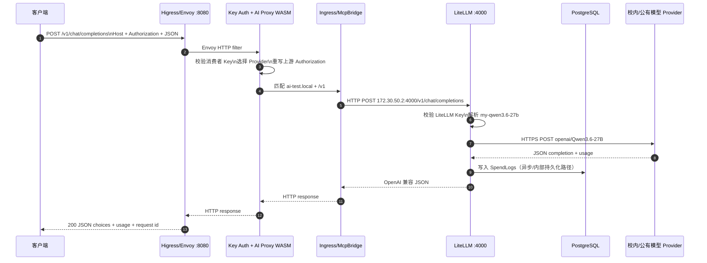
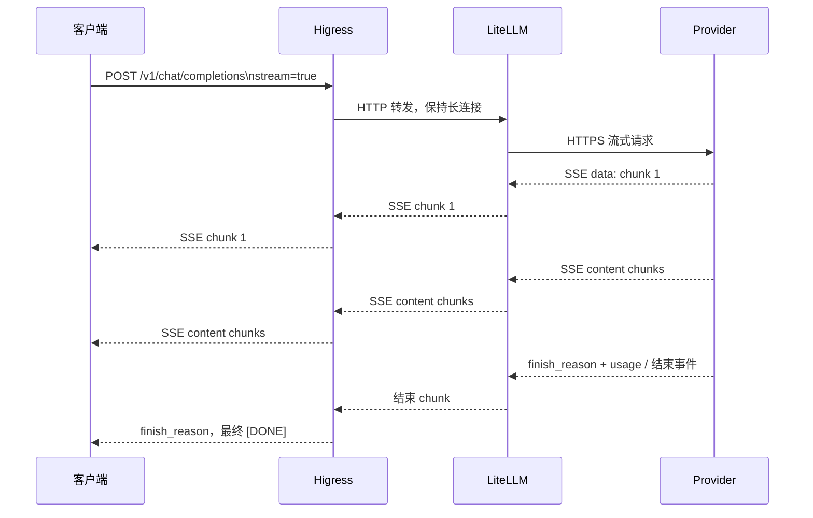
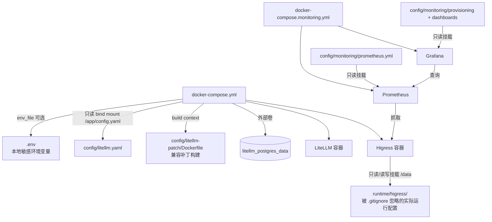
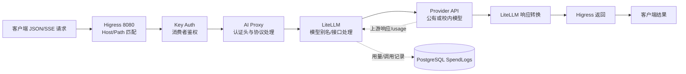
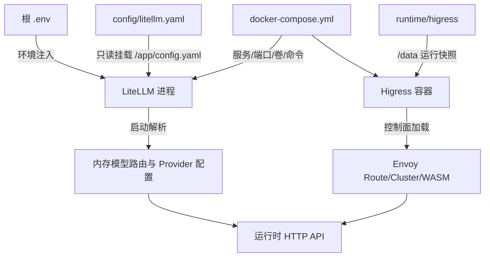
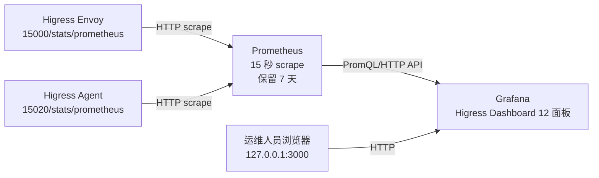
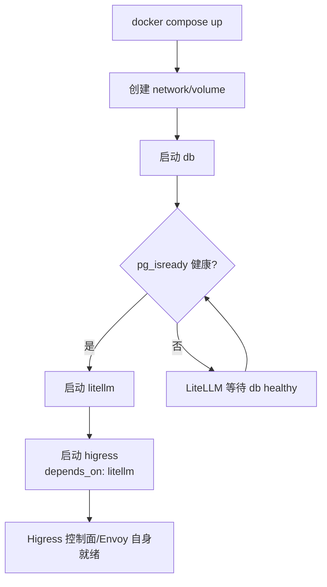
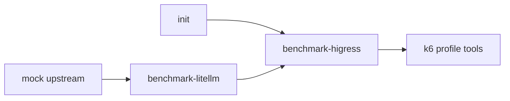

# AI 网关完整技术链路与架构设计

## 0. 阅读说明

本文依据当前工作区实际文件编写，重点参考：

- `docker-compose.yml`
- `docker-compose.monitoring.yml`
- `docker-compose.benchmark.yml`
- `config/litellm.yaml`
- `config/litellm-patch/`
- `config/monitoring/`
- `runtime/higress/`
- `test/test_higress_route.py`
- `test/test_responses_patch_live.py`

本文中的“HiGateway”按当前工程实际组件名称理解为 **Higress**。项目实际运行链路是 Higress + LiteLLM + PostgreSQL；Prometheus/Grafana 是独立监控链路；压测 Compose 是隔离测试环境，不是生产请求链路。

需要注意：当前专用 AI 路由的上游凭证配置与 LiteLLM 主密钥相同，因此专用路由上的所有请求在 LiteLLM 侧可能表现为同一个高权限身份。本文会在对应位置单独标注这一风险。

## 1. 整体架构概览

### 1.1 组件关系图

```mermaid
flowchart LR
    C[客户端\nOpenAI SDK / curl / Codex / 业务系统]
    H[Higress\nEnvoy 数据面\n端口 8080/8443]
    K[Key Auth WASM\n消费者 Key 校验]
    P[AI Proxy WASM\n协议入口与上游凭证处理]
    R[Higress 路由\nHost + Path 匹配\nMcpBridge 服务发现]
    L[LiteLLM Proxy\n端口 4000\nOpenAI 兼容 API、模型映射、Provider 调用]
    CB[Responses 兼容 Callback\n仅目标模型/aresponses]
    DB[(PostgreSQL 16\nLiteLLM 管理数据与 SpendLogs)]
    M[模型配置\nconfig/litellm.yaml]
    U1[公有模型 API\nDashScope / DeepSeek / Agnes 等]
    U2[校内模型 API\n配置的内网/校园端点]
    PM[Prometheus\n15 秒抓取]
    G[Grafana\n12 面板]
    E[Envoy 管理指标\n15000/15020]

    C -->|HTTP/HTTPS JSON 或 SSE| H
    H --> K
    K --> P
    H --> R
    P --> R
    R -->|HTTP 172.30.50.2:4000| L
    L --> CB
    L -->|HTTP/HTTPS Provider API| U1
    L -->|HTTP/HTTPS Provider API| U2
    L -->|Prisma/PostgreSQL| DB
    M -.挂载为 /app/config.yaml.-> L
    H -.Envoy Prometheus endpoint.-> E
    PM -->|Prometheus HTTP scrape| E
    G -->|Prometheus HTTP API| PM
```

### 1.2 组件职责与通信方式

| 组件 | 当前职责 | 通信方式 | 关键文件 |
| --- | --- | --- | --- |
| 客户端 | 发送 OpenAI 兼容请求，读取 JSON 或 SSE | HTTP/HTTPS | `test/test_higress_route.py:133` |
| Higress | 统一入口、Host/Path 路由、Envoy 连接治理、WASM 插件承载 | HTTP/HTTPS；内部 Envoy 集群转发 | `docker-compose.yml:50`、`runtime/higress/` |
| Key Auth WASM | 对专用 AI 路由校验消费者 Key | Envoy HTTP filter/WASM | `runtime/higress/wasmplugins/key-auth.internal.yaml:63` |
| AI Proxy WASM | AI 请求代理、Provider 配置、上游授权头处理 | Envoy HTTP filter/WASM | `runtime/higress/wasmplugins/ai-proxy.internal.yaml:55`、`sources/higress-src/plugins/wasm-go/extensions/ai-proxy/provider/openai.go:147` |
| McpBridge/Ingress | 将域名和路径绑定到静态服务注册项 | Higress/Kubernetes 风格配置 | `runtime/higress/ingresses/ai-route-litellm-ai-test.internal.yaml:46`、`runtime/higress/mcpbridges/default.yaml:17` |
| LiteLLM Proxy | API 认证、逻辑模型映射、Provider 调用、用量/费用记录、管理 API | HTTP/HTTPS；Prisma 到 PostgreSQL | `docker-compose.yml:24`、`config/litellm.yaml:1` |
| Responses Callback | 将特定模型的 Responses 输入适配为目标 Chat 模板 | LiteLLM Python hook | `config/litellm-patch/gateway_responses_compat.py:38` |
| PostgreSQL | LiteLLM Key、User、Team、SpendLogs 等持久化 | PostgreSQL 协议/Prisma | `docker-compose.yml:2`、`sources/litellm-src/litellm/proxy/schema.prisma:419` |
| Prometheus | 抓取 Higress Envoy 指标并保存 7 天 | HTTP scrape | `docker-compose.monitoring.yml:2`、`config/monitoring/prometheus.yml:5` |
| Grafana | 查询 Prometheus，渲染 Higress Dashboard | HTTP API | `docker-compose.monitoring.yml:17`、`config/monitoring/dashboards/higress.json:1` |
| Mock/k6 压测环境 | 模拟上游、构造请求负载、生成压测 JSON | Docker 网络 HTTP | `docker-compose.benchmark.yml:3`、`test/benchmark/gateway.k6.js:11` |

### 1.3 两条实际入口路径

当前 runtime 中存在两条有区别的路径：

| 路径 | 匹配 | 鉴权/上游身份 | 目标 |
| --- | --- | --- | --- |
| 默认 LiteLLM 代理路径 | Higress 默认域名，`/v1` | LiteLLM 直接校验客户端提交的 Key | `litellm.static`，最终到 LiteLLM 4000 |
| 专用 AI 测试路径 | `Host: ai-test.local`，`/v1` | Higress Key Auth 校验消费者；AI Proxy 使用配置的固定上游 Token | `llm-litellm.internal.static`，最终到 LiteLLM 4000 |

专用路径的固定 Token 位于 `runtime/higress/wasmplugins/ai-proxy.internal.yaml` 的 `providers[0].apiTokens`。它与 Compose 中 LiteLLM 的 `LITELLM_MASTER_KEY` 相等这一事实已通过只读比对确认。该配置适合当前测试链路，但不应直接作为多用户生产授权方案。

## 2. 完整请求链路实例

以下示例使用当前测试脚本所对应的 OpenAI Chat Completions API，模型别名为 `my-qwen3.6-27b`。示例请求经过专用 Higress 路由，因此带 `Host: ai-test.local`。

### 2.1 客户端请求

```http
POST http://localhost:8080/v1/chat/completions HTTP/1.1
Host: ai-test.local
Authorization: Bearer <HIGRESS_CONSUMER_KEY>
Content-Type: application/json
Accept: application/json
X-Request-ID: 2f4f4b2d-2cc2-4bbf-a909-example

{
  "model": "my-qwen3.6-27b",
  "messages": [
    {"role": "user", "content": "请用一句话介绍自己"}
  ],
  "stream": false,
  "max_tokens": 128
}
```

代码对应：`test/test_higress_route.py:133-152`。该脚本默认使用 `http://localhost:8080/v1`、`Host: ai-test.local` 和模型 `my-qwen3.6-27b`，并可通过 `--stream` 切换 SSE。

### 2.2 请求处理步骤

| 步骤 | 组件 | 处理动作 | 传递内容 |
| --- | --- | --- | --- |
| 1 | 客户端 | 组装 JSON，设置 Authorization、Host 和 Content-Type | HTTP POST 请求 |
| 2 | Higress Listener/Envoy | 接收 8080 入口，按 Host 和 `/v1` 匹配 Ingress | 请求头、请求体、连接上下文 |
| 3 | Key Auth WASM | 查找 Authorization Header，匹配 `test-client` 消费者；无效 Key 返回 401 | 请求继续或直接返回 401 |
| 4 | AI Proxy WASM | 读取 `my-qwen3.6-27b` 请求，选择 `litellm` Provider；按当前配置生成上游 Authorization | 请求体基本保持 OpenAI Chat 格式，上游认证头被重写 |
| 5 | McpBridge/静态注册 | 将 `llm-litellm.internal.static` 解析到 `172.30.50.2:4000` | 内部 HTTP 转发 |
| 6 | LiteLLM Proxy | 校验收到的上游 Key，解析逻辑模型别名 | 逻辑模型 -> `openai/Qwen3.6-27B`，见 `config/litellm.yaml:29-34` |
| 7 | LiteLLM Callback | 本例是 `/chat/completions`，`aresponses` callback 不触发 | 请求保持 Chat Completions 流程 |
| 8 | LiteLLM Provider | 按 `api_base` 和 `api_key` 调用校内模型端点 | HTTPS JSON 或上游 SSE，取决于 Provider |
| 9 | PostgreSQL | 写入 SpendLogs 等调用记录；管理配置也可存储在数据库 | Prisma/PostgreSQL，不是消息队列 |
| 10 | LiteLLM | 将上游响应转换为 OpenAI 兼容响应，并返回用量字段 | HTTP JSON 或 SSE |
| 11 | Higress | 将 LiteLLM 响应沿同一连接返回；流式场景逐事件转发 | HTTP response 或 `text/event-stream` |
| 12 | 客户端 | 解析 choices/message，或消费 SSE 直到 `finish_reason` 和 `[DONE]` | 最终回答、usage、状态 |

当前配置没有在 LiteLLM `model_list` 中设置多个同别名 deployment，也没有打开该 AI Proxy Provider 的 `failover.enabled`。因此本示例的“路由”是模型别名映射和单 Provider 转发，不能描述为已启用多供应商智能路由。

### 2.3 时序图：非流式 Chat Completion



关于数据库写入：当前 LiteLLM 代码和数据库表明存在 SpendLogs 持久化，但一次调用何时提交、失败时如何补偿，应以运行版本的 LiteLLM 日志和专项测试进一步确认。本文不把“有表”解释为每个请求都已完成可靠结算。

### 2.4 时序图：流式 Chat Completion



Higress 和客户端测试脚本都依赖 SSE 事件结束语义。LiteLLM 本地补丁对“choices 为空的 usage chunk”增加边界检查，避免流式迭代器把统计事件当成正文事件，见 `config/litellm-patch/patch_streaming.py:14-35`。

### 2.5 失败响应的返回路径

- Key Auth 不通过：Higress 直接返回 401，LiteLLM 和 Provider 不会被调用。
- LiteLLM 模型或 Key 校验失败：LiteLLM 返回 4xx，沿 Higress 原连接返回。
- Provider 失败：LiteLLM 按当前配置返回错误。当前单 Provider 配置没有启用业务 Fallback；Higress Ingress 另有 `error,timeout,non_idempotent` 网络级 next-upstream 配置，见 `runtime/higress/ingresses/ai-route-litellm-ai-test.internal.yaml:7-11`，这不等同于模型级 Fallback。
- 流式中断：若已收到部分 SSE，客户端只能将连接视为不完整；不能把另一模型的输出直接拼到已返回内容后面。当前这一业务策略尚未形成完整生产验收。

## 3. 配置链路

### 3.1 Compose 到服务的加载关系



### 3.2 `docker-compose.yml` 的关键配置

| 配置 | 当前含义 | 位置 |
| --- | --- | --- |
| `db` | PostgreSQL 16；数据库名 `litellm`；健康检查使用 `pg_isready` | `docker-compose.yml:2-21` |
| `litellm.build` | 使用 `config/litellm-patch` 构建定制镜像 | `docker-compose.yml:24-28` |
| `litellm.command` | 以 `/app/config.yaml` 启动 LiteLLM，监听 4000 | `docker-compose.yml:31-33` |
| `litellm.environment` | 注入 LiteLLM 主密钥和 PostgreSQL URL | `docker-compose.yml:34-36` |
| `litellm.env_file` | 可选加载根目录 `.env` | `docker-compose.yml:37-39` |
| `litellm.volumes` | 将 `config/litellm.yaml` 挂载为容器内 `/app/config.yaml` | `docker-compose.yml:42-43` |
| `higress.depends_on` | 仅等待 LiteLLM 容器启动顺序，不等同于 LiteLLM healthcheck 就绪 | `docker-compose.yml:50-55` |
| `higress.volumes` | 将 `runtime/higress` 挂载到 `/data` | `docker-compose.yml:60-61` |
| `ports` | LiteLLM 4000、Higress 8001/8080/8443 映射到宿主机 | `docker-compose.yml:40-59` |

### 3.3 `config/litellm.yaml` 如何生效

LiteLLM 容器启动参数指定 `--config /app/config.yaml`。Compose 将宿主机 `config/litellm.yaml` 只读挂载到该路径，因此容器重启时重新读取文件。

当前模型映射：

| 逻辑模型 | 实际配置 | 上游方式 |
| --- | --- | --- |
| `my-kimi-k2.7-code` | `openai/kimi-k2.7-code` | DashScope 兼容 API |
| `my-qwen3.5-ocr` | `openai/qwen3.5-ocr` | DashScope 兼容 API |
| `qwen3.7-flash` | 当前实际写的是 `openai/qwen3.5-ocr` | 需要确认是否为有意映射 |
| `my-qwen3.7-text-embedding` | `openai/qwen3.7-text-embedding` | DashScope 兼容 API |
| `my-qwen3.6-27b` | `openai/Qwen3.6-27B` | 校内模型端点 |
| `my-deepseek-v4-flash` | `openai/deepseek-v4-flash` | DeepSeek API |
| `my-agnes-2.5-pro` | `openai/agnes-2.5-pro` | Agnes API |
| `my-agnes-image-2.5-flash` | `openai/agnes-image-2.5-flash` | Agnes API |

每个 Provider 的 `api_key` 采用 `os.environ/变量名`，LiteLLM 在进程启动时从环境变量读取。模型列表不是从 PostgreSQL 的 `LiteLLM_ProxyModelTable` 读取的当前 YAML 数据库记录，本地只读统计显示该表当前为 0；当前 `/v1/models` 仍能返回 8 个别名。

### 3.4 `.env.example` 与环境变量

当前 `.env.example` 只有：

```dotenv
MODEL_API_KEY=在这里填写模型供应商的API_Key
```

它不会自动加载，也不会替代 `.env`。Compose 的 `env_file` 指向根目录 `.env`，而 `config/litellm.yaml` 实际引用以下变量：

| 变量 | 用途 | 当前状态 |
| --- | --- | --- |
| `DASHSCOPE_API_KEY` | DashScope/Kimi/Qwen 等配置的 Provider Key | 根 `.env` 存在；值不展示 |
| `ZHILIN_aigc_API_KEY` | 校内模型端点的 Provider Key | 根 `.env` 存在；值不展示 |
| `DEEPSEEK_API_KEY` | DeepSeek Provider Key | 根 `.env` 存在；值不展示 |
| `AGNES_API_KEY` | Agnes Provider Key | 根 `.env` 存在；值不展示 |
| `MODEL_API_KEY` | 示例占位变量 | 当前 YAML 未引用，不能认为能驱动模型调用 |
| `LITELLM_MASTER_KEY` | Compose 直接注入 LiteLLM 管理/代理主密钥 | 不在 `.env.example` 中，当前由 Compose 配置提供；应迁移到安全注入 |
| `DATABASE_URL` | LiteLLM 数据库连接；当前 Compose 直接组合 | `.env` 中存在同名变量，但 Compose 的 `environment` 定义优先级需按实际 Compose 合并验证 |

环境变量值不应写入日志、Git、示例请求或前端配置。`.env` 被 `.gitignore` 忽略，见 `.gitignore:2`，但 Compose 中仍存在数据库密码和主密钥硬编码风险。

### 3.5 Higress 路由规则如何生效

当前不是通过根目录 Compose 文件直接声明路由，而是通过挂载的 `runtime/higress` 目录提供 Higress 使用的 Kubernetes 风格资源：

1. `McpBridge` 的 static registry 将 `llm-litellm.internal` 和 `litellm` 指向 `172.30.50.2:4000`，见 `runtime/higress/mcpbridges/default.yaml:17-31`。
2. Ingress `ai-route-litellm-ai-test.internal.yaml` 匹配 `Host: ai-test.local` 和 `/v1`，后端资源为 `McpBridge/default`，见 `runtime/higress/ingresses/ai-route-litellm-ai-test.internal.yaml:46-57`。
3. `ai-proxy.internal.yaml` 将 `llm-litellm.internal.static` 关联到 AI Proxy WASM，见 `runtime/higress/wasmplugins/ai-proxy.internal.yaml:70-75`。
4. `key-auth.internal.yaml` 将 `ai-route-litellm-ai-test.internal` 关联到 Key Auth WASM，见 `runtime/higress/wasmplugins/key-auth.internal.yaml:81-91`。
5. Higress 启动或配置控制面加载这些资源后，Envoy 数据面生成 Listener、Route、Cluster 和 WASM filter。当前实际是否每次从这些 YAML 重新生成，取决于 Higress 控制面；这些文件是当前挂载的运行状态快照，不是根仓库可独立复建的标准部署清单。

## 4. 数据流分析

### 4.1 用户请求数据流



请求正文通常在 Higress 和 LiteLLM 之间继续作为 HTTP JSON 传递。当前 AI Proxy 对 OpenAI Provider 会读取/改写 Authorization Header；请求正文是否完全改写取决于接口和具体 Provider。OpenAI Chat Completions 在当前配置下主要保持 OpenAI 兼容格式。

### 4.2 配置数据流



配置生效通常需要重启或由 Higress 控制面重新分发。当前没有独立的配置发布服务、版本审批、草稿/发布/回滚状态机。修改 `config/litellm.yaml` 只会影响 LiteLLM 进程读取，不会自动修改 Higress route；修改 `runtime/higress` 也不等同于已被运行中的 Envoy 采纳，必须在隔离环境验证实际生效。

### 4.3 监控数据流



Prometheus 配置见 `config/monitoring/prometheus.yml:1-13`，Grafana 数据源见 `config/monitoring/provisioning/datasources/prometheus.yml:1-9`。当前 Dashboard 主要显示 Envoy 入口 QPS、状态码、5xx、上游速率、超时、重试、平均耗时和活跃请求，不能直接等同于 LiteLLM Token/费用看板；文档也明确当前不含逐 Key 费用和模型首字时间，见 `doc/higress-monitoring-local.md:27-38`。

Prometheus 是指标存储，不是业务消息队列；项目当前没有 Kafka/RabbitMQ。LiteLLM 到 PostgreSQL 是数据库写入，不是消息队列传输。

## 5. 部署与启动链路

### 5.1 主 Compose 启动顺序



实际 `depends_on`：

```yaml
litellm:
  depends_on:
    db:
      condition: service_healthy

higress:
  depends_on:
    - litellm
```

因此：

- `db` 有 `pg_isready` healthcheck，间隔 5 秒、超时 5 秒、重试 10 次，见 `docker-compose.yml:12-16`。
- LiteLLM 等数据库健康后再启动。
- Higress 只依赖 LiteLLM 的容器启动顺序，没有 LiteLLM healthcheck 条件。Higress 容器启动并不证明 LiteLLM HTTP 4000 已可用。
- Compose 不会自动等待外部 PostgreSQL volume 的业务初始化、模型 Provider 可用、Higress WASM 插件加载成功、Envoy `/ready` 变为 LIVE 或真实模型请求成功。
- 当前运行容器中 LiteLLM 和 Higress 没有 Docker healthcheck；需要额外执行 `/health/liveliness`、Envoy `/ready`、`/v1/models` 和受控业务冒烟。

### 5.2 监控 Compose 启动

监控 Compose 不是主 Compose 的 `depends_on` 子服务。Prometheus 使用 `network_mode: container:api-gateway-higress` 共享 Higress 容器网络空间，以访问回环绑定的 15000/15020；Grafana 连接外部 Docker network `api-gateway-network`，见 `docker-compose.monitoring.yml:6-39`。

启动要求：Higress 容器必须已经存在，且监控 Compose 使用正确的项目名/网络名。监控服务 UP 只说明 Prometheus 可抓取指标，不说明模型 API 正常。

### 5.3 压测 Compose 启动

压测环境使用独立 `172.30.51.0/24` 网络：



`init` 复制测试 ingress/mcpbridge；`mock` 提供固定 JSON/SSE；`litellm` 使用 `test/benchmark/litellm.yaml`；`higress` 加载 `runtime/gateway-benchmark/higress`；k6 通过 `TARGET=mock|litellm|higress|full` 选择链路，见 `docker-compose.benchmark.yml:3-80`、`test/benchmark/gateway.k6.js:11-18`。

该环境只测模拟模型链路，不能证明真实 Provider、真实费用、校园 Key 或生产插件配置的性能。

## 6. HiGateway/Higress 与 LiteLLM 横向对比

这里的 HiGateway 按实际工程组件 Higress 说明。

| 能力 | Higress | LiteLLM | 当前协同方式 |
| --- | --- | --- | --- |
| 统一网络入口 | 强项：监听端口、Host/Path、TLS/Envoy 连接治理 | 可提供 HTTP API，但不是本项目边缘入口 | 客户端先到 Higress 8080/8443 |
| 消费者 Key | Key Auth WASM 可做入口消费者认证 | Virtual Key/主 Key 可做模型 API 认证 | 专用路径先 Higress，默认路径主要由 LiteLLM 认证 |
| IP/来源治理 | 适合在边缘执行 | 可按用户/团队/Key 管理业务权限 | 当前未形成完整 IP 限制闭环 |
| 协议适配 | AI Proxy 具备部分 OpenAI/Provider 适配 | 模型/Provider 适配是核心强项 | LiteLLM 负责模型别名及 Provider 调用 |
| 模型目录/别名 | 可通过 AI 路由配置 | `model_list`、模型访问、Provider 路由 | 当前目录来自 `config/litellm.yaml` |
| 多 Provider 路由/Fallback | 可做入口转发和部分 AI 路由 | 适合按模型组、Provider 做路由/Fallback | 当前 LiteLLM 单 deployment，Fallback 未启用 |
| Token/费用 | AI 统计插件和 Envoy 网络指标 | SpendLogs、Token、预算和费用逻辑 | 数据落 PostgreSQL；统一账单尚未验收 |
| 用户/团队/预算 | 入口消费者概念 | User/Team/Virtual Key/Budget | 当前有上游表记录，校园 SSO/组织未接入 |
| 监控 | Envoy QPS、状态码、上游连接、延迟 | 可提供 AI 业务统计和管理数据 | Prometheus/Grafana 当前主要看 Higress 指标 |
| 安全边界 | 适合作为外层安全和流量层 | 适合作为 AI 业务权限和计量层 | 推荐 Higress 做外层，LiteLLM 做业务额度权威 |

推荐职责边界：

1. Higress 负责 DNS/TLS、入口访问控制、来源 IP、连接/请求级保护、HTTP 路由和网关可观测性。
2. LiteLLM 负责逻辑模型、Provider 选择、接口转换、用户/应用/团队模型权限、Token/预算和 AI 调用记录。
3. 管理面负责校园 SSO、组织同步、申请审批、模型目录展示、Key 生命周期编排和统一门户。
4. 业务 Token/费用额度只选择一个权威执行层，建议放在 LiteLLM；Higress 只做入口级保护，避免两层重复扣减。

当前工程尚未完成第 3 项管理面，也未完成第 4 项的生产级规则统一。评估依据见 `doc/higress-litellm-evaluation.md:61-70`、`doc/higress-litellm-evaluation.md:95-105`。

## 7. 交接时最重要的检查顺序

| 顺序 | 检查 | 命令/方法 | 通过含义 |
| --- | --- | --- | --- |
| 1 | Compose 解析 | `docker compose -f docker-compose.yml config --quiet` | YAML 和变量插值语法正确，不代表服务可用 |
| 2 | 数据库健康 | `docker inspect litellm_db`；`pg_isready` | PostgreSQL 接受连接 |
| 3 | LiteLLM 存活 | `Invoke-RestMethod http://localhost:4000/health/liveliness` | LiteLLM HTTP 进程可响应 |
| 4 | Higress 就绪 | `docker exec api-gateway-higress curl http://127.0.0.1:15000/ready` | Envoy 就绪，不代表模型调用成功 |
| 5 | 模型目录 | 带受限 Key GET `/v1/models` | Key、路由和 LiteLLM 目录可达 |
| 6 | Chat 冒烟 | 受控 `POST /v1/chat/completions` | 只在费用和资源确认后执行，检查正文、finish_reason、usage |
| 7 | 流式冒烟 | `stream=true` | 检查 Content-Type、非空 delta、finish_reason 和 `[DONE]` |
| 8 | 计量核对 | 只读查询 SpendLogs，与 request_id/usage 对照 | 仅在费用规则已确认时用于上线验收 |

当前已完成前 5 项的本地检查，未在本次架构梳理中重复执行第 6、7 项真实模型调用。

## 8. 结论

当前技术链路已经具备“客户端 -> Higress -> LiteLLM -> Provider”的可运行骨架，补丁测试、模型目录、基础鉴权和监控采集均有实际证据。Higress 更接近外层 HTTP/Envoy 网关，LiteLLM 更接近 AI 模型路由和计量内核。

当前不能把它描述为完整的校园 AI 平台，原因是：专用路由使用共同主密钥、校园身份和组织权限未接入、费用为 0 的账本未对账、业务 Fallback/配额/审计/告警/统一门户未形成闭环，而且关键运行配置位于被 Git 忽略的 `runtime/`。

接手人应先解决身份传递和工程可复建性，再推进配额计量、管理面、路由韧性和正式测试。只有在这些前置条件完成后，架构图中的“用户权限、预算、Fallback、审计”才可以从设计目标升级为上线能力。
