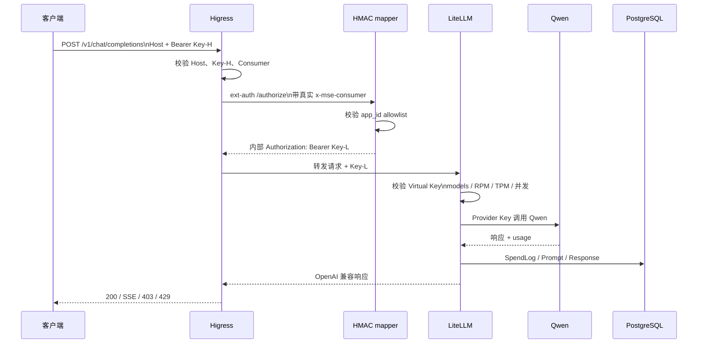
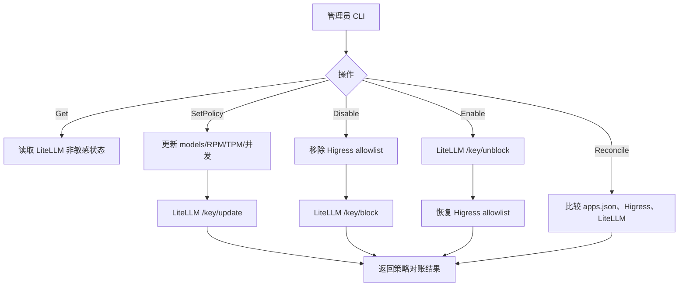
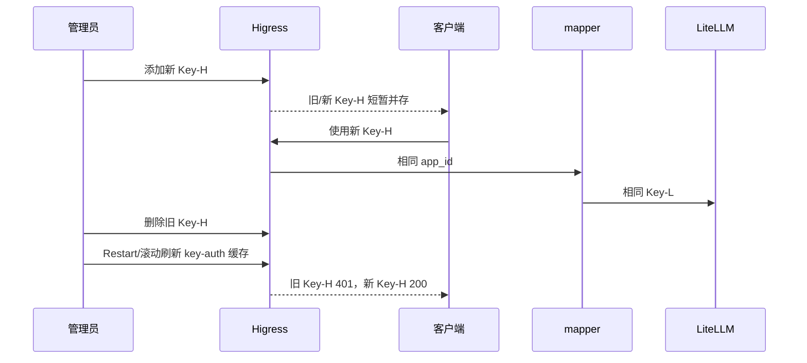
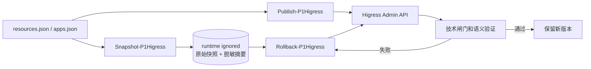

# P1 流程说明：应用治理、请求链路与运维操作

日期：2026-09-23  
环境：本地 Docker `api-gateway-p1-test`  
入口：`http://ai-gateway-p1-test.local:28080`

## 1. P1 能解决什么问题

P1 的目标不是重新实现一个 AI 网关，而是让“一个客户端应用”在现有 Higress + LiteLLM 链路上拥有独立、可治理、可回滚的运行边界。

### 已实现能力

- 一个应用对应一个 Higress Consumer 和一个 LiteLLM Virtual Key。
- 客户端只使用 Higress Key-H，不接触 LiteLLM Key-L、Master Key 或 Provider Key。
- 每个应用可独立配置模型白名单、RPM、TPM 和最大并发。
- 可执行应用创建、查询、策略更新、禁用、恢复、对账。
- 支持 Key-H 双凭证短窗口轮换和旧 Key 退休。
- 支持应用创建失败补偿回滚。
- 支持 Higress 配置快照、发布和回滚。
- LiteLLM 原生记录 Token、估算 Spend、Prompt/Response 和请求状态。
- 支持 Chat、SSE、Responses、Tools 等 OpenAI 兼容调用形态。

### P1 不解决的问题

- 组织、学院、部门、用户、SSO、OAuth、RBAC。
- 财务级计费、充值、账单、发票和第二套额度账本。
- 生产 KMS/Secret、生产 CIDR/mTLS、高可用集群。
- LiteLLM 原生 Audit 授权之外的自研审计系统。

## 2. 总体线路图

```mermaid
flowchart LR
    C[客户端 / CCSwitch\n地址 + Key-H] --> H0[Higress 入口\nHost: ai-gateway-p1-test.local]
    H0 --> T[p1-strip-client-internal\n清除伪造内部头]
    T --> K[p1-key-auth\nKey-H -> Consumer]
    K --> E[p1-ext-auth\n把真实 Consumer 交给 mapper]
    E --> M[mapper\nallowlist + HMAC(app_id)]
    M -->|Authorization: Bearer Key-L| E
    E --> P[p1-ai-proxy\n路由到 LiteLLM]
    P --> L[LiteLLM\nVirtual Key 策略]
    L --> Q[Qwen Provider\nmy-qwen3.6-27b]
    L --> S[(PostgreSQL\nSpendLogs / 请求日志)]
    L --> O[LiteLLM 管理 API\n仅本地受控管理面]
```

### 2.1 请求中各凭证的作用

| 凭证 | 谁持有 | 作用 | 是否对客户端暴露 |
|---|---|---|---|
| Key-H | 客户端、Higress | 入口认证和应用识别 | 是 |
| Key-L | mapper 派生、LiteLLM 校验 | 应用级模型/额度/用量归属 | 否 |
| LiteLLM Master Key | LiteLLM 管理面 | Virtual Key 管理和内部管理 | 否 |
| Provider Key | LiteLLM | 访问上游 Qwen | 否 |

P1 的关键点是：Key-H 和 Key-L 不是同一个值。客户端拿到 Key-H 也不能直接绕过 Higress 使用 LiteLLM。

## 3. 普通请求流程



### 3.1 不同失败点的结果

| 失败点 | 返回/行为 | 目的 |
|---|---|---|
| Host 错误 | 403 | 防止错误入口和路由绕过 |
| Key-H 错误 | 401 | Higress 入口认证失败 |
| Consumer 不在 allowlist | 403 | 应用被禁用或未登记 |
| mapper 不可用 | 403 | ext-auth fail-closed |
| 模型不在 Virtual Key allowlist | 403 | LiteLLM 模型权限拒绝 |
| RPM/TPM/并发超限 | 429 | LiteLLM 原生策略拒绝 |
| Provider 异常 | 5xx/上游错误 | 记录失败状态和请求归属 |

## 4. 应用创建流程

```mermaid
flowchart TD
    A[管理员执行 New-P1Application] --> B[校验参数和 app_id]
    B --> C[获取创建锁]
    C --> D[读取 Higress 当前资源快照]
    D --> E[按 app_id HMAC 派生 Key-L]
    E --> F{LiteLLM Key 是否存在}
    F -->|不存在| G[/key/generate\nmodels/RPM/TPM/并发]
    F -->|存在且声明一致| H[幂等检查]
    F -->|存在但声明冲突| X[拒绝并要求人工对账]
    G --> I[创建 Higress Consumer Key-H]
    I --> J[更新 apps.json 和 Higress 模板]
    J --> K[重启 mapper / 刷新 allowlist]
    K --> L[刷新 Higress key-auth 缓存]
    L --> M[真实请求验证]
    M -->|授权 200、未授权模型 403| N[提交成功]
    M -->|失败| R[执行补偿回滚]
    R --> R1[恢复 apps.json / Higress 快照]
    R1 --> R2[mapper 重启并拒绝新 app_id]
    R2 --> R3[LiteLLM /key/block Key-L]
    N --> O[Key-H 写入本机 ignored runtime]
```

### 创建后可以验证什么

1. 新应用是否真的能调用指定模型。
2. 未授权模型是否被 LiteLLM 拒绝。
3. mapper 重启后 app_id 是否仍被识别。
4. LiteLLM Virtual Key 的策略是否和应用声明一致。
5. 同一声明再次创建是否幂等，不生成第二个应用。

## 5. 应用策略和状态流程



### 禁用与恢复的安全顺序

- 禁用：先撤销 Higress Key-H，再阻断 LiteLLM Key-L。
- 恢复：先解除 LiteLLM Key-L，再恢复 Higress allowlist。
- 这样可以避免入口已放行但下游 Key-L 仍不可用，或入口仍可访问但下游已被阻断的长时间不一致。

## 6. Key-H 轮换流程



轮换只改变 Key-H，不改变同一应用的 Key-L、模型策略和 SpendLog 归属。当前本地 Higress key-auth 存在运行时缓存，因此退休旧 Key-H 必须显式重启或采用生产滚动刷新方案。

## 7. 配置快照、发布与回滚



快照内容包括 `McpBridge`、Ingress、key-auth、ext-auth、ai-proxy 和内部头清理插件。原始快照可能含 Key-H，只允许存放在 `runtime/p1-test/higress/snapshots/`，不能提交 Git。

## 8. 已验证的 P1 流程能力

| 流程 | 已验证结果 |
|---|---|
| App A/App B 正常调用 | HTTP 200 |
| 未授权模型 | HTTP 403 |
| Key-H 错误 | HTTP 401 |
| mapper 故障 | HTTP 403，失败闭合 |
| RPM/TPM/最大并发 | 200/429、TPM 429、并发 `[429,200]` |
| SSE | `text/event-stream` 和 `[DONE]` |
| Responses | HTTP 200 |
| Tools | function tool 请求 HTTP 200 |
| SpendLog | 通过 SHA-256(Key-L) 归属，正文和 usage 存在 |
| Key-H 双凭证轮换 | 窗口内新旧 Key-H 均可用 |
| Key-H 退休 | 重启刷新后旧 Key-H 401 |
| 应用创建 | 创建、回滚、持久化重启、幂等均通过 |
| Higress 配置 | 快照、发布、回滚均通过 |

## 9. 当前不能从 P1 流程得到的结论

- 不能证明生产 KMS/Secret 已部署。
- 不能证明生产 CIDR、mTLS 和真实客户端 IP 规则已批准。
- 不能证明当前本地 LiteLLM Audit 授权满足生产审计要求。
- 不能证明多副本 LiteLLM/mapper 的共享限流和高可用行为。
- 不能把 LiteLLM Spend 当作财务结算金额。
- 不能把 P1 当作组织、SSO、RBAC 或管理后台的完整实现。

## 10. 推荐操作入口

| 目标 | 脚本 |
|---|---|
| 查看应用 | `scripts/Manage-P1Application.ps1 -Action Get` |
| 更新策略 | `scripts/Manage-P1Application.ps1 -Action SetPolicy` |
| 禁用/恢复 | `scripts/Manage-P1Application.ps1 -Action Disable/Enable` |
| 对账 | `scripts/Manage-P1Application.ps1 -Action Reconcile` |
| Key-H 轮换 | `scripts/Manage-P1Application.ps1 -Action RotateKeyH` |
| Key-H 退休 | `scripts/Manage-P1Application.ps1 -Action RetireKeyH -RestartHigress` |
| 创建应用 | `scripts/New-P1Application.ps1` |
| Higress 快照 | `scripts/Snapshot-P1Higress.ps1` |
| Higress 发布 | `scripts/Publish-P1Higress.ps1` |
| Higress 回滚 | `scripts/Rollback-P1Higress.ps1` |
| 全量技术闸门 | `scripts/Run-P1TechnicalGate.ps1` |
| 协议专项矩阵 | `scripts/Test-P1ProtocolMatrix.ps1` |

## 11. 结论

P1 已把 P0 的统一 AI 入口升级为应用级原生治理链路：客户端由 Higress 认证，应用身份由 mapper 映射，模型权限、Token、RPM、TPM、并发和 Spend 由 LiteLLM 原生执行，配置由快照/发布/回滚流程管理。

本地 P1 核心流程已经具备继续进入服务器预发布的基础；生产部署前仍必须完成 Secret/KMS、CIDR/mTLS、Provider 网络和 LiteLLM Audit 授权确认。
