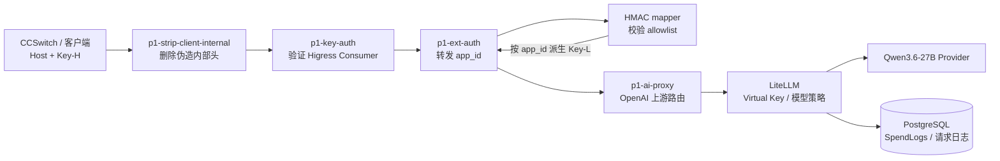
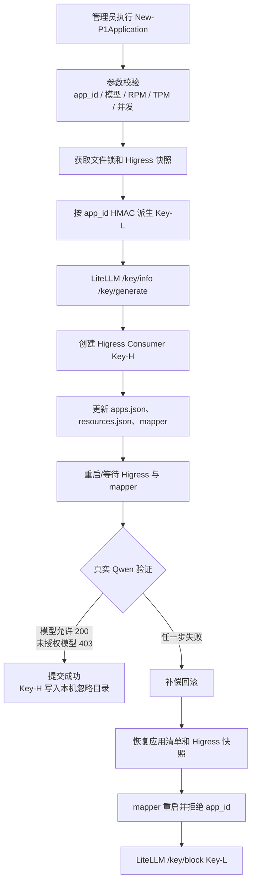
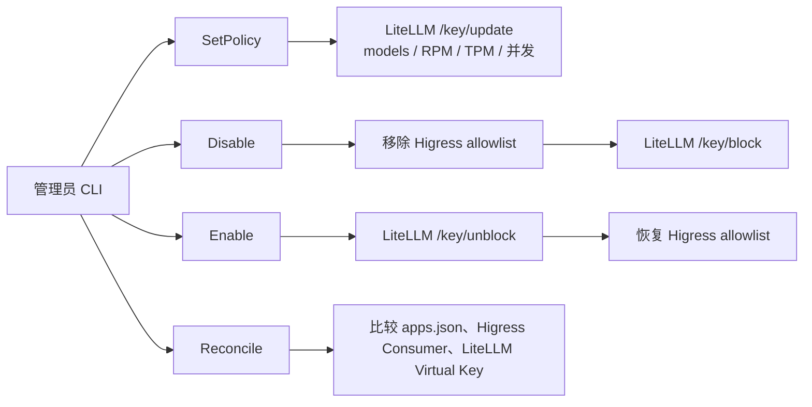
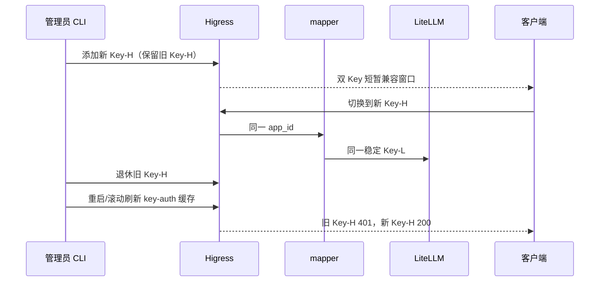

# P1 阶段技术报告（本地 Docker 验收）

> 结论：**本地 P1 核心能力验收通过，可进入服务器预发布准备；不构成生产上线批准。**
>
> 本报告覆盖 P1 应用级原生治理、应用生命周期、Key-H 轮换、LiteLLM 原生策略、SpendLog 以及 Higress 配置发布能力。生产 Secret/KMS、CIDR/mTLS、LiteLLM 原生 Audit 授权和上游网络仍须按 [P0/P1 上线前决策清单](P0上线前决策清单-2026-09-22.md) 关闭。

## 1. 基本信息

| 项目 | 值 |
|---|---|
| 项目名称 | 校园统一 AI 网关 P1 阶段 |
| 报告日期 | 2026-09-23 |
| 报告范围 | 本机 Docker 独立 P1 测试环境；未修改 P0 运行环境 |
| P1 Compose 项目 | `api-gateway-p1-test` |
| 测试域名 / 入口 | `ai-gateway-p1-test.local:28080` |
| 已验证模型 | `my-qwen3.6-27b` / 内网 Qwen3.6-27B |
| 应用数量 | App A、App B、持久化重启验证应用各一个 Higress Consumer |
| P1 网络 | `172.30.53.0/24` |
| P1 LiteLLM / mapper | 无宿主机发布端口，仅 Higress 内部访问 |
| Prompt / Response | 本地测试 PostgreSQL 记录，默认保留 7 天，不提交仓库 |
| 工作区状态 | 本报告对应实现尚未单独形成新的生产发布提交 |

## 2. P1 目标与实际边界

P1 将 P0 的“统一入口 + LiteLLM 调用”扩展为“应用级原生治理”，核心原则是复用 Higress 和 LiteLLM，不再自建第二套 Token、额度、计费和审计数据库。

| 能力 | P1 实现 | 归属组件 |
|---|---|---|
| 客户端认证 | 每个应用一个 Higress Consumer Key-H | Higress key-auth |
| 应用到 LiteLLM 身份 | 按 app_id HMAC 派生稳定 Key-L | mapper |
| 模型权限 | 每个 LiteLLM Virtual Key 的 `models` allowlist | LiteLLM |
| RPM / TPM / 并发 | 每个 Virtual Key 原生策略 | LiteLLM |
| Token / Spend | Token 统计和估算 SpendLog | LiteLLM |
| SSE / Responses / Tools | 复用 OpenAI 兼容接口和现有 Qwen callback | Higress + LiteLLM |
| Key-H 轮换 | Higress 双凭证短窗口、旧凭证退休 | Higress 管理 API + CLI |
| 应用创建 | Key-L、Consumer、allowlist、清单和验证事务 | `New-P1Application.ps1` |
| 配置发布 | 快照、发布、回滚 | Higress 原生 API + P1 脚本 |
| 组织、SSO、RBAC、财务结算 | P1 不实现 | 后续阶段 |

## 3. 实际访问链路

关键安全边界：

1. 客户端只携带 Key-H，不携带 LiteLLM Key-L、Master Key 或 Provider Key。
2. mapper 不发布宿主机端口，只接受 Higress ext-auth 的内部标记和可信 Consumer 头。
3. LiteLLM 只接收 mapper 派生的 Key-L；Higress 直接携带 LiteLLM Key、伪造 Consumer 头或错误 Host 均不能绕过链路。
4. Key-L 不写入应用清单、仓库、客户端响应或 mapper 日志；SpendLog 保存 Key Hash。

## 4. 工作包完成状态

| 工作包 | 状态 | 主要实现 | 验收结论 |
|---|---|---|---|
| P1-0 技术闸门 | PASS | `Run-P1TechnicalGate.ps1` | 认证、模型隔离、mapper 故障闭合、端口隔离和 P0 回归通过 |
| P1-1 HMAC mapper | PASS | `gateway/p1-mapper/app.py` | 3 个 HMAC v1 测试向量通过；allowlist 生效 |
| P1-2 应用治理 CLI | PASS | `Manage-P1Application.ps1` | Get、SetPolicy、Disable、Enable、Reconcile、Key-H 轮换/退休通过 |
| P1-2 应用创建 | PASS | `New-P1Application.ps1` | 真实创建、回滚、持久化重启和重复执行幂等通过 |
| P1-3 LiteLLM 原生策略 | PASS | LiteLLM Virtual Key | RPM、TPM、最大并发和模型 allowlist 通过 |
| P1-3 协议矩阵 | PASS | `Test-P1ProtocolMatrix.ps1` | SSE、Responses、Tools、SpendLog 通过 |
| P1-4 Higress 发布 | PASS | Snapshot/Publish/Rollback 脚本 | 运行时快照、发布和回滚通过 |
| P1-5 生产审计 | 待确认 | LiteLLM 原生 Audit | 本地配置已打开，但授权条件仍待生产确认 |

## 5. 应用生命周期流程

### 5.1 应用创建与提交

### 5.2 应用策略、禁用和恢复

### 5.3 Key-H 轮换

## 6. 已实现能力和验收结果

### 6.1 认证与安全隔离

| 场景 | 结果 |
|---|---|
| App A / App B 正常调用 Qwen | HTTP 200 |
| 错误 Key-H | HTTP 401 |
| 错误 Host | HTTP 403 |
| 客户端携带派生 Key-L 直达 Higress | HTTP 401 |
| 伪造 `X-Mse-Consumer` | 伪造头被忽略，仍按真实 Consumer 处理 |
| mapper 宕机 | HTTP 403，失败闭合 |
| LiteLLM 和 mapper 宿主机端口 | 无 host published port |
| P0 回归 | P0 全部 healthy，未重启 |

### 6.2 应用生命周期

| 场景 | 结果 |
|---|---|
| 创建 App C | LiteLLM Virtual Key、Higress Consumer、应用清单均生成 |
| 创建后真实模型验证 | 授权模型 HTTP 200，未授权模型 HTTP 403 |
| 重启 LiteLLM、mapper、Higress | 重启后授权模型仍 HTTP 200 |
| 重复执行同声明创建命令 | 幂等成功，不生成第二个应用 |
| 事务回滚 | 临时应用真实验证后恢复清单、Higress 和阻断 Key-L |

持久化应用：`app-3f9c7b21-6b5e-4d8a-9c31-2e7a6f5b4c10`。Key-H 明文只保存在本机被忽略的 runtime/env 文件，不写入本报告。

### 6.3 LiteLLM 原生治理与协议

| 场景 | 结果 | 证据 |
|---|---|---|
| RPM | PASS，临时 RPM=1 得到 200/429 | `Test-P1NativePolicy.ps1` |
| TPM | PASS，临时 TPM=1 返回 429 | 协议矩阵报告 |
| 最大并发 | PASS，`max_parallel_requests=1` 得到 `[429,200]` | 协议矩阵报告 |
| SSE | PASS，`text/event-stream`、`[DONE]` | 协议矩阵报告 |
| Responses | PASS，HTTP 200 | 协议矩阵报告 |
| Tools | PASS，function tool 请求 HTTP 200 | 协议矩阵报告 |
| SpendLog | PASS，`rows/messages/responses=61|61|61` | SHA-256(Key-L) 查找 |
| Spend | 估算值 | 未作为财务结算依据 |

### 6.4 Higress 配置发布和回滚

已验证资源范围：

- `McpBridge/default`
- `Ingress/p1-ai-gateway-test`
- `WasmPlugin/p1-strip-client-internal`
- `WasmPlugin/p1-key-auth`
- `WasmPlugin/p1-ext-auth`
- `WasmPlugin/p1-ai-proxy`

原始快照只写入被 Git 忽略的 `runtime/p1-test/higress/snapshots/`；摘要包含资源版本、敏感字段提示和 SHA-256，不将 Consumer 凭证提交到仓库。

## 7. 自动化证据

| 验收项 | 文件 |
|---|---|
| P1 技术闸门 | `runtime/p1-test/reports/p1-technical-gate-20260923-110219.md` |
| 协议矩阵 | `runtime/p1-test/reports/p1-protocol-matrix-20260923-104258.md` |
| 持久化应用创建 | `runtime/p1-test/reports/p1-application-create-app-3f9c7b21-6b5e-4d8a-9c31-2e7a6f5b4c10-20260923-110019.md` |
| mapper 测试 | `scripts/Test-P1Mapper.ps1`，3/3 PASS |
| Higress 快照/发布/回滚 | `scripts/Snapshot-P1Higress.ps1`、`Publish-P1Higress.ps1`、`Rollback-P1Higress.ps1` |
| LiteLLM 原生策略 | `scripts/Test-P1NativePolicy.ps1`、`Test-P1ProtocolMatrix.ps1` |

## 8. 配置和密钥边界

| 项目 | 本地 P1 实际值/策略 |
|---|---|
| 客户端凭证 | Higress Key-H |
| LiteLLM 身份 | 每应用稳定 HMAC Key-L，LiteLLM SpendLog 保存 Hash |
| Provider 凭证 | 仅 LiteLLM 容器读取 |
| HMAC 根密钥 | Docker Secret / runtime 文件，未提交 Git |
| LiteLLM Master Key | P1 环境变量，仅管理面容器内部使用 |
| 日志正文 | 本机测试数据库，默认 7 天清理 |
| 生产 Secret/KMS | 未实施，必须上线前确认 |
| 生产 CIDR/mTLS | 未实施，必须上线前确认 |

## 9. 风险、边界和未完成门禁

| 事项 | 当前结论 | 生产前要求 |
|---|---|---|
| LiteLLM 原生 Audit | 本地配置打开但受 `premium_user` 条件限制，Audit 表无有效行 | 确认生产版本/授权；若不可用，审批管理日志+快照+工单替代方案 |
| HMAC 根密钥泄露 | 理论上可推导全部应用 Key-L | 使用外部 Secret/KMS，限制 mapper 读取权限，演练全量恢复 |
| Key-H 退休缓存 | Higress key-auth 可能需要重启/滚动刷新 | 生产采用健康检查、连接摘除和滚动轮换，不直接无计划重启 |
| 多副本限流状态 | 本地仅证明单 LiteLLM 实例 | 生产确认 Redis/官方共享状态和一致性 |
| CIDR/mTLS | 本地未启用生产规则 | 运维/安全批准最小 CIDR 和 mTLS 方案并预发布验证 |
| Provider 网络归属 | 本地调用可用，不等于生产网络合规 | 目标服务器确认 DNS、路由、TLS、出口和防火墙 |
| Spend | LiteLLM 估算值 | 未确认单价前不得用于财务结算 |
| 组织、SSO、RBAC、管理后台 | P1 不实现 | 后续产品阶段建设 |

## 10. 结论与签署

- [x] P1 本地 Docker 核心链路通过。
- [x] 应用创建、失败回滚、持久化重启和幂等通过。
- [x] RPM、TPM、最大并发、SSE、Responses、Tools、SpendLog 通过。
- [x] Higress 快照、发布和回滚通过。
- [x] P0 容器保持 healthy，未被 P1 操作重启或修改。
- [ ] 生产 Secret/KMS、CIDR/mTLS、Provider 网络和 LiteLLM Audit 门禁关闭。
- [ ] 服务器预发布验收和生产上线批准。

**本地 P1 结论**：通过，可进入服务器预发布准备。

**生产结论**：未批准，待上线前决策清单中的生产门禁关闭后重新评审。

**报告日期**：2026-09-23  
**验收记录人**：自动化验收记录；人工签署人待指定
