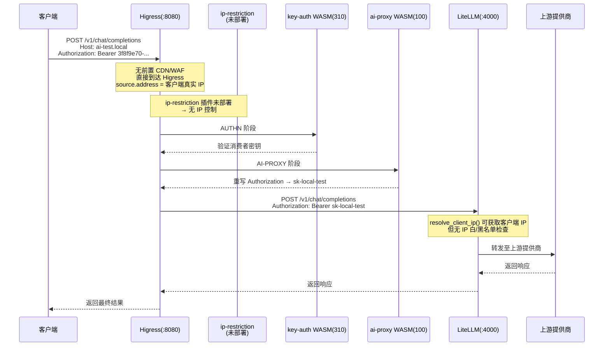
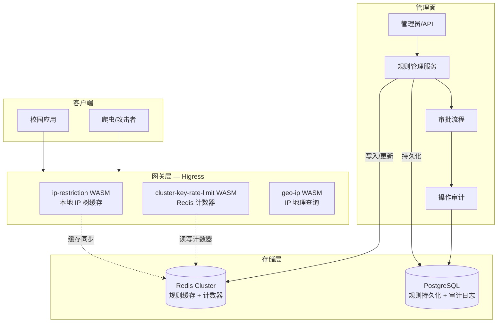

# 业界主流 IP 控制方案技术调研报告

**版本：** 1.0
**日期：** 2026-09-17
**作者：** 技术调研（基于代码审查与官方文档）
**项目：** 校园统一 AI 网关（Higress + LiteLLM 双层架构）
**状态：** 技术评审用

---

## 调研范围与假设

### 调研范围
- **对象：** API 网关（Nginx、Envoy、Kong、APISIX、Higress）、AI API 网关（LiteLLM）、云服务平台（AWS WAF/Cloudflare）、SaaS 平台、电商/支付系统
- **能力：** IP 白名单/黑名单、CIDR 控制、IP 限流、动态封禁、代理 IP 识别、地域控制、审计与解封
- **当前项目：** Higress（Envoy 数据面 + WASM 插件）作为边缘入口，LiteLLM 作为 AI 路由层，PostgreSQL 作为持久化存储，Docker Compose 部署

### 关键假设
1. 当前项目为 **Docker Compose 单机部署**（非 Kubernetes 生产集群）
2. 所有外网请求经 Higress（:8080/:8443）进入，无前置 CDN/WAF
3. 内网拓扑：`172.30.50.0/24`，Higress 直连 LiteLLM，无负载均衡器
4. 未来可能迁移至校园 K8s 集群，需考虑多节点一致性
5. 校园网络场景：大量 NAT 共享出口、校内 IP 段固定、需区分内/外网访问

### 资料来源
- Higress 源码：`sources/higress-src/plugins/`（本地代码审查）
- LiteLLM 源码：`sources/litellm-src/litellm/proxy/auth/`（本地代码审查）
- 项目配置：`docker-compose.yml`、`config/litellm.yaml`、`runtime/higress/`
- Envoy 文档：https://www.envoyproxy.io/docs/envoy/latest
- Cloudflare WAF 文档：https://developers.cloudflare.com/waf/
- AWS WAF 文档：https://docs.aws.amazon.com/waf/latest/developerguide/
- Kong 文档：https://docs.konghq.com/
- APISIX 文档：https://apisix.apache.org/

---

## 一、问题定义

### 1.1 什么是 IP 控制

IP 控制是以客户端源 IP 地址（或 IP 段）为维度的访问控制策略集合，包括但不限于：
- **准入控制：** 允许或拒绝特定 IP/网段的请求
- **限流控制：** 对特定 IP/网段的请求速率、并发数进行限制
- **风控控制：** 基于 IP 行为特征（异常频率、地域异常、代理特征）进行动态封禁
- **审计控制：** 记录 IP 相关访问日志，支持追溯和合规

### 1.2 IP 控制要解决哪些问题

| 问题 | 描述 |
|---|---|
| **未授权访问** | 阻止非授权 IP 段访问内部 API |
| **暴力破解** | 限制单 IP 请求频率，防止 API Key 爆破 |
| **资源滥用** | 防止单 IP 耗尽提供商配额（RPM/TPM） |
| **爬虫与机器人** | 识别并限制自动化工具调用 AI 模型 |
| **合规要求** | 满足校园网络审计、数据出境合规 |
| **DDoS 防护** | 快速封禁异常流量源 |
| **成本隔离** | 按 IP 维度归因成本，防止部门间资源抢占 |

### 1.3 IP 控制与认证、权限、限流、风控、WAF 的区别

| 维度 | IP 控制 | 认证 | 权限 | 限流 | 风控 | WAF |
|---|---|---|---|---|---|---|
| **判断依据** | 源 IP/CIDR | 用户凭证/Token | 角色/策略 | 请求速率/Token 数 | 行为评分 | 请求内容模式 |
| **粒度** | IP/网段级 | 用户级 | 用户+资源级 | 多维度组合 | 多维度动态 | 请求内容级 |
| **优先级** | 最早（L3-L4） | 次早（L7） | 认证后 | 认证前后均可 | 持续评估 | 请求处理中 |
| **可绕过性** | 高（代理/NAT） | 低 | 低 | 中（多 IP 轮换） | 低 | 低 |
| **误伤率** | 高（NAT 共享） | 低 | 低 | 中 | 中 | 低 |

**关键结论：** IP 控制是**第一道防线**，不能替代认证和权限，但能大幅降低认证层的压力和成本。AI API 网关场景下，IP 控制主要用于防暴力破解和防配额耗尽，而非业务授权。

### 1.4 为什么仅依赖 IP 控制通常不够

1. **代理/VPN/Tor：** 攻击者可通过代理链轻松更换 IP
2. **NAT 共享：** 校园出口 NAT 可能导致数百用户共享一个公网 IP，封禁该 IP 影响面大
3. **IPv6 普及：** 双栈环境下攻击者可切换协议栈绕过限制
4. **云 IP 段：** 合法业务流量来自云厂商 IP 段（阿里云、腾讯云），与攻击者 IP 段重叠
5. **IP 欺骗：** 源 IP 无法伪造（TCP 握手限制），但 X-Forwarded-For 头可以被伪造

### 1.5 IPv4、IPv6、代理、NAT、CDN 和负载均衡对 IP 判断的影响

| 因素 | 影响 | 应对 |
|---|---|---|
| **IPv4** | 32 位地址空间，易穷举 | 基础 CIDR 匹配 |
| **IPv6** | 128 位地址空间，临时地址常见 | 需双栈支持，IPv6 CIDR 匹配 |
| **NAT** | 多对一映射，出口 IP 共享 | 不应对 NAT IP 做黑名单，需结合认证 |
| **CDN** | 替换源 IP 为 CDN 节点 IP | 依赖真实 IP Header（X-Forwarded-For） |
| **负载均衡** | 替换源 IP 为 LB IP | 同 CDN，依赖可信 Header |
| **多级代理** | XFF 链中包含多个 IP | 按可信代理列表从右向左解析 |

---

## 二、业界主流 IP 控制模型

### 1. 静态 IP 白名单

| 控制模型 | 适用场景 | 工作原理 | 优点 | 缺点 | 常见实现位置 | 业界使用情况 | 适合当前项目吗 |
|---|---|---|---|---|---|---|---|
| 静态 IP 白名单 | 内部 API、管理后台、固定办公网络 | 请求 IP 在白名单列表中则放行，否则拒绝 | 实现简单、误杀率低（允许列表精确） | 维护成本高、不兼容动态 IP | 网关/WAF/防火墙 | 几乎所有企业 API 网关 | **适合** — 校园固定 IP 段 |

### 2. 静态 IP 黑名单

| 控制模型 | 适用场景 | 工作原理 | 优点 | 缺点 | 常见实现位置 | 业界使用情况 | 适合当前项目吗 |
|---|---|---|---|---|---|---|---|
| 静态 IP 黑名单 | 已知攻击源、恶意爬虫 | 请求 IP 在黑名单中则拒绝，其余放行 | 部署快、影响面小 | 黑名单易过时、被绕过 | 网关/WAF/防火墙 | 常见于公开 API | **部分适合** — 辅助防御 |

### 3. CIDR 网段控制

| 控制模型 | 适用场景 | 工作原理 | 优点 | 缺点 | 常见实现位置 | 业界使用情况 | 适合当前项目吗 |
|---|---|---|---|---|---|---|---|
| CIDR 网段控制 | 校园网段、企业内网、云厂商 IP 段 | 将 IP 与 CIDR 前缀匹配，支持 /8 到 /32 粒度 | 一个规则覆盖整个网段 | 粗粒度可能误伤 | 所有主流网关 | 标准能力 | **非常适合** — 校园网段管理 |

### 4. 按 API/租户/用户/应用分别配置 IP

| 控制模型 | 适用场景 | 工作原理 | 优点 | 缺点 | 常见实现位置 | 业界使用情况 | 适合当前项目吗 |
|---|---|---|---|---|---|---|---|
| 多维度 IP 策略 | 多租户 SaaS、按部门隔离 | IP 策略绑定到 API Key/租户 ID/应用 ID，不同维度独立规则 | 隔离性好、灵活 | 配置复杂 | API 网关 + 配置中心 | SaaS 平台标配 | **推荐** — 校园多部门场景 |

### 5. 全局 IP 限流

| 控制模型 | 适用场景 | 工作原理 | 优点 | 缺点 | 常见实现位置 | 业界使用情况 | 适合当前项目吗 |
|---|---|---|---|---|---|---|---|
| 全局 IP 限流 | 防 DDoS、防配额耗尽 | 对每个独立 IP 做统一速率限制（如 100 req/min） | 实现简单、防突发 | 不区分接口重要性 | CDN/WAF/网关 | 公开 API 标配 | **适合** — 外层防护 |

### 6. 单接口 IP 限流

| 控制模型 | 适用场景 | 工作原理 | 优点 | 缺点 | 常见实现位置 | 业界使用情况 | 适合当前项目吗 |
|---|---|---|---|---|---|---|---|
| 单接口 IP 限流 | 高成本接口（如 AI 补全）、敏感数据接口 | 对特定路径做 IP 级限流，不同接口不同阈值 | 精细控制 | 配置多 | API 网关路由级 | 电商/支付核心接口 | **适合** — /chat/completions 高成本 |

### 7. IP + API Key 联合控制

| 控制模型 | 适用场景 | 工作原理 | 优点 | 缺点 | 常见实现位置 | 业界使用情况 | 适合当前项目吗 |
|---|---|---|---|---|---|---|---|
| IP + API Key 联合 | AI API 网关、SaaS API | 白名单/限流规则同时绑定 IP 和 API Key，两者结合判断 | 精确控制、防 Key 泄露后被异地滥用 | 配置复杂度中等 | API 网关 + 业务层 | OpenAI/AWS/Google Cloud 标配 | **强烈推荐** — 核心方案 |

### 8. IP + 用户身份联合控制

| 控制模型 | 适用场景 | 工作原理 | 优点 | 缺点 | 常见实现位置 | 业界使用情况 | 适合当前项目吗 |
|---|---|---|---|---|---|---|---|
| IP + 用户身份联合 | 企业内部系统、校园系统 | 认证成功后结合用户身份与 IP 做二次校验 | 安全级别高 | 依赖认证系统 | 认证中心 + 网关 | 金融、政务系统 | **适合** — 校园 SSO 接入后 |

### 9. 动态封禁和自动解封

| 控制模型 | 适用场景 | 工作原理 | 优点 | 缺点 | 常见实现位置 | 业界使用情况 | 适合当前项目吗 |
|---|---|---|---|---|---|---|---|
| 动态封禁/自动解封 | 暴力破解防护、异常流量 | 超过阈值（如 100 次 401/min）自动加入临时黑名单，到时解封 | 自动化、无需人工干预 | 需调优阈值防误伤 | WAF/网关 + Redis | Cloudflare/AWS WAF 标配 | **推荐** — 防 Key 爆破 |

### 10. 基于风险评分的 IP 控制

| 控制模型 | 适用场景 | 工作原理 | 优点 | 缺点 | 常见实现位置 | 业界使用情况 | 适合当前项目吗 |
|---|---|---|---|---|---|---|---|
| 风险评分 IP 控制 | 支付系统、高安全 API | 综合 IP 来源、行为频率、地理异常、代理特征计算风险分 | 灵活、自适应 | 系统复杂、误报率需持续优化 | 风控引擎 + WAF | 支付、金融核心系统 | **暂不适合** — 一期过于复杂 |

### 11. 代理、VPN、Tor、IDC IP 识别

| 控制模型 | 适用场景 | 工作原理 | 优点 | 缺点 | 常见实现位置 | 业界使用情况 | 适合当前项目吗 |
|---|---|---|---|---|---|---|---|
| 代理 IP 识别 | 防止通过代理绕过 IP 控制 | 使用 IP 情报库（MaxMind、AbuseIPDB）识别数据中心/代理 IP | 识别能力强 | 需第三方数据源、有成本 | WAF/风控系统 | 电商、内容平台 | **可选** — 二期考虑 |

### 12. 地域、ASN、云厂商 IP 段控制

| 控制模型 | 适用场景 | 工作原理 | 优点 | 缺点 | 常见实现位置 | 业界使用情况 | 适合当前项目吗 |
|---|---|---|---|---|---|---|---|
| 地域/ASN 控制 | 仅允许国内访问、按国家限制 | IP 归属地数据库匹配国家/省份/ASN | 粗粒度但覆盖广 | 误伤跨境业务 | CDN/WAF | 政务、教育平台 | **适合** — 教育平台限定国内 |

### 13. CDN/WAF/网关多层 IP 控制

| 控制模型 | 适用场景 | 工作原理 | 优点 | 缺点 | 常见实现位置 | 业界使用情况 | 适合当前项目吗 |
|---|---|---|---|---|---|---|---|
| 多层 IP 控制 | 高安全要求系统 | CDN 层拦截已知攻击 IP → WAF 层执行动态策略 → 网关层执行业务 IP 策略 | 纵深防御、攻击面逐层收敛 | 成本高、配置一致性难 | CDN + WAF + 网关 | 大型 SaaS/电商平台 | **推荐** — 生产环境目标 |

### 14. 分布式环境下的集中式 IP 规则管理

| 控制模型 | 适用场景 | 工作原理 | 优点 | 缺点 | 常见实现位置 | 业界使用情况 | 适合当前项目吗 |
|---|---|---|---|---|---|---|---|
| 集中式 IP 规则管理 | 多节点网关集群 | 规则存储在 Redis/配置中心，各节点订阅更新，本地缓存执行 | 规则一致、实时生效 | 依赖中间件、复杂度中等 | 网关 + Redis/etcd | 中大型 K8s 集群 | **推荐** — 未来 K8s 迁移时 |

---

## 三、主流产品和开源方案对比

### 3.1 能力矩阵

| 产品/方案 | 白名单 | 黑名单 | CIDR | 限流 | 动态更新 | 分布式一致性 | 代理 IP 识别 | 审计 | 适合场景 |
|---|---|---|---|---|---|---|---|---|---|
| **Nginx** | ✅ `allow` | ✅ `deny` | ✅ | ✅ `limit_req`/`limit_conn` | 热重载 | ❌ 单机 | ❌ | ✅ 访问日志 | 传统 L7 反向代理 |
| **Envoy** | ❌ 原生不支持 | ❌ 原生不支持 | ❌ | ✅ `local_ratelimit`/`ext_proc` | ✅ xDS | ✅ xDS | ❌ | ✅ 访问日志 | 服务网格/网关数据面 |
| **Kong** | ✅ IP Restriction 插件 | ✅ | ✅ | ✅ Rate Limiting 插件 | ✅ 管理 API | ✅ DB/DB-less | ❌ | ✅ | 企业 API 网关 |
| **APISIX** | ✅ proxy-control + consumer-restriction | ✅ | ✅ | ✅ plugin: prometheus + rate-limit | ✅ Admin API | ✅ etcd | ❌ | ✅ | 云原生 API 网关 |
| **Higress** | ✅ ip-restriction WASM | ✅ | ✅ | ✅ cluster-key-rate-limit WASM | ✅ xDS | ✅ xDS（K8s） | ✅ bot-detect WASM | ✅ 访问日志 | AI 网关/服务网格 |
| **Cloudflare** | ✅ Firewall Rules | ✅ | ✅ | ✅ Rate Limiting | ✅ 实时 | ✅ 全球 | ✅ Bot Management | ✅ Logs | CDN/WAF 边缘防护 |
| **AWS WAF** | ✅ IP Sets + ACL | ✅ | ✅ | ❌（需集成其他服务） | ✅ 控制台/CLI | ✅ 全球 | ✅ AWS Managed Rules | ✅ CloudWatch | AWS 生态 API 防护 |
| **K8s Ingress** | ❌ 需注解扩展 | ❌ | ❌ | ❌ 需外部控制器 | 取决于控制器 | ✅ | ❌ | ✅ | K8s 内网路由 |
| **Redis + 自研** | ✅ 自定义 | ✅ | ✅ | ✅ 任意算法 | ✅ 自定义 | ✅ Redis 集群 | 需外部数据源 | 需自建 | 灵活定制 |
| **LiteLLM** | ❌（仅 MCP IP 过滤） | ❌ | ❌ | ✅ 按 Key/Team RPM/TPM | 配置重载 | ❌ 单机 | ❌ | ✅ SpendLog | AI 模型路由 |

### 3.2 Higress IP 相关插件详解（基于源码审查）

**来源：** `sources/higress-src/plugins/wasm-go/extensions/ip-restriction/`

#### ip-restriction 插件（IP 白名单/黑名单）

- **路径：** `plugins/wasm-go/extensions/ip-restriction/`
- **阶段：** Authentication Phase，优先级 210
- **能力：**
  - `allow` 数组：IP/CIDR 白名单
  - `deny` 数组：IP/CIDR 黑名单
  - `ip_source_type`：`origin-source`（从 Envoy `source.address` 读取）或 `header`（从自定义 Header 读取）
  - `ip_header_name`：默认 `x-forwarded-for`
  - `status`：拒绝时返回的 HTTP 状态码（默认 403）
  - `message`：拒绝时的响应体
  - 使用 `iptree.IPTree`（`github.com/zmap/go-iptree/iptables`）支持 CIDR 匹配
  - **不支持** allow 和 deny 同时生效（互斥）
  - **无** Redis 集成（纯本地执行）

#### geo-ip 插件（地理 IP 查询）

- **路径：** `plugins/wasm-go/extensions/geo-ip/`
- **阶段：** Authentication Phase，优先级 440
- **能力：**
  - 将客户端 IP 解析为国家、省份、城市、ISP
  - 注入请求属性（`geo-country`、`geo-province`、`geo-city`、`geo-isp`）
  - 注入 HTTP Header（`X-Higress-Geo-Country` 等）
  - 内嵌 `geoCidr.txt` 数据库（基于 ip2region 项目），启动时加载到内存 radix tree
  - 仅支持 IPv4（IPv6 跳过，标注为后续工作）
  - **仅查询/增强**，不提供阻断能力

#### ai-token-ratelimit 插件（AI Token 级限流）

- **路径：** `plugins/wasm-go/extensions/ai-token-ratelimit/`
- **阶段：** Default Phase，优先级 600
- **能力：**
  - 支持 `limit_by_per_ip` 维度
  - IP 来源：`from-remote-addr` 或 `from-header-<headerName>`
  - `limit_keys[].key` 支持 IP/CIDR
  - **必须** Redis 集成（Lua 脚本保证原子操作）
  - Token 级限流（input + output tokens）

#### cluster-key-rate-limit 插件（请求级限流）

- **路径：** `plugins/wasm-go/extensions/cluster-key-rate-limit/`
- **能力：**
  - 支持 `limit_by_per_ip` 维度
  - 同 ai-token-ratelimit 的 IP 解析逻辑
  - **必须** Redis 集成
  - 请求级限流（非 Token 级）

#### bot-detect 插件（机器人检测）

- **路径：** `plugins/wasm-cpp/extensions/bot_detect/`
- **能力：** 基于 User-Agent 正则匹配，**不支持 IP 过滤**

#### Envoy 内置过滤器

- `envoy.filters.http.ext_authz`：已编译入 Higress，可路由到外部授权服务
- `envoy.filters.http.local_ratelimit`：已编译入 Higress，注解 `higress.io/route-limit-rpm` 可配置，**不支持 IP 维度**（全局本地限流）

### 3.3 LiteLLM IP 相关能力（基于源码审查）

**来源：** `sources/litellm-src/litellm/proxy/auth/`

#### 可信代理与 IP 解析

| 文件 | 功能 |
|---|---|
| `trusted_proxy_utils.py` | 读取 `general_settings.trusted_proxy_ranges`，校验直接 TCP 对端是否在可信 CIDR 内，保护 Header 级认证不被伪造 |
| `network.py` | `resolve_client_ip()` — 从 XFF 右向左遍历，找到第一个非代理 IP；`resolve_network_context()` 返回 `NetworkContext(client_ip, host, via_trusted_proxy)` |
| `ip_address_utils.py` | MCP 专用 IP 工具：内网/外网分类、`mcp_trusted_proxy_ranges` 配置、`mcp_xff_num_trusted_hops` 跳数控制 |

#### LiteLLM 配置项

| 配置项 | 类型 | 说明 |
|---|---|---|
| `general_settings.trusted_proxy_ranges` | CIDR 列表 | 全局可信代理范围，启用后信任 XFF |
| `general_settings.use_x_forwarded_for` | 布尔值 | 启用 XFF Header 处理 |
| `general_settings.mcp_trusted_proxy_ranges` | CIDR 列表 | MCP 专用可信代理范围 |
| `general_settings.mcp_xff_num_trusted_hops` | 整数 | XFF 信任跳数 |
| `general_settings.mcp_internal_ip_ranges` | CIDR 列表 | 自定义内网范围 |

#### LiteLLM IP 控制局限

- **不支持** 通用 API 级别的 IP 白名单/黑名单
- **不支持** 按 IP 限流（限流维度为 API Key/Team/Model）
- **仅 MCP 服务**有 IP 过滤（内网/外网可见性控制）
- 客户端 IP 会记录在 Prometheus 指标中（`requester_ip_address` label）
- `require_trusted_proxy_request()` 可在特定场景下作为 IP 门控

---

## 四、典型请求处理流程

### 4.1 示例请求

```http
POST /v1/chat/completions HTTP/1.1
Host: api.example.com
X-Forwarded-For: 203.0.113.10
Authorization: Bearer <API_KEY>
Content-Type: application/json
```

### 4.2 各环节处理

| 步骤 | 组件 | 操作 | IP 相关 |
|---|---|---|---|
| 1 | **客户端** | 发起请求 | 真实 IP: 203.0.113.10 |
| 2 | **CDN/WAF**（如有） | 获取真实 IP，执行 IP 规则 | CDN 用真实 IP Header（如 `CF-Connecting-IP`），WAF 检查 IP 白/黑名单 |
| 3 | **负载均衡**（如有） | 转发请求，添加/更新 XFF | 追加自身 IP 到 XFF 链末端 |
| 4 | **Higress** | 域名/路径路由 | 读取 `source.address` 或 XFF 头，执行 ip-restriction 插件（如有），执行 IP 限流（如有） |
| 5 | **Higress key-auth** | 验证消费者密钥 | 无 IP 维度 |
| 6 | **LiteLLM** | 虚拟密钥验证 | 可读取客户端 IP（通过 `resolve_client_ip()`），记录在日志和 Prometheus 指标中 |
| 7 | **LiteLLM** | 模型路由 → 提供商 | 无 IP 维度 |
| 8 | **提供商** | 返回响应 | — |

### 4.3 当前项目实际流程



### 4.4 IP 被拒绝时的状态码

| 组件 | 状态码 | 响应体 |
|---|---|---|
| Higress ip-restriction | 403（可配置） | 自定义 message（默认 "Your IP address is blocked."） |
| Higress cluster-key-rate-limit | 429 | 限流响应 |
| Cloudflare WAF | 403 | WAF 拦截页 |
| AWS WAF | 403/429 | 默认拒绝页 |
| LiteLLM | 401/403 | JSON 错误信息 |

---

## 五、真实 IP 识别和安全问题

### 5.1 Header 对比

| Header | 格式 | 可信度 | 备注 |
|---|---|---|---|
| **`X-Forwarded-For`** | `client, proxy1, proxy2` | **不可直接信任** | 可被客户端伪造，需结合可信代理列表从右向左解析 |
| **`X-Real-IP`** | 单个 IP | **不可直接信任** | Nginx 添加，可被伪造 |
| **`Forwarded`** | `for=192.0.2.60;proto=http` (RFC 7239) | **不可直接信任** | 标准化格式，同样可被伪造 |
| **PROXY Protocol** | TCP 层协议（非 HTTP Header） | **可信任**（如来自可信代理） | 不经过 HTTP 层，无法由客户端伪造 |
| **CDN 自定义** | `CF-Connecting-IP`、`X-Forwarded-For` | **可信任**（CDN 写入） | Cloudflare 等 CDN 在最后一层代理写入 |

### 5.2 安全配置建议

1. **绝不直接信任 XFF**：客户端可以发送任意 `X-Forwarded-For` 值。正确做法是：
   - 确认直接 TCP 对端（`source.address`）是否在可信代理 CIDR 列表中
   - 如果是可信代理，从其追加的 XFF 值中从右向左找到第一个非代理 IP

2. **可信代理列表**：当前项目中，Higress 的 `source.address` 在 Docker Compose 环境下即为客户端真实 IP（无前置代理）。若未来部署 LB 或 CDN，需在 Higress/LiteLLM 中配置可信代理范围。

3. **LiteLLM 的 `trusted_proxy_ranges`**：当前 `config/litellm.yaml` 未配置此选项，意味着 LiteLLM 不会信任 XFF，仅使用直接 TCP 对端 IP。当前 Higress 到 LiteLLM 的 `source.address` 为 `172.30.50.3`（Higress 内网 IP），不是客户端真实 IP。**这是 IP 控制的盲区**。

4. **Higress 到 LiteLLM 的 IP 传递**：Higress 转发请求时，应确保将客户端真实 IP 通过 XFF 传递给 LiteLLM。当前未确认 ai-proxy WASM 是否保留/添加 XFF 头。

5. **内网请求 vs 外网请求**：在校园场景下，需区分：
   - 校内直连（真实 IP 为校内网段）
   - 校外通过 VPN（真实 IP 为公网）
   - 代理接入（XFF 中存在代理链）

### 5.3 NAT 共享误封风险

校园出口 NAT 可能导致成百上千师生共享一个公网 IP。对该 IP 执行：
- **黑名单/封禁：** 影响面极大，不推荐
- **限流：** 需要足够高的阈值（如 1000+ req/min），或结合 API Key 维度
- **白名单：** 对校内 NAT IP 段做白名单是安全的

---

## 六、动态 IP 控制系统设计

### 6.1 系统架构



### 6.2 数据模型设计

#### IP 规则表（PostgreSQL）

```sql
CREATE TABLE ip_rules (
    id UUID PRIMARY KEY DEFAULT gen_random_uuid(),
    name VARCHAR(255) NOT NULL,           -- 规则名称
    rule_type VARCHAR(20) NOT NULL,       -- allow / deny / rate_limit
    ip_cidr VARCHAR(45) NOT NULL,         -- IP 或 CIDR（支持 IPv4/IPv6）
    scope VARCHAR(50),                    -- global / tenant_id / api_key_id / route_path
    scope_value VARCHAR(255),             -- scope 具体值
    priority INTEGER DEFAULT 100,         -- 优先级（越小越优先）
    status VARCHAR(20) DEFAULT 'active',  -- active / inactive / expired
    reason TEXT,                          -- 封禁原因
    created_by VARCHAR(255),              -- 创建者
    created_at TIMESTAMPTZ DEFAULT NOW(),
    expires_at TIMESTAMPTZ,               -- 过期时间（NULL = 永不过期）
    auto_ban_source VARCHAR(50),          -- 自动封禁来源（如 'brute_force_detector'）
    unban_by VARCHAR(255),               -- 手动解封者
    unban_at TIMESTAMPTZ,                 -- 手动解封时间
    version INTEGER DEFAULT 1             -- 乐观锁版本号
);

CREATE INDEX idx_ip_rules_type_scope ON ip_rules(rule_type, scope, status);
CREATE INDEX idx_ip_rules_expires ON ip_rules(expires_at) WHERE expires_at IS NOT NULL;
```

#### IP 审计日志表

```sql
CREATE TABLE ip_audit_log (
    id BIGSERIAL PRIMARY KEY,
    rule_id UUID REFERENCES ip_rules(id),
    action VARCHAR(20) NOT NULL,          -- create / update / delete / auto_ban / auto_unban / manual_unban
    ip_cidr VARCHAR(45),
    operator VARCHAR(255),
    reason TEXT,
    request_ip VARCHAR(45),               -- 触发操作的客户端 IP
    created_at TIMESTAMPTZ DEFAULT NOW()
);
```

### 6.3 API 设计

```yaml
# IP 规则管理 API
POST /admin/ip-rules          -- 创建规则
GET /admin/ip-rules           -- 列出规则（分页、过滤）
GET /admin/ip-rules/{id}      -- 获取规则详情
PUT /admin/ip-rules/{id}      -- 更新规则
DELETE /admin/ip-rules/{id}   -- 删除规则
POST /admin/ip-rules/{id}/approve   -- 审批规则
POST /admin/ip-rules/{id}/unban     -- 手动解封
POST /admin/ip-rules/batch         -- 批量操作

# 自动封禁相关
GET /admin/ip-bans/active        -- 查看活跃封禁
POST /admin/ip-bans/{id}/unban    -- 解除自动封禁

# 审计
GET /admin/ip-audit-log           -- 审计日志查询
```

### 6.4 规则匹配伪代码

```python
def evaluate_ip_rule(client_ip: str, context: RequestContext) -> RuleResult:
    """
    规则匹配逻辑：
    1. 加载缓存中的规则列表（Redis Hash）
    2. 按优先级排序
    3. 匹配 scope（global → route → tenant → api_key）
    4. 返回第一个命中的规则
    """
    rules = load_rules_from_cache(context)  # Redis GET

    # 按优先级排序
    rules.sort(key=lambda r: r.priority)

    for rule in rules:
        if not is_active(rule):
            continue

        if not matches_scope(rule, context):
            continue

        if ip_in_cidr(client_ip, rule.ip_cidr):
            if rule.rule_type == "allow":
                return RuleResult(ALLOW, rule)
            elif rule.rule_type == "deny":
                return RuleResult(DENY, rule)
            elif rule.rule_type == "rate_limit":
                return check_rate_limit(client_ip, rule)

    return RuleResult(ALLOW, None)  # 默认放行
```

### 6.5 Redis Key 设计

```
# 规则缓存（Hash，按 scope 分片）
ip:rules:global          → Hash {rule_id: json_rule}
ip:rules:route:{path}    → Hash {rule_id: json_rule}
ip:rules:tenant:{tid}    → Hash {rule_id: json_rule}
ip:rules:key:{key_hash}  → Hash {rule_id: json_rule}

# 限流计数器（按 IP + 维度）
ip:rate:{route}:{ip_hash}:min  → INCR + EXPIRE 60s
ip:rate:{route}:{ip_hash}:hour → INCR + EXPIRE 3600s

# 自动封禁（Set + TTL）
ip:ban:active             → Set {ip_cidr}
ip:ban:reason:{ip_hash}   → String reason_json + TTL

# 规则版本号（用于缓存失效）
ip:rules:version:global   → INCR（每次规则变更 +1）
```

### 6.6 关键日志和指标

| 类型 | 名称 | 说明 |
|---|---|---|
| **日志** | `ip_rule_hit` | 规则命中日志（IP、规则 ID、action、scope） |
| **日志** | `ip_rule_miss` | 未命中日志（采样记录） |
| **日志** | `ip_auto_ban` | 自动封禁事件 |
| **日志** | `ip_manual_unban` | 手动解封事件 |
| **指标** | `ip_rule_allow_total` | 白名单放行计数 |
| **指标** | `ip_rule_deny_total` | 黑名单拒绝计数 |
| **指标** | `ip_rate_limit_total` | 限流拒绝计数 |
| **指标** | `ip_auto_ban_total` | 自动封禁计数 |
| **指标** | `ip_cache_miss_total` | 规则缓存未命中（触发 DB 回源） |

### 6.7 异常处理

| 场景 | 策略 |
|---|---|
| Redis 不可用 | 回退到本地缓存（最后已知规则），限流功能降级为本地模式 |
| PostgreSQL 不可用 | 规则更新失败，审计日志异步重试 |
| 规则冲突 | 优先级高的规则优先；同优先级按 scope 粒度（越细越优先） |
| CIDR 解析失败 | 拒绝该规则（FAIL_CLOSE），记录错误日志 |
| IP 树内存溢出 | 限制规则数量（如最大 10000 条 CIDR），超出时告警 |
| 紧急封禁 | 绕过审批流程，直接写入 Redis + 异步通知 |

---

## 七、限流与封禁策略

### 7.1 策略对比

| 策略 | 原理 | 优点 | 缺点 | 适用场景 | AI API 网关推荐 |
|---|---|---|---|---|---|
| **固定窗口** | 按时间窗口（如每分钟）计数 | 实现简单 | 窗口边界突刺 | 基础限流 | ❌ |
| **滑动窗口** | 按时间戳排序，滚动计算 | 平滑、精确 | 内存占用高 | 精确限流 | ⚠️ 中等 |
| **令牌桶** | 固定速率生成令牌，请求消耗 | 允许突发、实现简单 | 突发可能超限 | API 网关 | ✅ **推荐** |
| **漏桶** | 固定速率流出 | 强制平滑 | 不允许任何突发 | 流控 | ⚠️ SSE 流式不适用 |
| **并发数限制** | 限制同时进行的请求数 | 保护后端资源 | 不控制请求速率 | 连接池保护 | ✅ 辅助 |
| **短期封禁** | 触发阈值后临时封禁（分钟级） | 自动防御 | 误伤 NAT 用户 | 暴力破解防护 | ✅ |
| **长期封禁** | 人工确认后的持久封禁（天级+） | 安全级别高 | 需要管理流程 | 恶意攻击 | ✅ 人工 |
| **分级惩罚** | 按违规次数递增封禁时长 | 渐进式、公平 | 实现复杂 | 综合防护 | ⚠️ 二期 |
| **IP + API Key 双维度** | 同时对 IP 和 Key 做独立限流 | 防 Key 泄露 + 防 IP 滥用 | 配置复杂度 | AI API 核心 | ✅ **强烈推荐** |
| **多维度限流** | IP + 用户 + 接口组合 | 最精细 | 配置最复杂 | 大型平台 | ⚠️ 后期 |

### 7.2 AI API 网关推荐方案

```
第一层（Higress）：IP + 全局防突发
  ├── 白名单放行（校园 IP 段 /8 /16 /24）
  ├── 黑名单拒绝（已知攻击源）
  ├── 全局 IP 限流：100 req/min/IP（令牌桶，Redis）
  └── 自动封禁：>500 次 401/min → 封禁 30 分钟

第二层（LiteLLM）：API Key + 业务配额
  ├── 虚拟 Key 验证
  ├── RPM/TPM 配额（按 Key/Team）
  └── 预算控制
```

---

## 八、当前项目适配分析

### 8.1 逐项检查

| 检查项 | 当前状态 | 证据文件 | 风险 | 建议 |
|---|---|---|---|---|
| Higress 是否已配置 IP 白名单/黑名单 | **未配置** | `runtime/higress/wasmplugins/` 仅有 key-auth、ai-proxy、ai-statistics | 无 IP 防护，任何 IP 可访问 | 部署 ip-restriction WASM 插件 |
| Higress 是否支持 IP 控制插件 | **支持** | `sources/higress-src/plugins/wasm-go/extensions/ip-restriction/` | 能力就绪但未启用 | 创建 WasmPlugin YAML 并关联 Ingress |
| LiteLLM 是否已有 IP 限流/访问控制 | **无通用 IP 控制** | `sources/litellm-src/litellm/proxy/auth/` 仅 MCP IP 过滤 | 无法在 LiteLLM 层做 IP 策略 | 在 Higress 层实现，非 LiteLLM 职责 |
| 当前是否使用 Redis | **未部署** | `docker-compose.yml` 无 Redis 服务，`higress-config.yaml` 中 Redis 地址为占位符 | 无法使用 Redis 级 IP 限流 | 先部署 Redis，或使用本地模式 |
| Docker Compose 是否包含配置中心 | **无** | 无 Redis、etcd、或配置管理服务 | 规则无法动态更新 | 添加 Redis 容器作为规则存储 |
| 当前请求入口的真实 IP 获取 | **直接获取** | Docker Compose 无前置代理，Higress `source.address` 为客户端真实 IP | 当前可行，部署 LB 后需调整 | 配置可信代理范围 |
| 当前日志是否记录客户端 IP | **部分记录** | `higress-config.yaml` 访问日志格式包含 `downstream_remote_address` 和 `x_forwarded_for` | 可追溯但无结构化分析 | 现有日志格式足够 |
| 当前是否有动态规则更新 | **无** | 无规则管理服务、无 Redis | 规则变更需重启或手动 | 一期用文件+热重载，二期用 Redis |
| 是否存在绕过 IP 控制的路径 | **存在** | 端口 4000（LiteLLM）绑定 0.0.0.0，可从宿主机直接访问 | 绕过 Higress 入口 | 将 LiteLLM 端口绑定 127.0.0.1 或 172.30.50.2 |
| 应该在哪一层实现 IP 控制 | **Higress 层** | 架构文档明确 Higress 为边缘入口 | LiteLLM 不适合 | 见第九节方案推荐 |

### 8.2 关键风险

1. **LiteLLM 端口暴露**：`docker-compose.yml` 中 `ports: "4000:4000"` 绑定 `0.0.0.0`，绕过 Higress 直接访问 LiteLLM
2. **Higress 端口暴露**：`8080`、`8443`、`8001` 均绑定 `0.0.0.0`
3. **路径 A 无认证**：`default` Ingress 的 key-auth 已禁用
4. **无速率限制**：Higress 和 LiteLLM 均未配置限流
5. **无 Redis**：无法使用 Higress 的 Redis 级 IP 限流插件
6. **IP 传递问题**：Higress → LiteLLM 间 XFF 传递未确认

---

## 九、方案推荐

### 9.1 方案一：最小可用方案（MVP）

**目标：** 最快速度实现基础 IP 控制，满足校园封闭网络需求。

| 维度 | 说明 |
|---|---|
| **架构组成** | Higress ip-restriction WASM 插件（本地模式） |
| **规则存储** | 硬编码在 WasmPlugin YAML 配置中 |
| **请求处理位置** | Higress 边缘层（ip-restriction 插件，AUTHN Phase） |
| **规则更新方式** | 修改 YAML → Higress 自动 xDS 热重载 |
| **性能影响** | 微秒级（iptree 内存查找） |
| **运维复杂度** | 低（编辑 YAML 文件） |
| **故障模式** | 规则文件错误 → 插件不生效（FAIL_OPEN） |
| **实施工作量** | 1-2 小时 |
| **适用条件** | 校园封闭网络、少量固定 IP 段 |
| **迁移路径** | 可平滑升级至方案二 |

**配置示例：**

```yaml
# runtime/higress/wasmplugins/ip-restriction.internal.yaml
apiVersion: extensions.higress.io/v1alpha1
kind: WasmPlugin
metadata:
  name: ip-restriction.internal
  namespace: higress-system
spec:
  defaultConfig:
    ip_source_type: origin-source
    allow:
      - "10.0.0.0/8"
      - "172.16.0.0/12"
      - "192.168.0.0/16"
      - "127.0.0.1/32"
    status: 403
    message: "Your IP is not in the allowed range."
  defaultConfigDisable: false
  failStrategy: FAIL_CLOSE
  phase: AUTHN
  priority: 200
```

### 9.2 方案二：推荐生产方案

**目标：** 支持动态规则管理、分布式限流、审计日志。

| 维度 | 说明 |
|---|---|
| **架构组成** | Higress ip-restriction + cluster-key-rate-limit WASM + Redis + PostgreSQL |
| **规则存储** | PostgreSQL 持久化 + Redis 缓存 |
| **请求处理位置** | Higress 边缘层（IP 控制） + LiteLLM（API Key 维度） |
| **规则更新方式** | 管理 API → 写 PostgreSQL + 更新 Redis（实时生效） |
| **性能影响** | 微秒级（iptree）+ Redis 延迟（<1ms） |
| **运维复杂度** | 中等（需维护 Redis + 规则管理服务） |
| **故障模式** | Redis 故障 → 回退到本地缓存 | PostgreSQL 故障 → 规则更新失败，缓存仍可用 |
| **实施工作量** | 1-2 周 |
| **适用条件** | 校园正式运行环境、多部门接入 |
| **迁移路径** | 从方案一平滑升级（添加 Redis 和管理 API） |

**架构：**
```
客户端 → Higress(ip-restriction: 白名单/CIDR)
       → Higress(cluster-key-rate-limit: IP 限流, Redis)
       → Higress(key-auth: 消费者认证)
       → LiteLLM(API Key 配额, RPM/TPM)
       → 上游提供商
```

### 9.3 方案三：高并发和多集群方案

**目标：** 支持 K8s 集群部署、多可用区、大规模并发。

| 维度 | 说明 |
|---|---|
| **架构组成** | Higress K8s 集群 + Redis Cluster + 规则管理服务 + geo-ip 插件 + bot-detect |
| **规则存储** | Redis Cluster + etcd（K8s ConfigMap/CRD） |
| **请求处理位置** | CDN/WAF（如 Cloudflare）→ Higress 集群 → LiteLLM 集群 |
| **规则更新方式** | CRD 自定义资源 → 控制器同步到 Redis |
| **性能影响** | 微秒级本地 + Redis Cluster <2ms |
| **运维复杂度** | 高（需 K8s 运维能力） |
| **故障模式** | 单节点故障无影响，Redis 分区可用 |
| **实施工作量** | 1 个月+ |
| **适用条件** | 全校级别服务、跨省多集群 |
| **迁移路径** | Docker → K8s 迁移时升级 |

---

## 十、实施计划

| 阶段 | 任务 | 涉及组件 | 前置条件 | 交付物 | 验收标准 |
|---|---|---|---|---|---|
| **P0** | 修复真实 IP 识别 | Higress ai-proxy, LiteLLM trusted_proxy_ranges | 当前架构 | XFF 传递确认文档 | 客户端 IP 正确传递至 LiteLLM |
| **P0** | 基础 IP 白名单 | Higress ip-restriction WASM | Higress 源码 | WasmPlugin YAML | 非白名单 IP 返回 403 |
| **P0** | 修复 LiteLLM 端口暴露 | docker-compose.yml | — | 更新后的 Compose | LiteLLM :4000 仅内网可达 |
| **P1** | CIDR 网段支持 | Higress ip-restriction | P0 白名单 | 校园 IP 段配置 | 校园网段 CIDR 正确放行 |
| **P1** | IP + API Key 联合限流 | Higress cluster-key-rate-limit, Redis | Redis 部署 | 限流规则 YAML | 超限 IP 返回 429 |
| **P1** | Redis 规则存储 | Redis, docker-compose | — | Redis 容器 + 规则表 | 规则可动态更新 |
| **P2** | 动态规则更新 | 规则管理 API, PostgreSQL | Redis | 管理 API + 前端 | 规则实时生效 |
| **P2** | 审计日志 | PostgreSQL ip_audit_log | 规则管理 API | 审计日志表 | 所有操作可追溯 |
| **P2** | 监控指标 | Prometheus, Grafana | 现有监控 | IP 控制面板 | 可可视化 IP 拒绝/放行 |
| **P3** | 自动封禁/解封 | 规则管理服务, Redis TTL | 规则管理 API | 自动封禁规则 | >500 次 401/min 自动封禁 30 分钟 |
| **P3** | 地域 IP 控制 | Higress geo-ip WASM | — | geo-ip 插件配置 | 可按国家/省份过滤 |
| **P3** | 代理 IP 识别 | 第三方 IP 情报库 | — | bot-detect + IP 库 | 可识别数据中心 IP |
| **P3** | 集成测试 | test/ | 以上 | 测试用例 | 覆盖白名单/黑名单/CIDR/限流 |
| **P3** | 压力测试 | k6 | 以上 | 压测报告 | IP 控制下性能降级 <10% |

---

## 十一、结论

### 11.1 业界最常见的 IP 控制架构是什么？

**CDN/WAF → API 网关 → 业务层** 三层架构是业界最普遍的 IP 控制模式：
- **CDN/WAF 层**（Cloudflare/AWS WAF）：执行全局 IP 黑名单、地域封锁、机器人检测，利用全球 IP 情报库
- **API 网关层**（Kong/APISIX/Higress）：执行业务 IP 白名单、IP 限流、IP + API Key 联合控制
- **业务层**：执行用户级 IP 绑定、细粒度风控评分

对于无 CDN 的场景（如内网系统），**API 网关 → 业务层** 两层模式即可。

### 11.2 哪些控制应该放在 CDN/WAF？

- 全球黑名单（已知恶意 IP、Tor 出口节点）
- 地域封锁（按国家/省份）
- 机器人/爬虫检测
- DDoS 级防护（Gbps 级清洗）
- IP 级频率限制（防扫描）

**当前项目无 CDN/WAF 层**，这些能力由 Higress 承担。

### 11.3 哪些控制应该放在 Higress？

- **IP 白名单/黑名单**（ip-restriction WASM 插件）
- **IP 级限流**（cluster-key-rate-limit WASM 插件 + Redis）
- **IP + API Key 联合控制**
- **地域 IP 过滤**（geo-ip WASM + 阻断逻辑）
- **自动封禁**（基于 401/429 频率）
- **真实 IP 解析**（可信代理列表）

### 11.4 LiteLLM 是否应该负责 IP 控制？为什么？

**不应该。** 原因：
1. **职责分离：** LiteLLM 的核心能力是模型路由、协议适配、虚拟密钥管理和 Token 记账。IP 控制属于网络层安全，应由网关承担。
2. **技术局限：** LiteLLM 无通用 IP 白/黑名单能力，仅 MCP 服务有 IP 过滤。
3. **IP 可见性：** LiteLLM 在 Higress 之后，看到的是 Higress 的内网 IP（172.30.50.3），而非客户端真实 IP。
4. **性能：** LiteLLM 是 Python 进程，IP 控制应在 C++/WASM 层面（Higress/Envoy）执行以获得低延迟。

LiteLLM 应负责的维度：**API Key 配额、用户/团队 RPM/TPM、模型级访问权限**。

### 11.5 当前项目最适合采用哪种方案？

**方案一（MVP）作为起步，向方案二过渡。** 理由：
- 当前为 Docker Compose 单机部署
- 校园封闭网络，IP 段相对固定
- 无前置 CDN/WAF，Higress 即第一道防线
- Higress ip-restriction 插件就绪，部署成本低

### 11.6 当前项目已经具备哪些基础？

| 能力 | 状态 | 说明 |
|---|---|---|
| Higress ip-restriction 插件源码 | ✅ 就绪 | WASM 插件可用，无需编译 |
| Higress WASM 插件机制 | ✅ 就绪 | 已有 key-auth/ai-proxy 部署经验 |
| 访问日志含客户端 IP | ✅ 就绪 | `downstream_remote_address` 和 `x_forwarded_for` |
| 可信代理 IP 解析 | ✅ 就绪 | LiteLLM `resolve_client_ip()` 支持 |
| Prometheus 监控 | ✅ 就绪 | 可扩展 IP 相关指标 |
| PostgreSQL 存储 | ✅ 就绪 | 可扩展 ip_rules 表 |
| CIDR 匹配能力 | ✅ 就绪 | iptree 库支持 |

### 11.7 当前最缺少的 3-5 项能力

1. **IP 白名单/黑名单执行** — 插件未部署，任何 IP 可访问
2. **Redis 服务** — 无分布式规则存储和 IP 限流能力
3. **真实 IP 传递** — Higress → LiteLLM 的 XFF 传递未确认
4. **动态规则更新** — 无管理 API，规则变更需手动改 YAML
5. **审计日志** — 无 IP 操作审计表

### 11.8 下一步最应该先实现什么？

**优先级排序：**

1. **修复安全漏洞**（P0）
   - 将 LiteLLM 端口绑定 `127.0.0.1:4000` 或内网 IP
   - 将 Higress 控制台端口 8001 绑定 `127.0.0.1`
2. **部署 ip-restriction 插件**（P0）
   - 创建 `runtime/higress/wasmplugins/ip-restriction.internal.yaml`
   - 配置校园 IP 段白名单
3. **确认 XFF 传递**（P0）
   - 验证 Higress 是否将客户端 IP 传递给 LiteLLM
   - 在 LiteLLM 配置中添加 `trusted_proxy_ranges`
4. **部署 Redis**（P1）
   - 添加 Redis 容器到 `docker-compose.yml`
   - 配置 Higress 限流插件使用 Redis
5. **配置 IP 限流**（P1）
   - 使用 cluster-key-rate-limit 插件
   - 设置合理的 IP 级限流阈值

---

## 附录 A：Higress IP 相关插件清单

| 插件 | 路径 | IP 白/黑名单 | CIDR | Redis | IP 限流 | 地理查询 |
|---|---|---|---|---|---|---|
| **ip-restriction** | `wasm-go/extensions/ip-restriction/` | ✅ | ✅ | ❌ | ❌ | ❌ |
| **geo-ip** | `wasm-go/extensions/geo-ip/` | ❌（仅查询） | ✅（内部） | ❌ | ❌ | ✅ |
| **bot-detect** | `wasm-cpp/extensions/bot_detect/` | ❌ | ❌ | ❌ | ❌ | ❌ |
| **ai-token-ratelimit** | `wasm-go/extensions/ai-token-ratelimit/` | ❌ | ✅（per-ip） | ✅ | ✅（Token 级） | ❌ |
| **cluster-key-rate-limit** | `wasm-go/extensions/cluster-key-rate-limit/` | ❌ | ✅（per-ip） | ✅ | ✅（请求级） | ❌ |
| **key_rate_limit** | `wasm-cpp/extensions/key_rate_limit/` | ❌ | ❌ | ❌ | ❌（仅 header/param） | ❌ |
| **Envoy local_ratelimit** | 内置过滤器 | ❌ | ❌ | ❌ | ❌（全局本地） | ❌ |
| **Envoy ext_authz** | 内置过滤器 | 取决于外部服务 | 取决于外部服务 | 取决于外部服务 | 取决于外部服务 | 取决于外部服务 |

## 附录 B：当前项目 IP 控制现状速查

| 维度 | 现状 |
|---|---|
| IP 白名单 | ❌ 未部署 |
| IP 黑名单 | ❌ 未部署 |
| CIDR 控制 | ❌ 未部署 |
| IP 限流 | ❌ 未部署 |
| 动态封禁 | ❌ 未部署 |
| 审计日志 | ❌ 未部署 |
| 真实 IP 解析 | ⚠️ 部分支持（Higress 直接获取，LiteLLM 依赖 XFF） |
| 代理 IP 识别 | ❌ 未部署 |
| 地域控制 | ❌ 未部署 |
| Redis 规则存储 | ❌ 未部署 |
| 规则热更新 | ⚠️ YAML 热重载（Higress xDS），但无 IP 规则 |

---

*本报告基于 2026-09-17 的代码审查和文档调研生成。所有代码路径相对于项目根目录 `d:\zhilin\API网关\`。*