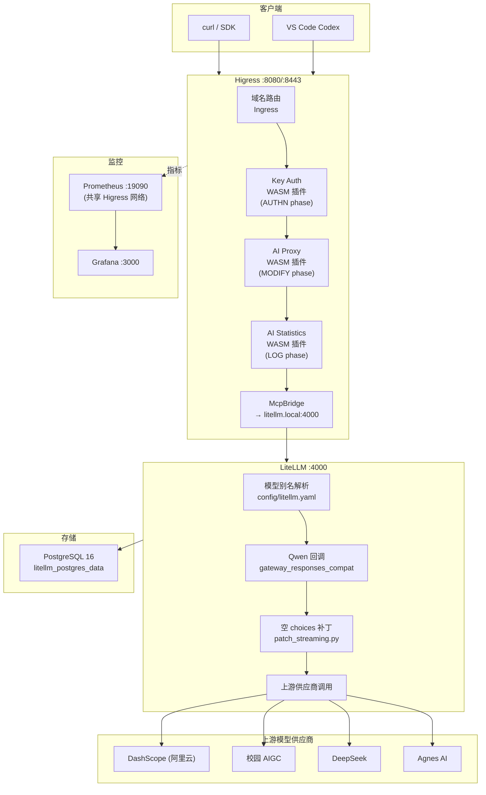
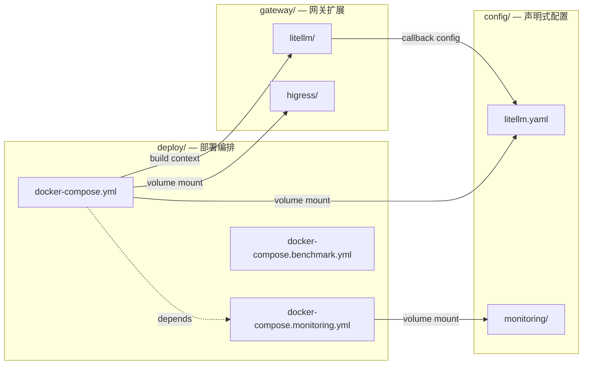

# 架构整理方案

> 基于当前仓库代码、配置和可核查证据的只读分析。
> 不移动、删除、修改任何文件。

---

## 一、现状概览

### 1.1 本项目真正维护的代码

| 类别 | 文件/目录 | 说明 |
|---|---|---|
| **部署编排** | `docker-compose.yml` | 主环境 (db → litellm → higress) |
| | `docker-compose.monitoring.yml` | 监控 (Prometheus + Grafana) |
| | `docker-compose.benchmark.yml` | 隔离压测 |
| **模型配置** | `config/litellm.yaml` | 7个模型别名+上游+回调注册 |
| **补丁构建** | `config/litellm-patch/Dockerfile` | 自定义 LiteLLM 镜像构建 |
| | `config/litellm-patch/patch_streaming.py` | 流式空 choices 补丁(3处防御) |
| | `config/litellm-patch/gateway_responses_compat.py` | Qwen 指令合并回调 |
| | `config/litellm-patch/test_empty_choices.py` | 6个流式回归测试 |
| | `config/litellm-patch/test_gateway_responses_compat.py` | 7个回调回归测试 |
| | `config/litellm-patch/compose.rollback.yml` | 回滚 Compose 覆盖 |
| **监控配置** | `config/monitoring/prometheus.yml` | Prometheus 采集规则 |
| | `config/monitoring/provisioning/` | Grafana 数据源+仪表盘自动配置 |
| | `config/monitoring/dashboards/` | Grafana 仪表盘 JSON |
| **功能测试** | `test/test_*.py` | 鉴权、模型能力、路由、韧性(8个脚本) |
| **压测** | `test/benchmark/` | mock服务、init脚本、k6、litellm配置 |
| **文档** | `doc/*.md` | 13个架构/验证/需求文档 |

### 1.2 上游项目 (非本项目维护)

| 上游 | 本地路径 | 文件数 | Git 状态 |
|---|---|---|---|
| Higress | `sources/higress-src/` | 13,715+ | shallow clone, commit `dc09993`, 无本地改动(除 `__pycache__/`) |
| LiteLLM | `sources/litellm-src/` | 11,066+ | shallow clone, commit `47b15ff` (`litellm_internal_staging`), 无本地改动 |

**关键结论**: 两个 `sources/` 是浅层 Git clone,仅供**参考查阅**,不参与任何构建或部署。实际运行通过 Docker 镜像启动。

### 1.3 版本对应关系

```
Dockerfile 基础镜像: docker.litellm.ai/berriai/litellm@sha256:c8756e7b9a61...
sources/litellm-src/ commit: 47b15ff (litellm_internal_staging)
──────────────────────────────────────────────────────────────────────
  镜像 digest c8756e 与 sources/ 的 47b15ff commit 是否对应同一版本无法确认。
  sources/是 shallow clone,无法追溯完整历史。
  补丁的 EXPECTED_SHA256 锚定的是特定源码文件内容,是实际生效的校验。

Higress 运行镜像: higress-registry.cn-hangzhou.cr.aliyuncs.com/higress/all-in-one:latest
sources/higress-src/ commit: dc09993 (main)
──────────────────────────────────────────────────────────────────────
  运行镜像打的是 `latest` 标签,非版本锁定。
  sources/是 shallow clone at main 分支,无法确认与 latest 镜像版本对应。
```

---

## 二、当前结构问题 (及具体证据)

### 问题 1: `sources/` 体积巨大但仅用作参考

- `sources/higress-src/`: 13,715+ 文件 (shallow clone, pack ~数百MB)
- `sources/litellm-src/`: 11,066+ 文件 (shallow clone, pack ~数百MB)
- 不参与任何构建: Dockerfile 的基础镜像来自远程 registry,不是本地 buildx
- `sources/higress-src/` 有 `plugins/wasm-go/extensions/ai-search/prompts/__pycache__/` 未追踪的缓存文件
- **没有 `.gitmodules`** — 不是 Git 子模块,是手动 clone 后放在 sources/ 下的
- 占用大量磁盘空间,与部署链路无关

### 问题 2: `config/litellm-patch/` 职责混杂

该目录包含:
- Python 补丁逻辑 (`patch_streaming.py`)
- Python 回调 (`gateway_responses_compat.py`)
- Python 测试 (`test_empty_choices.py`, `test_gateway_responses_compat.py`)
- Dockerfile (镜像构建)
- Compose 回滚 (`compose.rollback.yml`)
- README (说明文档)
- `__pycache__/` (本地运行缓存)

所有这些东西混在一个目录中。测试文件和本地 `__pycache__/` 未被 `.gitignore` 排除。

### 问题 3: `runtime/` 整体被 `.gitignore` 忽略,但包含可复建的配置模板

`runtime/higress/` 中的关键文件:
- `ingresses/litellm-proxy.yaml` — 核心路由: `/v1` → `litellm.local:8080` (通过 Higress McpBridge)
- `wasmplugins/key-auth.internal.yaml` — Key 鉴权插件配置 (含 `test-client` 凭据)
- `wasmplugins/ai-proxy.internal.yaml` — AI 代理插件配置 (流式、重试、超时)
- `wasmplugins/ai-statistics-2.0.1.yaml` — AI 统计插件
- `configmaps/ai-route-litellm-ai-test.yaml` — 域名字典
- `configmaps/domain-ai-test.local.yaml` — 域名路由

这些是**声明式配置**,可以在干净环境中复建,但:
- Higress 控制台也会生成内部配置 (`.console-used` 标记、`higress-console.yaml` 等)
- `runtime/gateway-checks/` 包含 10个 JSON 检查报告,是运行时输出
- `runtime/*.py` 和 `runtime/*.bin` 是临时探测/抓包脚本和二进制数据

### 问题 4: 测试分散、缺乏统一入口

- `config/litellm-patch/` 下: 补丁回归测试(在 Docker 构建内运行)
- `test/` 下: 功能/集成测试(8个 Python 脚本 + `test_responses_patch_live.py`)
- `test/benchmark/` 下: 压测 mock 服务的单元测试 (`.test.mjs`)
- 没有 `Makefile` 或统一测试脚本,需要逐个记忆命令
- `test_responses_patch_live.py` 调用真实上游(可能产生费用),但没有明确标识

### 问题 5: Higress 配置在干净环境中无法恢复

`runtime/` 被 Git 忽略,新 clone 的仓库没有 Higress 的路由配置。虽然 Higress 容器可以通过控制台创建,但:
- 路由规则、插件配置、WASM 插件都需要手动配置
- `docker-compose.benchmark.yml` 中的 `init` 服务可以初始化压测环境,但主环境没有对应的初始化流程

### 问题 6: 文档与代码状态的对应关系不清晰

`doc/` 下有 13 个文档,部分标注日期 (2026-09-16/17),部分无版本信息。历史结论需要重新核实,当前代码是权威来源。

---

## 三、请求处理链路

```
客户端 (curl / SDK / VS Code Codex)
    │
    │  HTTP(S)
    ▼
┌─────────────────────────────────────────────┐
│ Higress :8080 (HTTP) / :8443 (HTTPS)        │
│                                              │
│  1. 域名路由: ai-test.local → McpBridge      │
│     (ingresses/ai-route-litellm-ai-test.yaml)│
│  2. Key Auth 插件 (AUTHN phase, priority 310)│
│     - Header: Authorization: Bearer <key>    │
│     - 匹配 test-client 凭据                   │
│     (wasmplugins/key-auth.internal.yaml)     │
│  3. AI Proxy 插件 (MODIFY phase)             │
│     - 流式配置、重试策略、超时                 │
│     (wasmplugins/ai-proxy.internal.yaml)     │
│  4. AI Statistics 插件 (LOG phase)           │
│     - 请求统计                                 │
│     (wasmplugins/ai-statistics-2.0.1.yaml)   │
│  5. 转发到 litellm.local:8080                │
│     (ingresses/litellm-proxy.yaml)           │
└─────────────────────────────────────────────┘
    │
    │  HTTP (内部网络)
    ▼
┌─────────────────────────────────────────────┐
│ LiteLLM :4000                                │
│                                              │
│  1. 模型别名解析:                             │
│     my-qwen3.6-27b → openai/Qwen3.6-27B     │
│     api_base: https://test2-aigc.campusapp... │
│     (config/litellm.yaml)                    │
│  2. 对于 Responses 请求:                      │
│     - gateway_responses_compat.callback       │
│       仅 aresponses + my-qwen3.6-27b         │
│       合并 system/developer → instructions    │
│     - patch_streaming.py 补丁                 │
│       3处空 choices 防御                      │
│  3. 上游调用 (DashScope / 校园AIGC / 等)      │
│  4. 用量记录 → PostgreSQL                    │
└─────────────────────────────────────────────┘
    │
    │  HTTP (外部网络)
    ▼
上游模型供应商
```

### 组件职责

| 能力 | Higress | LiteLLM |
|---|---|---|
| **入口路由** | ✅ 域名路由、Ingress 规则 | ❌ |
| **认证鉴权** | ✅ Key Auth WASM 插件 | ✅ API Key (含虚拟 Key) |
| **模型映射** | ❌ | ✅ 模型别名 → 上游配置 |
| **重试/Fallback** | ⚠️ AI Proxy 可能配置 | ✅ LiteLLM 内置 fallback |
| **用量计量** | ⚠️ AI Statistics (请求级) | ✅ spend/logs (token 级) |
| **兼容转换** | ❌ | ✅ Responses ↔ Chat bridge |
| **持久化** | ❌ | ✅ PostgreSQL |
| **限流** | ✅ WASM 插件能力 | ✅ 内置 rate limit |

**关键重叠**: Key Auth 在 Higress 和 LiteLLM 两层都存在。Higress 的 Key Auth 是 Wasm 插件层,LiteLLM 的是应用层。如果 Higress Key Auth 配置错误但 LiteLLM Master Key 正确,请求会绕过 Higress 鉴权但仍被 LiteLLM 接受。

---

## 四、目标目录树

```
校园统一AI网关/
│
├── config/                              # 声明式配置 (Git 版本管理)
│   ├── litellm.yaml                     # [现有保留] 模型别名+上游+回调
│   └── monitoring/                      # [现有保留]
│       ├── prometheus.yml               # Prometheus 采集
│       ├── provisioning/                # Grafana 自动配置
│       └── dashboards/                  # Grafana 仪表盘
│
├── gateway/                             # [新增] 网关扩展代码
│   ├── litellm/                         # LiteLLM 扩展
│   │   ├── Dockerfile                   # [迁移] config/litellm-patch/Dockerfile
│   │   ├── patch/                       # 直接修改上游的补丁
│   │   │   └── streaming_empty_choices.py  # [迁移] patch_streaming.py
│   │   ├── callback/                    # LiteLLM 扩展接口回调
│   │   │   └── qwen_responses_compat.py    # [迁移] gateway_responses_compat.py
│   │   ├── test/                        # 补丁回归测试
│   │   │   ├── test_streaming.py         # [迁移] test_empty_choices.py
│   │   │   └── test_qwen_compat.py       # [迁移] test_gateway_responses_compat.py
│   │   └── rollback/                    # 回滚配置
│   │       └── compose.rollback.yml      # [迁移] compose.rollback.yml
│   │
│   └── higress/                         # [新增] Higress 声明式配置模板
│       ├── init/                        # 初始化脚本 (可选)
│       ├── ingress/                     # 路由配置
│       │   ├── litellm-proxy.yaml       # [迁移] runtime/higress/ingresses/
│       │   ├── ai-route-litellm.yaml    # [迁移]
│       │   └── default.yaml             # [迁移]
│       ├── wasm-plugin/                 # WASM 插件配置
│       │   ├── key-auth.yaml            # [迁移] (脱敏)
│       │   ├── ai-proxy.yaml            # [迁移]
│       │   └── ai-statistics.yaml       # [迁移]
│       └── configmap/                   # ConfigMap
│           ├── domain-ai-test.local.yaml # [迁移]
│           └── higress-config.yaml       # [迁移]
│
├── deploy/                              # [新增] 部署编排
│   ├── docker-compose.yml               # [迁移] 主环境
│   ├── docker-compose.monitoring.yml    # [迁移] 监控
│   └── docker-compose.benchmark.yml     # [迁移] 压测
│
├── test/                                # [保留,职责调整]
│   ├── test_auth.py                     # [现有保留] 鉴权测试
│   ├── test_model_capabilities.py       # [现有保留] 模型能力
│   ├── test_higress_route.py            # [现有保留] 路由
│   ├── test_gateway_resilience.py       # [现有保留] 韧性
│   ├── test_dual_gateway.py             # [现有保留] 双网关
│   ├── test_dual_gateway_unit.py        # [现有保留] 离线单元
│   ├── test_gateway_resilience_unit.py  # [现有保留] 韧性单元
│   ├── test_responses_patch_live.py     # [现有保留] 真实上游验证 ⚠️
│   └── benchmark/                       # [现有保留]
│       ├── mock.mjs                     # Mock 服务
│       ├── mock.test.mjs                # Mock 服务测试
│       ├── init.mjs                     # 压测初始化
│       ├── gateway.k6.js                # k6 脚本
│       └── litellm.yaml                 # 压测 LiteLLM 配置
│
├── data/                                # [新增] 运行数据 (Git 忽略)
│   ├── higress/                         # 运行时 Higress 配置 (volume 挂载)
│   ├── higress-benchmark/               # 压测 Higress 配置
│   ├── higress-checks/                  # 检查报告 (JSON)
│   └── benchmark-reports/               # 压测报告
│
├── references/                          # [新增] 上游源码参考
│   └── README.md                        # 说明 sources 的获取方式
│
└── doc/                                 # [现有保留]
    ├── architecture.md
    ├── 校园统一AI网关产品需求文档.md
    └── ... (其他文档)
```

### 标注说明

- **[现有保留]**: 文件名和内容不变,仅可能改名/移动
- **[迁移]**: 从现有位置移动到新位置
- **[新增]**: 新建的目录或文件

---

## 五、迁移表

| 现有路径 | 目标路径 | 调整原因 | 受影响引用 |
|---|---|---|---|
| `docker-compose.yml` | `deploy/docker-compose.yml` | 部署编排归类 | 所有启动命令需加 `-f deploy/` |
| `docker-compose.monitoring.yml` | `deploy/docker-compose.monitoring.yml` | 同上 | README、启动命令 |
| `docker-compose.benchmark.yml` | `deploy/docker-compose.benchmark.yml` | 同上 | README、压测文档 |
| `config/litellm-patch/Dockerfile` | `gateway/litellm/Dockerfile` | 构建上下文整理 | Compose build.context |
| `config/litellm-patch/patch_streaming.py` | `gateway/litellm/patch/streaming_empty_choices.py` | 补丁与回调分离 | Dockerfile COPY |
| `config/litellm-patch/gateway_responses_compat.py` | `gateway/litellm/callback/qwen_responses_compat.py` | 回调归类 | litellm.yaml callbacks |
| `config/litellm-patch/test_empty_choices.py` | `gateway/litellm/test/test_streaming.py` | 测试归类 | Dockerfile COPY |
| `config/litellm-patch/test_gateway_responses_compat.py` | `gateway/litellm/test/test_qwen_compat.py` | 测试归类 | Dockerfile COPY |
| `config/litellm-patch/compose.rollback.yml` | `gateway/litellm/rollback/compose.rollback.yml` | 回滚归类 | Compose -f 命令 |
| `config/litellm-patch/README.md` | `gateway/litellm/README.md` | 跟随代码 | 链接引用 |
| `runtime/higress/ingresses/*.yaml` | `gateway/higress/ingress/*.yaml` | 声明式配置入版本控制 | Compose volume 路径 |
| `runtime/higress/wasmplugins/*.yaml` | `gateway/higress/wasm-plugin/*.yaml` | 插件配置入版本控制 | 同上 |
| `runtime/higress/configmaps/*.yaml` | `gateway/higress/configmap/*.yaml` | ConfigMap 归类 | 同上 |
| `runtime/higress/` | `data/higress/` | 运行时数据归类 | Compose volume 路径 |
| `runtime/gateway-benchmark/` | `data/higress-benchmark/` | 压测运行时归类 | benchmark compose |
| `runtime/gateway-checks/` | `data/higress-checks/` | 检查报告归类 | 测试脚本引用 |
| `sources/` | `references/` (删除源码,仅留说明) | 体积巨大,不参与构建 | 文档引用 |

---

## 六、Mermaid 架构图





---

## 七、分阶段整理计划

### 阶段 1: `.gitignore` 和数据分离 (低风险,可立即执行)

**改动**:
1. 更新 `.gitignore`,排除 `__pycache__/`、`.pytest_cache/`、`data/`、`references/`
2. 将 `runtime/gateway-checks/` 中的 JSON 检查报告分类:保留模板,删除一次性结果
3. 将 `runtime/` 下的临时脚本 (`capture_codex_request.py`, `probe_*.py`) 移动到 `scripts/` 诊断目录

**验证**: `git status` 确认无意外纳入的文件
**回退**: `git checkout .gitignore`

### 阶段 2: 部署文件归类 (中风险,需全面更新引用)

**改动**:
1. 创建 `deploy/` 目录
2. 移动三份 Compose 文件到 `deploy/`
3. **关键**: Compose 中的相对路径 (`./config/litellm.yaml`, `./config/litellm-patch/`, `./runtime/higress/`) 需要调整为相对于 `deploy/` 的路径 (`../config/litellm.yaml`, `../gateway/litellm/`, `../data/higress/`)
4. 更新 README.md 中的启动命令: `docker compose -f deploy/docker-compose.yml up -d --build`

**验证**: 每个 Compose 能正常解析 (`docker compose -f deploy/docker-compose.yml config`)
**回退**: `git revert` 单阶段提交

### 阶段 3: LiteLLM 补丁重组 (中风险,需验证构建)

**改动**:
1. 创建 `gateway/litellm/` 目录结构
2. 移动 Dockerfile、补丁、回调、测试、回滚配置
3. 更新 Dockerfile 中的 `COPY` 路径
4. 更新 `config/litellm.yaml` 中的 `callbacks` 路径 (如从 `gateway_responses_compat.callback` 改为 `qwen_responses_compat.callback`)
5. 添加 `.gitignore` 排除 `gateway/litellm/__pycache__/`
6. 更新 Compose `build.context` 为 `../gateway/litellm`

**验证**: `docker compose -f deploy/docker-compose.yml build litellm` 成功,13个测试通过
**回退**: `git revert` 单阶段提交

### 阶段 4: Higress 配置模板纳入版本控制 (中风险,需脱敏)

**改动**:
1. 将 `runtime/higress/` 中的声明式配置 (ingress, wasm-plugin, configmap) 复制到 `gateway/higress/`
2. **脱敏**: 移除 `key-auth` 中的实际凭据,改用模板占位符,文档说明如何替换
3. 更新 Compose volume 挂载: `../data/higress:/data` (运行时数据)
4. 创建初始化脚本或文档说明如何在干净环境中应用 Higress 配置模板
5. `data/` 加入 `.gitignore`

**验证**: 新环境启动后 Higress 路由、鉴权正常工作
**回退**: `git revert`

### 阶段 5: `sources/` 清理 (低风险,大空间释放)

**改动**:
1. 创建 `references/README.md`,记录:
   - Higress 源码仓库 URL 和当前参考 commit
   - LiteLLM 源码仓库 URL 和当前参考 commit
   - 如何获取源码的命令 (`git clone --depth=1 ...`)
2. 删除 `sources/higress-src/` 和 `sources/litellm-src/`
3. 更新文档中对 `sources/` 的引用

**验证**: 文档链接可访问,源码可按说明重新获取
**回退**: `git revert` (但需注意 Git 会重新拉取大文件)

### 阶段 6: 测试工具统一 (低风险)

**改动**:
1. 创建 `Makefile` 或 `scripts/test.sh`:
   ```makefile
   test-unit:     # 离线单元测试
   test-patch:    # 补丁回归 (Docker 构建内)
   test-integ:    # 集成测试 (需网关运行)
   test-live:     # 真实上游验证 (⚠️ 可能产生费用)
   test-bench:    # mock 服务单元测试
   benchmark:     # k6 压测
   ```
2. 在 `test_responses_patch_live.py` 顶部添加费用警告注释
3. 统一测试辅助逻辑 (如果有共用代码,提取为 `test/conftest.py`)

**验证**: 每个 Makefile target 可独立运行
**回退**: `git revert`

---

## 八、配置与运行状态管理

### Higress 配置初始化流程

整理后建议在干净环境中:

1. `docker compose -f deploy/docker-compose.yml up -d --build` — 启动 Higress + LiteLLM + PostgreSQL
2. Higress 启动后,通过 Higress API 或控制台应用 `gateway/higress/` 下的声明式配置模板
3. 运行时的 Higress 数据保存在 `data/higress/` (volume 挂载)
4. 配置变更: 修改 `gateway/higress/` 下的 YAML → 通过 API 或控制台重新应用

### 配置权威来源

| 配置项 | 权威来源 | 修改后如何生效 |
|---|---|---|
| 模型别名/上游 | `config/litellm.yaml` | 重启 LiteLLM 容器 |
| LiteLLM Master Key | `deploy/docker-compose.yml` (environment) | 重启 LiteLLM 容器 |
| 供应商 API Key | `.env` 文件 (环境变量) | 重启 LiteLLM 容器 |
| Higress 路由 | `gateway/higress/ingress/` (模板) → `data/higress/` (运行) | 通过 Higress API 应用 |
| Higress 插件 | `gateway/higress/wasm-plugin/` (模板) → `data/higress/` (运行) | 通过 Higress API 应用 |
| 监控配置 | `config/monitoring/` | 重启 Prometheus/Grafana |
| LiteLLM 虚拟 Key/团队/配额 | PostgreSQL (通过 LiteLLM API 管理) | 实时生效 |

---

## 九、后续校园平台功能扩展建议

### 应接在哪一层

| 功能 | 建议层 | 理由 |
|---|---|---|
| **统一身份认证 (OAuth2/SAML)** | Higress WASM 插件 | 入口鉴权,与现有 Key Auth 同层 |
| **用户/组织/应用管理** | 自建管理 API + PostgreSQL | LiteLLM 有 Team 概念但不适配校园组织模型 |
| **模型目录与权限** | 复用 LiteLLM (model_list + team 权限) | LiteLLM 已支持模型级访问控制 |
| **Key 管理** | 复用 LiteLLM (虚拟 Key + budget) | LiteLLM 的 Key 管理功能满足基础需求 |
| **额度与用量查询** | 复用 LiteLLM (spend_logs) + 自建报表 | LiteLLM 记录 usage,需自建聚合查询 |
| **管理门户/前端** | 自建 | LiteLLM UI 功能有限,校园需要自定义 |
| **IP 白名单/访问控制** | Higress WASM 插件 | 网络层控制,比应用层更高效 |
| **业务级配额** | 自建中间件 (Higress 或 LiteLLM 回调) | 需结合校园组织模型 |

### 不应做的事

- **不要** 为尚未实现的功能创建空目录结构
- **不要** 拆分微服务 — 当前 Higress + LiteLLM + 自建管理的三层已经足够
- **不要** 替换 LiteLLM 的核心功能 (模型适配、用量记录)为自建实现
- **不要** 在 Higress 和 LiteLLM 两层都做相同的事 (如重试)

---

## 十、整理后的日常开发指南

### 新增模型
1. 编辑 `config/litellm.yaml`,在 `model_list` 中添加新的 `model_name` 和 `litellm_params`
2. API Key 通过 `os.environ/变量名` 引用,在 `.env` 中设置
3. 重启: `docker compose -f deploy/docker-compose.yml restart litellm`

### 修改 Higress 路由
1. 编辑 `gateway/higress/ingress/` 下的对应 YAML
2. 通过 Higress API (`curl -X PUT ...`) 或控制台应用
3. 运行时数据自动写入 `data/higress/`

### 增加兼容逻辑
1. 如果是补丁 (修改 LiteLLM 源码) — 添加到 `gateway/litellm/patch/`,更新 Dockerfile
2. 如果是回调 (LiteLLM 扩展接口) — 添加到 `gateway/litellm/callback/`,在 `config/litellm.yaml` 注册
3. 构建并测试: `docker compose -f deploy/docker-compose.yml build litellm`

### 运行测试
```bash
make test-unit        # 离线单元
make test-patch       # 补丁回归 (Docker 内)
make test-integ       # 集成测试 (需网关运行)
make test-live        # 真实上游 (⚠️ 费用)
make benchmark        # k6 压测
```

### 查看监控
- Grafana: http://localhost:3000
- Prometheus: http://localhost:19090
- Higress 指标: 在 Grafana 仪表盘中查看 Envoy 指标
- LiteLLM 用量: 通过 LiteLLM API (`/v1/spend`, `/v1/users`) 查询

---

## 十一、总结

### 当前项目组成

| 组成部分 | 文件数 | 说明 |
|---|---|---|
| 本项目配置与代码 | ~50 文件 | Compose、YAML 配置、Python 补丁/回调、测试脚本 |
| 上游源码参考 | ~25,000 文件 | Higress + LiteLLM shallow clone,不参与构建 |
| 运行时数据 | ~80 文件 | Higress 配置输出、检查报告、压测报告、抓包数据 |
| 文档 | 13 文件 | 架构、验证、需求 |

### 核心结构问题

1. **上游源码体积大** — 25k+ 文件的 shallow clone 不参与构建,仅占空间
2. **补丁目录职责混杂** — Dockerfile、补丁、回调、测试、回滚、文档混在一起
3. **runtime/ 全被忽略** — 声明式配置模板和运行状态混在一起,干净环境无法恢复
4. **测试入口分散** — 8个测试脚本+2个补丁测试+mock测试,无统一入口

### 整理原则

- **不改变架构** — Higress + LiteLLM + PostgreSQL 的三层结构保持不变
- **按工程职责归类** — 部署编排、声明式配置、扩展代码、运行数据、测试工具分别归位
- **保留现有行为** — 不修改任何补丁逻辑、回调代码或测试用例
- **可逐步迁移** — 每个阶段独立提交,可独立验证和回退
- **不引入新复杂度** — 不拆分微服务、不引入 CI/CD、不建空目录