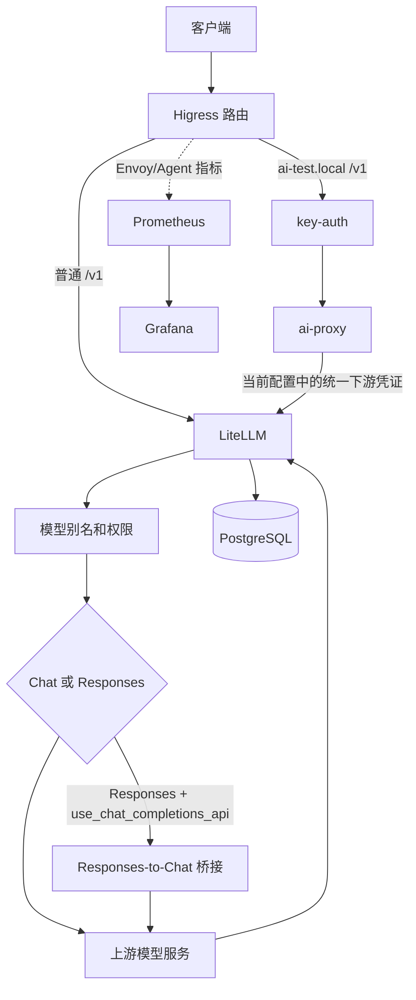

# API 网关工程架构整理方案（2026-09-20）

本文基于当前工作区的代码、Compose、运行配置、容器检查结果和已有验证记录整理。本文是只读分析结果，不代表本次已经执行迁移、重建服务或真实上游调用。

## 1. 结论先行

项目应按工程职责划分为部署编排、网关扩展、声明式配置、运行状态、测试工具、上游参考和文档，而不是按 Higress/LiteLLM 简单切成两个业务目录。

当前工作区已经完成部分目录迁移：Compose 位于 `deploy/`，LiteLLM 扩展位于 `gateway/litellm/`，模型和监控配置仍在 `config/`。迁移后的主要风险是 Compose 项目名变化、Higress 配置仍依赖被忽略的 `runtime/`、上游源码缺少 `.gitmodules`、LiteLLM 参考源码版本与运行包版本不一致。

当前最重要的整理目标是：在干净环境恢复与当前一致的 Higress 路由和插件配置；固定镜像、源码、补丁的版本对应；为每项配置指定唯一维护入口；保留现有请求链路并把校园身份、组织、额度和门户作为后续管理链路建设。

## 2. 当前工程组成

| 职责 | 当前路径 | 事实与边界 |
|---|---|---|
| 部署编排 | `deploy/docker-compose*.yml` | 主环境、监控、隔离压测；路径已按 `deploy/` 调整 |
| LiteLLM 扩展 | `gateway/litellm/` | Dockerfile、安装包补丁、Qwen 回调、构建期测试、回滚配置 |
| 模型配置 | `config/litellm.yaml` | 模型别名、上游地址、环境变量引用、回调注册 |
| 监控配置 | `config/monitoring/` | Prometheus 抓取、Grafana provisioning、仪表盘 |
| Higress 运行配置 | `runtime/higress/` | 路由、McpBridge、WasmPlugin、ConfigMap、Secret 和控制台生成字段；整体被 Git 忽略 |
| 测试和压测 | `test/`、`test/benchmark/` | 离线单元、集成/真实上游脚本、mock、k6 和压测初始化 |
| 诊断与抓包 | `scripts/`、`runtime/` | 可复用脚本与一次性产物目前仍混杂 |
| 上游参考 | `sources/higress-src/`、`sources/litellm-src/` | Gitlink；当前主环境不从这里构建 |

本项目维护的可执行代码主要是 `gateway/litellm/`、`test/`、`test/benchmark/` 和少量 `scripts/`。Higress、LiteLLM 上游源码属于参考基线，不因其中存在某项能力就表示当前部署已启用该能力。

## 3. 部署和版本证据

### 3.1 Compose 关系

主环境由 `deploy/docker-compose.yml` 启动 PostgreSQL、LiteLLM 和 Higress。LiteLLM 的构建上下文是 `../gateway/litellm`，配置文件通过只读挂载进入 `/app/config.yaml`；Higress 镜像通过 `../runtime/higress:/data` 读取运行目录。

监控 Compose 使用 `network_mode: container:api-gateway-higress` 共享 Higress 网络命名空间，Prometheus 抓取 `127.0.0.1:15000` 和 `127.0.0.1:15020`。Grafana 连接主网络中的 Prometheus。当前配置没有保证宿主机 `localhost:19090` 一定发布，README 对此应标为待修正。

压测 Compose 使用独立 `172.30.51.0/24` 网络，`init.mjs` 将 benchmark 路由复制到容器 `/data`，mock 服务作为唯一上游。压测 LiteLLM 使用 `main-stable`，不等同于主环境的定制镜像。

迁移后 Compose 默认项目名为 `deploy`，而现有容器标签仍属于 `api`。这会导致固定容器名、命名卷和监控资源出现漂移。应在后续提交中显式固定项目名或显式固定卷名，再进行任何重建。

### 3.2 版本对应

| 对象 | 当前证据 |
|---|---|
| Higress 参考 commit | `dc0999326b1a8df4269c13d0cf6ee2b725259f6e` |
| LiteLLM 参考 commit | `47b15ffb677902fc4550a4471b82e09f77ec77d7`，源码版本 `1.102.0` |
| 实际运行 LiteLLM 包 | `1.100.0` |
| LiteLLM 补丁基镜像 | Dockerfile 固定 digest `c8756e7b9a61...` |
| 当前定制 LiteLLM 镜像 | 容器镜像 ID `sha256:d4f224dd2854...` |
| 当前 Higress 镜像 | Compose 使用 `latest`；运行镜像 ID `sha256:930b314be06e...` |
| 补丁目标文件 | 构建脚本要求原始 SHA-256 `9ef2cb4d...`，三处替换锚点必须唯一 |

当前容器内补丁目标文件反向还原后与要求的原始哈希一致；回调、补丁脚本与工作区文件哈希一致。这证明构建产物与当前扩展文件对应，但没有替代完整功能回归。Higress 镜像与参考源码 commit 的对应关系尚未核实。

根目录没有 `.gitmodules`，但 `git ls-files --stage` 显示两个 `sources/` 项为 `160000` gitlink。应补齐 submodule 元数据，或在 `sources/README.md` 中明确固定 commit 的获取方式；不要直接删除源码 checkout 后再声称可以无损回退。

## 4. 请求链路与组件职责



普通路由配置在 `runtime/higress/ingresses/litellm-proxy.yaml`，专用路由配置在 `ai-route-litellm-ai-test.internal.yaml`。专用路由有 key-auth 消费者匹配、ai-proxy 地址和凭证重写、ai-statistics 统计；同时声明 3 次网络级重试和 120 秒超时。不能把这条专用路径的身份语义套用到普通入口。

LiteLLM 读取 `config/litellm.yaml`，其中 `store_model_in_db: true` 表示数据库模型和设置会参与最终配置。模型别名映射、虚拟 Key、团队和用量由 LiteLLM 负责；数据库当前是否存在重复或独有模型，本轮未直接查询。

Responses 请求中，`qwen_responses_compat.callback` 只处理 `aresponses` 和精确别名 `my-qwen3.6-27b`，将开头文本型 system/developer 消息合并为 `instructions`。流式补丁在三处保护空 `choices`，避免迭代器越界。它不把 Chat-only 上游变成原生 Responses 服务。

## 5. 目标目录

```text
API网关/
├── deploy/                         # Compose 与部署版本锁定
├── gateway/litellm/                # 本项目 LiteLLM 扩展
│   ├── patch/                      # 直接修改安装包的补丁
│   ├── callback/                   # LiteLLM 扩展接口
│   ├── test/                       # 扩展构建期回归
│   └── rollback/                   # 回滚覆盖
├── config/
│   ├── litellm.yaml                # 当前模型启动配置
│   ├── monitoring/                 # 监控声明配置
│   └── higress/                    # 后续纳入 Git 的脱敏期望配置模板
├── runtime/                        # Git 忽略的实例状态、报告、抓包
│   ├── higress/
│   ├── gateway-benchmark/
│   └── gateway-checks/
├── test/                           # 现有验证入口，先保持文件名
├── scripts/                        # 可复用诊断、初始化和测试入口
├── sources/                        # 固定 commit 的可选上游 checkout
└── doc/                            # 现状、方案、需求和带日期的验证记录
```

`runtime/higress` 不应整体纳入 Git。应从其中提取去除 Secret、`managedFields`、`resourceVersion`、时间戳和 status 的声明式模板到 `config/higress/`，同时保留实例运行目录。模板通过初始化脚本或管理 API 发布，控制台生成对象由 Higress 负责，避免 Git 与控制台同时维护同一生成资源。

## 6. 迁移表

| 当前路径 | 目标位置 | 原因 | 受影响引用 |
|---|---|---|---|
| 根目录 Compose（已迁移） | `deploy/` | 集中部署编排 | README、项目名、相对路径、卷 |
| `config/litellm-patch/`（已迁移） | `gateway/litellm/` | 分离扩展代码与静态配置 | `build.context`、Dockerfile COPY、回调 import |
| `runtime/higress` 中声明资源 | `config/higress/` 脱敏模板 | 可复建、可审查 | 初始化脚本、导出和差异检查 |
| `runtime/higress` 全部状态 | 继续保留 | 运行数据不应冒充源码 | 主 Compose bind mount |
| `scripts/` 中抓包和 HTML/JSON | `runtime/diagnostics/` | 运行产物与工具分开 | 捕获脚本输出路径 |
| `sources/` gitlink | 保留并补 `.gitmodules` | 可追踪上游升级 | 文档和获取命令 |
| 已跟踪 `__pycache__`/`.pyc` | 停止跟踪 | 清除机器产物 | Git 索引，不只是 `.gitignore` |

## 7. 配置权威来源

| 配置 | 权威来源 | 生效方式 |
|---|---|---|
| 模型别名和上游 | 当前 `config/litellm.yaml` | 重新创建 LiteLLM 容器；先检查 DB 合并行为 |
| LiteLLM Key、团队和基础预算 | LiteLLM 管理 API/PostgreSQL | 按运行版本的缓存刷新规则验证 |
| 供应商密钥 | `.env` 或外部密钥系统 | 重新创建容器，不把凭据写入 YAML/Git |
| Higress 期望配置 | `config/higress/` 脱敏模板 | 经初始化/管理 API 发布 |
| Higress 实例状态 | `runtime/higress/` | 控制面下发，定期导出备份 |
| Prometheus/Grafana | `config/monitoring/` | 重载或重启监控服务 |

新增模型先修改 `config/litellm.yaml`，并为环境变量补充 `.env.example` 的变量名；新增兼容逻辑先使用 callback，只有必须修改安装包时才新增 patch。任何补丁升级都必须重新核对基镜像、目标文件哈希和回归测试。

## 8. 校园功能的边界

统一身份、组织和应用管理、校园门户、审批和组织生命周期不属于当前网关链路，应由一个后续的校园管理应用承载。LiteLLM 可以复用其模型目录、虚拟 Key、团队和基础用量接口，但不能替代学校组织语义、应用责任人、离职转组和业务账本。

业务级额度需要原子预占、并发租约、周期边界、价格版本、流式中断和幂等结算。需求文档已明确这些要求，当前配置和历史用量记录不能证明已经实现。未来应先设计管理应用与 LiteLLM 的调用前检查和结果结算接口，再决定是否增加请求策略组件，不要先拆成多个微服务。

Higress 负责入口 TLS、域名、连接级治理和边缘认证；LiteLLM 负责模型选择、供应商适配和基础 Key/用量能力；重试和 Fallback 必须指定唯一策略层，避免 Higress 的网络重试与 LiteLLM 的业务重试叠加。

## 9. 分阶段计划

1. **固定基线**：保存当前镜像、源码 commit、卷名和运行配置；为主环境、监控和回滚命令固定 Compose 项目名。验证 `docker compose config` 的路径、卷、网络和容器名与现有实例一致。失败时只回退 Compose 文件，不触碰数据库卷。
2. **完成目录迁移**：修正 README、扩展文档、回滚路径和脚本中的旧路径；停止跟踪缓存和抓包产物。运行补丁离线测试、Python AST 检查和三份 Compose 解析。
3. **建立 Higress 模板**：脱敏提取路由、McpBridge、插件和必要 ConfigMap；实现初始化、导出、差异和恢复脚本。在独立网络与空 runtime 目录验证普通入口、专用入口、鉴权失败和 mock Chat/Responses。
4. **治理版本和配置**：补 `.gitmodules` 或等价获取说明；建立镜像、源码、插件和补丁锁定文件；盘点 YAML 与数据库模型，确定单一写入口。
5. **修复验证体系**：修正双网关和 mock 测试的漏检；将离线单元、补丁回归、集成验证、真实上游和隔离压测分组。压测记录镜像版本和配置摘要，不能把 `main-stable` 压测当作定制镜像证明。
6. **校园业务建设**：完成统一身份、组织/应用、Key 生命周期、额度账本和门户后，再做灰度。每阶段保留旧入口和数据库备份，身份与计费变更单独回退。

## 10. 验证入口

当前可继续使用的离线入口：

```powershell
python -B -m pytest -p no:cacheprovider `
  test/test_dual_gateway_unit.py `
  test/test_gateway_resilience_unit.py -q
node --test test/benchmark/mock.test.mjs
```

LiteLLM 扩展构建入口：

```powershell
docker compose -p api -f deploy/docker-compose.yml build litellm
```

真实上游脚本 `test/test_responses_patch_live.py` 可能产生费用；必须显式提供测试 Key 和模型。隔离压测使用 `deploy/docker-compose.benchmark.yml`，只调用本地 mock，不代表真实供应商吞吐或费用结论。

## 11. 证据口径

- “代码存在”：文件和调用关系已经读到。
- “部署已接入”：当前容器中的扩展文件、运行版本和挂载关系已核对。
- “已有验证记录”：引用带日期的 README、审计或验证报告。
- “本次已验证”：本次完成的 Compose 解析、路径核对、容器版本和哈希检查。
- “待核实”：实时路由、干净环境恢复、数据库当前数据、Higress 镜像与源码精确对应关系。
- “仅规划”：校园统一身份、组织门户、严格业务额度和结算账本。

