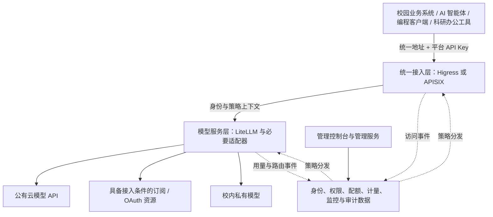

# 校园统一 AI 网关产品需求文档

| 项目 | 内容 |
| --- | --- |
| 文档版本 | V1.0，需求评审稿 |
| 编写日期 | 2026-09-15 |
| 产品名称 | 校园统一 AI 网关与模型服务平台 |
| 需求来源 | [架构图 5.jpg](../jpg/5.jpg)、[功能图 6.png](../jpg/6.png) |
| 来源说明 | 用户指定的第二张图为 `6.jpg`，本地实际文件为 `6.png`，本稿依据后者编写 |
| 作者 | nimbus |
| 文档署名 | Create By nimbus(WXID:168007300) |
| 文档用途 | 产品评审、交互设计、开发拆分与测试验收依据 |

## 一、功能名

校园统一 AI 网关与模型服务平台。

通过统一服务地址、平台 API Key 和模型名称，为校内业务系统、AI 智能体、编程工具及科研办公工具提供模型调用服务，并提供相应的管理控制台。

## 二、需求描述

建设校级模型服务入口，集中接入公有云模型 API、具备接入条件的订阅/OAuth 账号和校内私有模型。调用方在已验证的客户端中配置统一 Base URL 与平台 API Key，即可调用授权范围内的模型。

平台应支持协议适配、模型映射、智能路由、负载均衡、故障切换、会话粘性、身份认证、IP 控制、限流、配额管理、用量计量、费用统计、监控告警及日志审计，降低重复接入和运维成本，提高模型服务的稳定性与可管理性。

“一个地址 + 一个密钥”表示统一接入方式；不同应用可以使用独立密钥，权限和额度以各自授权为准。不同客户端的接口能力存在差异，只有通过兼容性验证的组合才应标记为支持。

## 三、概述

### 3.1 背景与目标

图片反映了校园应用与多类模型资源之间需要统一服务层的需求。本项目拟解决模型接入方式分散、密钥管理分散、额度难以控制、故障处理不统一和用量缺少集中统计的问题。

| 产品目标 | 对用户的价值 | 验证方式 |
| --- | --- | --- |
| 统一接入 | 减少逐供应商配置 | 通过同一 Base URL、同一授权 Key 调用至少两个已接入模型 |
| 统一治理 | 管理调用权限、来源和资源消耗 | 认证、IP、额度、限流、并发用例全部通过 |
| 稳定调用 | 在符合条件时自动切换可用资源 | 故障注入验证切换条件、次数上限及返回结果 |
| 可追踪计量 | 看清谁调用了什么、消耗多少 | 请求、尝试记录与统计汇总能够关联核对 |
| 自助服务 | 帮助用户发现模型并完成首次调用 | 用户依照文档完成创建 Key、选择模型和调用验证 |

### 3.2 依据与假设

本文使用三类标记：

- **【图示】**：两张图片直接提出的能力，是本次需求来源。
- **【建议】**：为使功能能够实施而补充的产品规则，供评审采用。
- **【待确认】**：图片无法确定、需要业务或技术负责人决定的事项。

以下模块中的页面结构、角色边界、状态机、错误处理和验收规则，除标明为图示外，均为建议方案。本稿不代表现有系统已具备相应能力，也不将技术组件名称视为功能已经实现的证据。

### 3.3 用户与权限

| 角色【建议】 | 使用目标 | 数据与操作范围 |
| --- | --- | --- |
| 平台管理员 | 配置资源和全局治理规则 | 全平台配置、组织授权、模型渠道、配额策略 |
| 部门/课题组管理员 | 分配组内资源、查看消耗 | 仅授权部门或课题组成员、应用及额度 |
| 开发者/普通用户 | 创建调用凭证并使用模型 | 本人的 Key、授权模型、个人用量和调用日志 |
| 运维人员 | 排查故障、维护稳定性 | 授权范围内运行指标、渠道健康与脱敏日志 |
| 审计人员 | 核查访问和管理行为 | 授权范围内审计记录，只读 |
| 应用服务身份 | 供业务系统自动调用 | 绑定应用和责任人，拥有独立模型权限与额度 |

控制台登录身份与模型调用凭证分别管理。控制台可对接学校统一身份认证；调用 API 使用平台 Key。学校身份认证、上游订阅 OAuth 和平台 Key 是三个独立概念。

### 3.4 产品边界与架构

【图示】架构分为调用方、接入治理层、模型代理层和模型资源层。图 5 给出 Higress 或 APISIX，并突出 Higress 与 LiteLLM。

【建议】本稿以 Higress + LiteLLM 作为设计基线，最终选型以评审与验证为准。

| 层级 | 建议责任 | 交接要求 |
| --- | --- | --- |
| 接入治理层 | 请求认证、来源 IP 校验、访问限速、统一请求标识 | 移除外部伪造身份头，向内部传递可信身份和追踪信息 |
| 模型服务层 | 协议适配、模型映射、路由、健康管理、Fallback、提取上游用量 | 返回逻辑模型、实际渠道、尝试链及计量结果 |
| 管理服务 | 用户、组织、授权、配置发布、配额策略与结算账本 | 对外形成统一配置入口与唯一账本 |
| 监控审计服务 | 汇总请求事件、指标、操作记录及告警 | 通过统一请求标识关联各层事件 |

实际限流、额度预占和结算能力可以由选定组件承载，但同一规则只能有一个明确的权威执行点，避免两层重复扣费或配置冲突。上游密钥仅由必要的服务读取。

本期不包含模型训练、科研工具本身的功能开发、订阅账号购买、支付充值和财务开票。私有模型的“部署管理”默认指管理服务端点、部署版本及上下线；GPU 调度、镜像构建和自动扩缩容是否纳入范围待确认。

### 3.5 范围与优先级【建议】

| 优先级 | 交付范围 | 完成标准 |
| --- | --- | --- |
| P0：首期闭环 | 统一调用、API/私有模型渠道、基础模型映射、用户/应用/Key、IP 控制、额度和限流、基础路由与故障切换、计量、基础看板、日志审计、模型目录与接入文档 | 用户能申请并完成调用，管理员能授权、限额、追踪和排障 |
| P1：增强能力 | 已验证的订阅/OAuth 适配、更多客户端/接口、会话粘性、高级路由、细粒度缓存计量、告警治理、内容审计、公告与 FAQ 管理 | 按具体供应商、客户端与模型组合逐项验收 |

P0/P1 为建议排期，不删减图示需求。所有图示能力均在后文定义；未交付能力应在界面和文档中明确标记。

## 四、相关页面设计

### 4.1 信息架构【建议】

管理控制台采用左侧导航、顶部组织切换与用户入口、主内容区的布局。不同角色仅显示有权限的菜单；隐藏菜单不能替代服务端权限校验。

| 页面 | 核心内容 | 主要操作 |
| --- | --- | --- |
| 工作台 | 统一调用地址、剩余额度、近期消耗、服务状态 | 复制地址、创建 Key、查看接入指南 |
| 模型与渠道 | 供应商、渠道、订阅账号、私有服务、模型映射、价格 | 新建、编辑、测试、启停、上线发布 |
| 用户与令牌 | 用户、角色、分组、应用、Key、IP 策略 | 授权、创建/轮换/禁用 Key、调整归属 |
| 配额与计量 | 初始/周期额度、限制策略、用量和费用明细 | 分配额度、设置限额、导出报表 |
| 路由策略 | 逻辑模型、候选渠道、权重、Fallback、粘性 | 配置、校验、试运行、发布、回滚 |
| 数据看板 | 请求量、Token、费用、性能、健康与排行 | 筛选、下钻、跳转日志 |
| 日志与审计 | 调用日志、操作审计、告警事件、留存策略 | 查询、追踪、脱敏导出、处置告警 |
| 模型广场 | 模型目录、能力、价格、上下文、可用状态 | 检索、筛选、查看详情、获取示例 |
| 接入与帮助 | 客户端配置、接口说明、公告、FAQ | 复制示例、查看兼容性、定位错误 |

### 4.2 通用交互要求【建议】

- 列表支持分页、条件筛选、清空筛选和保留当前筛选条件；数据范围由角色授权决定。
- 所有页面定义加载中、无数据、无权限、加载失败及部分数据失败状态，失败后提供重试。
- 新建或修改配置先进行字段校验；影响在线服务的配置通过“保存草稿 → 校验 → 发布”生效。
- 禁用渠道、撤销 Key、降低额度和批量操作需展示影响对象并二次确认；操作结果进入审计记录。
- 敏感字段默认脱敏。创建 Key 成功后仅在当次结果界面展示完整值并提供复制。
- 图表和明细标明时区、单位、统计口径及数据更新时间；不能用空白或 0 代替未知值。
- 用户错误提示应包含可执行建议和请求标识，不展示上游密钥、内部地址或堆栈。

## 五、用户旅程

### 5.1 开发者首次接入

| 步骤 | 用户行为 | 系统响应 | 异常与恢复 |
| --- | --- | --- | --- |
| 1 | 使用学校账号登录 | 显示用户身份、所属组和可用额度 | 未分配服务权限时说明申请渠道 |
| 2 | 在模型广场筛选模型 | 显示能力、接口、价格及授权状态 | 不可用模型说明原因并推荐已授权候选 |
| 3 | 创建个人或应用 Key | 校验权限，绑定额度、有效期和 IP 策略 | 未获模型权限或已达 Key 数量上限时说明原因 |
| 4 | 选择客户端接入教程 | 展示统一地址、模型名及匹配版本的配置 | 未验证组合标记“待验证”，不标记成功兼容 |
| 5 | 在客户端发起请求 | 认证、限流、选路并返回模型结果 | 返回可理解错误和 request_id |
| 6 | 查看调用记录和消耗 | 显示结果、Token、费用、余额及状态 | 待结算用量单独标识，可凭 request_id 排障 |
| 7 | 轮换或撤销 Key | 展示操作结果与生效状态 | 已撤销凭证不能继续发起新请求 |

### 5.2 管理员上线模型

新建供应商/渠道 → 配置凭证或私有端点 → 测试连接和能力 → 建立逻辑模型映射 → 设置价格、授权和额度策略 → 配置路由与故障切换 → 校验并发布 → 完成端到端调用 → 观察看板与日志。

连接失败、能力不匹配或价格缺失时显示原因。价格未知可以按配置允许试用，但必须标记为“价格未知”，不得按 0 元宣传。

### 5.3 运维处理故障

监控发现异常 → 创建或合并告警 → 运维查看受影响模型和请求 → 检查渠道健康与尝试链 → 临时禁用异常渠道或回滚配置 → 验证恢复 → 记录原因与处理结论 → 关闭告警。

对于已满足切换条件的请求，平台自动尝试兼容的备用渠道；已输出部分流式内容的请求按流式中断规则处理。

## 六、详细功能需求

### F01 统一 API 接入与协议适配

**功能名：** 统一调用入口与多协议模型适配。

**需求描述：** 【图示】为业务系统、AI 智能体和工具提供统一 Base URL、API Key、OpenAI 兼容接口及协议转换，减少供应商差异对调用方的影响。

**概述：** 一个逻辑模型名称对应一个或多个实际资源。调用方使用平台模型名，平台处理认证和上游协议差异。文本、推理、编码、向量、OCR、多模态属于能力分类，不等同于全部共享一个接口。

**相关页面设计：** 工作台展示 Base URL、已授权模型和快速接入入口；帮助页提供接口能力矩阵，按客户端、版本、接口、流式/工具能力和验证日期展示结果。

**用户旅程：** 选择模型 → 查看兼容接口 → 创建 Key → 配置客户端 → 调用 → 根据返回结果或错误提示处理。

**用户故事：** 作为应用开发者，我希望使用统一地址和平台凭证调用不同模型，以便减少接入改造，并在模型渠道调整时保持应用配置稳定。

**实现逻辑：** 接收请求 → 生成 request_id → 验证 Key、来源及授权 → 校验接口和模型能力 → 执行额度与流控检查 → 选择渠道 → 转换必要的请求字段 → 调用模型 → 转换结果 → 结算用量并记录日志。

**功能细节描述：**

| 项目 | 建议规则 |
| --- | --- |
| 首期接口 | 模型列表、对话生成、向量接口；最终以测试通过的接口清单为准 |
| 扩展接口 | Responses 类接口、其他厂商原生消息接口、OCR 专用接口及多模态接口按客户端/供应商逐项适配，不能仅凭“OpenAI 兼容”推定支持 |
| 输入 | 平台 Key、逻辑模型、消息或向量输入；可选流式标志、输出上限、工具定义及客户端会话标识 |
| 能力校验 | 按模型检查上下文、输入类型、输出限制、流式、工具调用、结构化输出等；不支持的必要能力应明确拒绝，不静默丢弃 |
| 输出 | 返回所选接口约定的结构；提供 request_id；记录实际模型、渠道、用量和耗时但不暴露凭证 |
| 流式调用 | 保持事件顺序和结束语义；透传或兼容表达工具调用增量；客户端断开时释放本地资源并尽可能取消上游 |
| 上下文超限 | 明确报错并显示允许范围；默认不截断历史消息 |
| 凭证隔离 | 下游 Key 不作为上游凭证透传；外部调用不能通过自定义参数指定未授权渠道或上游地址 |
| 兼容声明 | 以“客户端版本 + 接口 + 模型/渠道 + 测试项”为单位记录兼容结果 |

建议错误语义：401 表示凭证无效或过期；403 表示模型、组织或 IP 无权访问；400 表示输入或能力不匹配；429 表示限速、并发或额度阻断，并用独立业务错误码区分原因；502/503 表示上游异常或无可用渠道；504 表示请求超时。429 只有在能够确定恢复时间时提供重试等待信息，额度耗尽不应鼓励立即重试。具体响应格式遵循对外接口约定。

**验收要点：** 同一授权 Key 可通过统一地址调用至少两个模型；无效 Key 不触达上游；超限输入明确失败；已声明支持的非流式、流式及工具调用分别通过验证；客户端教程能够复现首次调用。

### F02 模型与渠道管理

**功能名：** 供应商、渠道、订阅资源与模型目录管理。

**需求描述：** 【图示 A】集中管理供应商与渠道、订阅账号、模型目录/分组/映射、价格、状态与部署信息。

**概述：** 供应商表示资源提供方；渠道表示一组实际连接配置；逻辑模型表示对用户公布的稳定名称；模型部署表示某渠道下可调用的具体模型版本或实例。

**相关页面设计：** 提供“供应商、渠道、订阅账号、模型、部署”页签。渠道详情显示连接配置、凭证状态、能力测试、关联模型、健康记录和最近调用。模型详情显示逻辑名称、能力、映射、价格和授权分组。

**用户旅程：** 选择资源类型 → 配置连接 → 测试 → 映射模型 → 设置价格和可见范围 → 发布上线 → 监控 → 必要时停用或更新。

**用户故事：** 作为平台管理员，我希望集中管理多种模型资源，并用稳定的模型名对外服务，以便在资源更换时控制影响范围。

**实现逻辑：** 创建资源草稿 → 校验字段和凭证 → 测试网络、认证与选定能力 → 关联实际模型 → 校验路由引用 → 发布配置版本 → 纳入运行健康检查。

**功能细节描述：**

- 渠道字段：名称、供应商、类型、Base URL/服务端点、凭证引用、实际模型标识、超时、权重、容量限制、责任人和备注。名称长度及唯一范围在数据设计阶段统一约定。
- 模型字段：逻辑模型 ID、展示名称、供应商、能力标签、上下文上限、最大输出、支持接口、输入/输出形式、状态、可见分组及映射列表。未验证能力标记为未知。
- 分开记录管理状态与健康状态：管理状态为草稿/启用/停用/归档；健康状态为未知/健康/降级/不可用。测试成功不直接替代上线发布，健康恢复不自动重新启用人为停用的渠道。
- 同一逻辑模型可关联多个渠道；映射目标必须满足该逻辑模型对外公布的必要能力。向量维度、工具调用、结构化输出等不兼容时禁止加入同一无差别切换池。
- 价格包含计价单位、币种、输入/输出单价、生效时间；支持时补充缓存命中、缓存写入及其他计费项。价格变更不覆盖历史请求使用的价格版本。
- 订阅/OAuth 资源仅在供应商提供可用接入方式、授权范围满足要求且适配验证通过后上线。不得假设任意订阅都能转换成通用 API，也不得假设订阅调用免费。
- OAuth 账号显示授权范围、到期时间及刷新状态；刷新失败或授权撤销后停止新流量进入并告警。原始访问令牌和刷新令牌不在页面明文展示。
- 私有模型记录内网端点、部署版本、能力、责任人、健康检查方式及维护窗口；是否由平台执行实际部署待确认。
- 连接测试应说明会否产生真实模型调用及费用，结果展示网络、认证、模型可用性与能力验证，不显示敏感原始响应。
- 停用渠道前展示引用路由和受影响模型；最后一个可用渠道被停用后，模型进入不可用状态并停止接收新调用。历史渠道优先归档，保留日志关联。

**验收要点：** 能接入一个公有 API 渠道和一个私有服务；同一逻辑模型可映射两个兼容渠道；凭证错误可定位；停用渠道不再接收新请求；价格调整后历史费用不被重算覆盖。

### F03 用户与令牌管理

**功能名：** 统一身份、组织授权与平台 API Key 管理。

**需求描述：** 【图示 B】支持统一身份认证、用户/角色/分组、令牌创建/复制/禁用/过期、额度与 IP 访问限制。

**概述：** 用户和应用通过分组获得模型权限；API Key 是可独立控制的调用凭证。平台 Key 与用量单位 Token 在页面中分别称为“API Key”和“Token 用量”，避免混淆。

**相关页面设计：** 用户列表展示身份、分组、角色与状态；应用详情展示责任人和所属组；Key 列表展示名称、脱敏前缀、归属、允许模型、有效期、状态、最后调用时间和限额。

**用户旅程：** 登录 → 确认组织归属 → 创建个人/应用 Key → 选择权限与限制 → 复制并保存 → 使用 → 轮换、禁用或撤销。

**用户故事：** 作为开发者，我希望为每个应用创建独立 Key，以便分开统计消耗，并在某个应用停用时单独撤销其访问能力。

**实现逻辑：** 识别登录身份 → 校验操作者授权 → 计算可授予权限 → 创建高强度随机 Key 并展示一次 → 存储校验摘要和元数据 → 每次请求核验状态、归属、有效期、模型和 IP 策略。

**功能细节描述：**

- Key 字段：名称、所属用户/应用、归属组织、允许模型或模型组、有效期、IP 策略、消费上限、RPM/TPM/并发限制。创建时不得授予超出创建者可管理范围的权限。
- 完整 Key 仅在创建或轮换成功时展示和复制；关闭结果页后仅提供脱敏标识。遗失后通过轮换生成新 Key。
- 状态包括有效、禁用、过期、已撤销；禁用可恢复，撤销不可恢复。到达有效期即拒绝新请求。
- 轮换支持立即替换或有期限的双 Key 过渡；过渡期结束后旧 Key 失效，两个 Key 均关联同一应用以便汇总统计。
- API Key 指向唯一计费归属。用户可属于多个组，但每个 Key 创建时确定扣费组，避免一笔消费在多个组重复扣减。
- 模型权限取组织、用户/应用和 Key 授权的交集；额度、速率和并发等限制分别检查所有适用层级，任一层不满足即拒绝。
- IP 支持 IPv4、IPv6 与 CIDR；若同时配置允许和拒绝规则，拒绝优先。来源 IP 仅从已配置的可信代理链解析，不能直接信任任意客户端提交的转发头。
- 空 IP 允许列表的含义应显式配置并显示为“未限制来源”；学校要求默认内网访问时使用平台级规则实现，默认策略待确认。
- 用户停用后个人 Key 停止接受新请求；应用 Key 应由组织继续管理，责任人离职后的转交和停用规则单独配置。
- 额度调整属于配额模块操作；Key 页显示其当前限制并提供权限受控的跳转。

**验收要点：** 过期、禁用、撤销与 IP 不符的请求均被拒绝；用户无法读取其他用户的 Key 信息或日志；新增 Key 不能越权；Key 轮换、组织归属和用户停用规则正确生效。

### F04 配额与精细计量

**功能名：** 多层配额、流控与用量费用统计。

**需求描述：** 【图示 C】支持初始与周期额度、Token 用量统计、RPM/TPM/并发限制，以及按用户、模型和渠道统计。

**概述：** 区分消费预算与瞬时流控。建议以可配置的内部额度作为预算口径，同时记录原始 Token、供应商估算费用和实际结算信息；内部额度与货币的换算规则待确认。

**相关页面设计：** 额度总览展示总额、已消费、预占、可用余额与周期；策略页配置组织/用户/应用/Key 规则；计量明细提供请求、模型、渠道、Token、价格版本和结算状态筛选。

**用户旅程：** 管理员分配额度 → 用户查看余额 → 发起调用 → 平台预占和结算 → 用户查询消耗 → 临近用尽时提醒 → 用尽后调整额度或等待周期更新。

**用户故事：** 作为课题组管理员，我希望限制组内资源消耗，并看清各应用、模型和渠道的用量，以便合理分配科研经费和计算资源。

**实现逻辑：** 校验所有适用限额 → 原子预占预算与并发名额 → 调用上游 → 获取实际用量 → 按当次价格版本结算 → 释放多余预占与并发名额 → 写入幂等账本和统计事件。

**功能细节描述：**

| 项目 | 建议规则 |
| --- | --- |
| 初始与周期额度 | 分别建账；初始额度设置有效期，周期额度设置开始/结束时间、周期和是否结转；建议默认不结转，先使用即将过期的额度 |
| 周期边界 | 建议按 Asia/Shanghai 展示和划分学校业务周期，内部统一存储时间；跨周期请求按受理时的预算周期结算，不因午夜重置被重复释放 |
| 管理调整 | 记录调整前后值、差额、原因、操作者和时间；新增额度不覆盖历史消费；调整后余额不足则阻断后续新请求 |
| RPM | 每分钟请求数；建议使用滚动窗口并明确统计范围。接入防刷计数与获准模型调用计数分别记录 |
| TPM | 每分钟 Token 预算；请求前估算输入与允许输出并预占，结束后按实际值校正；无法精确估算的模态应有独立计量规则 |
| 并发 | 统计进行中的请求；流式请求直到结束、取消或租约过期才释放；节点异常需通过可恢复租约清理占用 |
| 多副本 | 配额和限流状态在副本间一致协调，不能因增加实例绕过上限；所有层级预算预占应整体成功或整体回滚 |
| 输出控制 | 未传输出上限时使用已公布的模型默认上限。严格预算下，剩余额度不能覆盖预占则拒绝，或按明确告知的策略降低允许输出 |
| 原始用量 | 记录输入、输出、总 Token；缓存及推理 Token 仅在上游提供且语义明确时记录，不重复累加已经包含在总量中的字段 |
| 金额口径 | 按价格版本与对应计费项计算；内部额度扣减、上游估算成本、供应商实际账单分开标识。不同币种分开展示，统一换算需汇率及日期 |
| 缺失用量 | 标记估算或待核对，不填 0 冒充实际值；恢复后补记。订阅费用和私有资源费用按另行确认的分摊口径处理 |
| 失败与重试 | 记录每次上游尝试及其成本，不重复收取同一次成功结果。建议用户仅承担最终成功尝试的可确认用量，失败/切换成本单列平台成本；最终计费政策待确认 |
| 流式中断 | 优先获取上游最终用量；无法取得时进入待核对或明确的估算结算流程。已发生的上游消耗不能因客户端断开被直接清零 |
| 幂等结算 | 用户消费记录按请求标识及结算类型去重，上游成本按 attempt_id 去重；补偿任务可重复执行而不重复扣减 |
| 提醒 | 建议剩余额度低于 20% 时提醒、用尽时阻断；阈值和通知渠道可配置，不作为图片既定规则 |

用户额度已用尽时不应改用备用 Key、组或渠道绕过限制。供应商限流可以触发符合路由规则的切换，但不能绕过平台预算和访问策略。

**验收要点：** 并发请求不能将同一余额重复使用；各层级限制独立有效；周期切换、跨日流式请求、取消、服务崩溃与重复结算事件可正确处理；按用户、模型和渠道汇总能与相同口径的明细核对。

### F05 智能路由、负载均衡与故障切换

**功能名：** 模型选路、Fallback 和会话粘性。

**需求描述：** 【图示】支持多模型路由、智能负载均衡、故障切换及会话粘性，提高资源利用率和服务连续性。

**概述：** 路由先满足授权和能力要求，再根据健康、容量及策略选择渠道。会话粘性是一种选路偏好，不等同于保存聊天历史或跨供应商迁移会话。

**相关页面设计：** 路由页展示逻辑模型、候选资源、优先级/权重、必要能力、超时、最大尝试次数、Fallback 顺序、粘性有效期和配置版本，并提供校验、试运行、发布与回滚。

**用户旅程：** 管理员配置候选渠道 → 设置策略 → 模拟校验 → 发布 → 请求自动选路 → 异常时按规则切换 → 运维查看尝试链。

**用户故事：** 作为业务系统负责人，我希望某个模型渠道不可用时系统能够在能力允许的范围内使用备用资源，以降低业务中断。

**实现逻辑：** 解析逻辑模型与必要能力 → 过滤无权限、停用、不健康或无容量资源 → 查询有效会话绑定 → 应用优先级/权重策略 → 发起调用 → 根据错误类型、剩余超时和输出状态判断重试/切换 → 写入最终结果及所有尝试。

**功能细节描述：**

- 首期建议支持优先级和加权分配；最低成本、最低延迟等高级策略必须依赖可用且及时的数据，无数据时使用已定义的退回策略。
- 默认优先在同一逻辑模型的兼容部署间切换。跨模型降级需显式开启，公布可替代模型及可能变化的能力、价格和结果特征。
- 可切换错误包括连接失败、符合策略的上游超时、上游 5xx 和供应商限流；校验失败、下游 Key 无效、平台配额耗尽等错误不触发上游重试。
- 上游凭证失效可以将该渠道标记不可用并告警，再尝试其他合规渠道；不得把平台自身的身份认证失败混入此规则。
- 建议单次请求最多执行 3 次上游尝试，包含第一次；配置总请求时限，每次尝试不得突破剩余时限，避免每一层独立重试而成倍放大流量。
- 对状态可能已在上游创建、但因网络原因未取得响应的请求，应根据接口幂等能力决定是否重试；不能保证幂等时默认不自动重放有副作用的操作。
- 客户端尚未收到流式内容时，可在策略允许下切换；已返回首个内容片段或工具调用片段后，默认不切换并拼接另一模型输出，应以接口允许的方式报告中断并记录原因。
- 会话粘性使用客户端显式提供的会话标识，并绑定组织/用户或应用、Key 范围与逻辑模型，防止跨用户串用。不支持会话标识的客户端不承诺粘性。
- 粘性目标失效时，只有请求携带足够上下文且目标兼容时才重建绑定；依赖上游专属 conversation/response ID 的会话不得直接迁移到不支持该状态的渠道。
- 熔断支持失败阈值、观察窗口、冷却和探测恢复；容量饱和默认快速拒绝，若启用排队则必须设置队列上限及最长等待时间。
- 日志记录选路原因、命中规则、配置版本、attempt_id、实际渠道、错误类型和最终结果。用户界面仅展示其权限允许的信息。

**验收要点：** 主渠道不可用时兼容备用渠道接管；无候选时返回明确错误；重试次数与总超时受控；流式部分输出不混入另一渠道结果；不兼容向量维度或工具能力的渠道不参与切换；粘性不会跨身份生效。

### F06 数据看板与运行监控

**功能名：** 用量、费用和服务健康可视化。

**需求描述：** 【图示 D】展示请求数、Token、费用、RPM/TPM、性能趋势、模型消耗排行，以及成功、警告、异常监测。

**概述：** 将服务质量与资源消耗集中展示，帮助用户控制用量，帮助管理员发现成本和可用性问题。

**相关页面设计：** 顶部为请求量、成功率、Token、费用和活跃调用方指标卡；中部为请求、Token、首段延迟及完成耗时趋势；底部为模型/渠道排行和异常列表。支持按时间、组织、用户、应用、模型、渠道筛选。

**用户旅程：** 选择范围 → 查看趋势 → 发现异常或高消耗 → 下钻模型/渠道 → 打开相关日志 → 确认原因。

**用户故事：** 作为运维人员，我希望快速看出哪些模型变慢或失败增多，并进入对应请求记录，以缩短排障时间。

**实现逻辑：** 采集接入、路由和结算事件 → 按 request_id/attempt_id 去重与关联 → 按统一时间口径聚合 → 计算指标 → 按用户权限返回图表和下钻数据。

**功能细节描述：**

- 区分“外部逻辑请求数”和“上游尝试数”，一次请求切换两个渠道时，前者计 1，后者计 2。
- 分别展示平台拒绝、上游失败、成功、流式中断和客户端取消。建议逻辑成功率以已完成且获准转发的逻辑请求为分母，取消和处理中请求另列，图表应显示具体口径。
- 性能区分非流式完成耗时、流式首段延迟和流式总时长，提供 P50/P95/P99；不混用两类请求计算无说明的平均响应时间。
- 用量展示输入、输出、缓存等已支持字段；费用展示币种、估算/已确认状态。未知价格的请求纳入请求与 Token 总量，但金额标记未知。
- 模型排行默认按费用排序，也可切换为 Token 或请求数；渠道排行使用上游尝试口径，并解释其与用户费用的区别。
- 服务状态建议分为正常、警告、异常、无数据，阈值可配置；无数据不能直接解释为服务正常。
- 建议看板数据延迟不超过 60 秒、标准范围查询 P95 不超过 3 秒，需在约定数据规模下验证。
- 导出应继承筛选条件、权限和统计口径；大数据量采用后台任务，下载过程仍校验权限。

**验收要点：** 同一时间范围和口径下图表与明细一致；一次 Fallback 不重复增加外部请求数；流式中断不计为完整成功；普通用户不能通过筛选或导出获得其他人的数据。

### F07 日志审计与安全管控

**功能名：** 调用追踪、操作审计、异常告警与内容治理。

**需求描述：** 【图示 E】提供完整调用日志、账号与操作审计、异常追踪与告警、日志留存及内容审计。

**概述：** “完整调用日志”优先指调用过程和结果可追踪，不默认保存完整提示词、附件或模型输出。是否记录正文、适用场景和保留期需单独配置。

**相关页面设计：** 调用日志表展示 request_id、时间、调用方、逻辑模型、最终状态、耗时、Token、费用；详情按时间顺序展示各层事件和上游尝试。另设操作审计、告警和留存策略页签。

**用户旅程：** 用户复制 request_id → 在授权日志中检索 → 查看错误与用量 → 运维关联上游尝试 → 管理员处理异常配置 → 审计人员核查操作记录。

**用户故事：** 作为审计人员，我希望查到关键访问和配置变更的责任人、时间与结果，以便追溯异常操作，而不需要直接接触调用密钥。

**实现逻辑：** 各层产生结构化事件 → 敏感数据过滤 → 关联身份、请求和配置版本 → 写入受控存储 → 触发告警规则 → 执行保留、归档或删除策略。

**功能细节描述：**

- 调用日志字段至少包括 request_id、attempt_id、用户/应用/组、Key 标识、可信来源 IP、接口、逻辑/实际模型、渠道、开始/结束时间、状态码、业务错误、输入/输出 Token、费用状态、选路原因与配置版本。
- 操作审计包括登录结果、角色/分组调整、Key 创建/轮换/禁用/撤销、额度调整、渠道变更、路由发布与回滚、日志导出及内容访问。
- 配置审计记录变更前后差异，但不记录明文密钥、Authorization 头、OAuth 凭证和其他秘密值。
- 普通用户仅访问自己的调用记录；组管理员查看授权组；运维和审计权限分别授权。查看日志正文与导出正文需要独立权限并记录审计。
- 【建议】调用元数据保留 90 天，操作审计保留 180 天；正文默认不记录，特定排障场景开启后建议不超过 7 天。最终以学校数据要求及存储容量评审为准。
- 内容审计支持按组织/应用启用，并明确“仅标记”或“阻断”。阻断模式的请求应在上游调用前检查输入，生成结果的审查阶段和流式处理方式单独定义。
- 已经流出的内容无法追回；如要求输出先审后发，应采用经过验证的缓冲或分段审核机制，并接受其延迟影响。审计服务失败时放行或阻断的策略必须显式配置。
- 告警覆盖渠道不可用、错误率或延迟升高、授权刷新失败、接近额度阈值、计量积压和配置分发失败。阈值、持续时间、去重窗口、接收范围和通知渠道可配置。
- 告警状态建议为待处理、处理中、已恢复、已关闭；同一问题合并通知，恢复后发送恢复事件，保留处理责任人与结论。
- 日志暂时不可写时进入可靠缓冲并告警；缓冲耗尽后的放行/阻断策略必须明确。不得在静默丢失用量记录后仍宣称精确结算。
- 留存到期应按策略处理在线日志、索引与备份中的副本；查询结果展示缺失或已归档状态，不伪装成从未发生。

**验收要点：** 可从 request_id 定位完整尝试链；日志与导出无明文凭证；越权查询和正文访问被阻断；重复异常按规则合并告警；日志服务故障、恢复补写和留存到期行为可验证。

### F08 模型广场与服务支持

**功能名：** 模型发现、自助接入与帮助中心。

**需求描述：** 【图示 F】提供模型检索筛选、能力/价格/上下文说明、接口文档与调用示例、公告、FAQ 及快速配置。

**概述：** 为校内用户提供服务发现和首次调用入口。模型资料与实际配置使用同一数据来源，降低文档和线上状态不一致的问题。

**相关页面设计：** 模型广场采用搜索框、能力/供应商/授权状态筛选和模型卡片；详情展示能力、限制、价格、服务状态、接口和接入教程。帮助中心包含客户端教程、错误码、公告及 FAQ。

**用户旅程：** 搜索应用场景 → 比较可用模型 → 查看能力与费用 → 获取权限或创建 Key → 选择工具教程 → 配置并完成验证 → 通过帮助页解决常见问题。

**用户故事：** 作为科研用户，我希望了解哪些模型支持向量、OCR 或多模态，并按自己的工具获得配置说明，以便完成文献处理等任务。

**实现逻辑：** 读取已发布模型目录 → 按授权和公开策略过滤 → 聚合能力、价格与状态 → 展示版本化文档 → 生成不含真实秘密值的调用示例。

**功能细节描述：**

- 支持按模型名、供应商及文本、推理、编码、向量、OCR、多模态能力检索；能力标签必须来自配置及验证结果。
- 模型详情显示上下文上限、输出上限、支持输入、流式、工具调用、接口类型、价格单位、生效时间及验证日期；未知信息明确标记。
- 展示“可调用、未授权、额度不足、维护中、不可用”等状态，并提供原因；是否允许看到未授权模型及是否提供在线申请流程待确认，首期可展示既有申请入口。
- 覆盖图片列出的校园业务系统、AI 智能体、Codex、Claude Code、OpenCode、Gemini CLI、OpenClaw、QClaw、WorkBuddy、Zotero 等接入对象；按实际版本建立验证清单。
- 客户端教程说明适用版本、所需接口、Base URL 应否包含版本路径、模型名、Key 配置位置、验证步骤及已知限制。不能仅替换地址就宣称支持所有客户端。
- 示例使用占位符或本地环境变量引用 Key，不将用户真实 Key 放进 URL、公告、示例下载文件或分享链接。
- 提供通用 HTTP 示例及必要的 SDK/客户端示例；文档与接口变更共同发布，保留最后更新时间。
- 公告支持草稿、定时发布、有效期和目标分组，适用于维护、价格调整、模型下线与兼容性变更；通知内容不得暴露敏感内部配置。
- FAQ 至少包含认证失败、IP 拒绝、模型无权访问、限流、额度不足、超时、流式中断和兼容性问题，并引导提供 request_id。
- 如增加在线试用，需显示其消耗归属并使用与 API 相同的认证、额度和计量规则；在线试用是否首期提供待确认。

**验收要点：** 搜索与筛选准确；目录状态与发布配置一致；每个标记为支持的客户端存在可复现教程；示例不泄露真实 Key；普通用户能依据文档完成首次调用与常见错误定位。

## 七、共用实现逻辑与数据要求

### 7.1 核心业务对象【建议】

| 对象 | 关键标识与关系 | 约束 |
| --- | --- | --- |
| 用户、组织、角色 | user_id、group_id、role_id | 组织隔离在服务端执行；离职和转组保留历史归属 |
| 应用与 Key | app_id、key_id、owner_id、billing_group_id | Key 的计费归属明确，密钥校验摘要与展示元数据分开 |
| 供应商、渠道、订阅账号 | provider_id、channel_id、credential_ref | 凭证可轮换，不向下游暴露 |
| 逻辑模型与部署 | model_id、deployment_id、channel_id | 对外标识稳定；能力和映射版本可追溯 |
| 路由策略 | policy_id、version、候选部署 | 发布前校验引用、循环回退和能力匹配 |
| 额度与账本 | quota_id、period_id、ledger_id | 预占、结算、释放、调整和补偿分别记账 |
| 调用与尝试 | request_id、attempt_id | 一个外部请求对应零到多次上游尝试 |
| 审计与告警 | event_id、request_id、actor_id | 记录范围与权限明确，保留处置历史 |

### 7.2 请求与结算状态【建议】

请求执行状态与费用结算状态分开保存：

- 执行状态：已接收 → 校验中 → 已预占 → 调用中 → 成功/失败/取消/流式中断；校验不通过进入已拒绝。
- 结算状态：无需结算、预占中、待结算、已结算、待核对、已调整。请求失败不必然意味着上游未产生费用。
- 已预占但服务进程退出的请求，由恢复任务根据租约、调用记录和上游可用数据处理，避免永久占用或直接抹除真实消耗。
- 未实际发起上游调用且被拒绝的请求不扣模型用量，但保留必要的安全与限流记录。

### 7.3 配置发布与运行边界【建议】

配置采用草稿、校验通过、发布中、已生效、失败、已回滚状态。发布记录各服务版本及结果，出现部分失败时显示具体节点或服务，不将点击“发布”视为全部生效。

普通配置建议在 60 秒内完成生效；Key 撤销和用户禁用建议在 5 秒内阻止所有实例上的新请求，作为发布前重点验证项。正在进行的调用默认允许完成；是否提供强制终止由学校策略决定，并说明可能无法撤销已发生的上游执行。

新请求使用已生效配置，进行中的请求继续使用受理时的关键配置版本，便于解释路由和计费结果。紧急安全策略的例外行为应单独定义并审计。

## 八、非功能要求【建议，待容量和部署评审确认】

| 类别 | 要求或建议目标 | 验证边界 |
| --- | --- | --- |
| 可用性 | 平台受控部分月度可用性建议达到 99.9% | 分开统计平台故障与上游模型故障，并约定计划维护口径 |
| 网关性能 | 在约定负载下，短文本基准请求的网关附加耗时 P95 建议不超过 100ms | 通过相同网络和模型条件下直连/经网关对照测量，不包含模型本身生成时间 |
| 容量 | 分别确认峰值 RPM、TPM、并发流数、连接时长、输入大小和日志量 | 图片无法推导容量数值，须通过业务估算和压测确定 |
| 一致性 | 多副本不得造成权限绕过、重复扣费或重复结算 | 使用并发、节点故障和事件重放验证 |
| 异常依赖 | 身份和配额依赖故障时不得无控制放行 | 建议新请求拒绝或使用已明确定义的有效缓存策略；监控故障与调用故障分开处理 |
| 数据保护 | 对外 HTTPS；敏感凭证受控存储；日志默认脱敏 | 覆盖页面、API、导出、错误信息和备份 |
| 灾备 | 配置、身份授权与账本具备备份和恢复演练 | 恢复点与恢复时间目标由学校运维确认 |
| 可运维性 | 健康检查、版本识别、容量指标、回滚和维护窗口可用 | 能定位故障在接入层、模型代理层、渠道还是管理依赖 |
| 易用性 | 中文界面、统一术语、明确错误提示 | 未接触平台的测试用户能按教程完成首次调用 |

上述数值是评审建议，不是现有系统测试结论。未确定容量、数据规模及部署拓扑前，不作无条件性能承诺。

## 九、验收清单

| 编号 | 场景 | 验收结果 |
| --- | --- | --- |
| AC-01 | 同一统一地址与授权 Key 调用两个模型 | 正常返回，逻辑模型映射正确，分别记录用量 |
| AC-02 | 无效、过期、禁用、撤销 Key；IP 或模型不授权 | 请求在上游调用前被拒绝，错误原因可区分 |
| AC-03 | 用户访问其他用户/组织的资源、明细和导出 | 所有入口由服务端拒绝越权 |
| AC-04 | 同时命中用户、组、Key 额度和速率限制 | 任一适用限制不满足即阻断，无跨 Key 或跨渠道绕过 |
| AC-05 | 多实例并发抢占最后一笔余额 | 预占保持一致，不重复消费可用额度 |
| AC-06 | 周期边界仍有进行中的请求 | 请求结算归属正确，不因额度重置而丢失或重复扣减 |
| AC-07 | 主渠道故障、备用正常或全部异常 | 符合条件时切换；达到次数/时限后明确失败 |
| AC-08 | 流式输出中断或客户端取消 | 不拼接另一模型输出，释放资源并正确标记待核对用量 |
| AC-09 | 相同会话与不同身份的会话 | 同一授权范围内按策略粘性，不同身份不串路由绑定 |
| AC-10 | 上游缺失用量、价格更新、重复计量事件 | 未知值明确标记，历史价格可追溯，账本幂等 |
| AC-11 | 模型停用、映射变更、路由发布失败与回滚 | 展示影响范围和实际生效状态，历史请求可追溯 |
| AC-12 | 看板、日志和导出核对 | 同一筛选及口径下结果一致，尝试数与逻辑请求数区分 |
| AC-13 | 凭证刷新失败、渠道异常、日志积压 | 按配置告警，事件可合并、恢复和追踪 |
| AC-14 | 日志查询、正文权限、导出及留存到期 | 凭证不泄露，正文访问受控，留存策略实际执行 |
| AC-15 | 已声明支持的客户端配置 | 依据版本化文档完成实际调用，明确支持接口与限制 |
| AC-16 | 内容审计开启后的命中与审计依赖故障 | 按标记/阻断及故障策略处理；流式行为与页面声明一致 |

P0 上线前应完成对应首期功能的验收，P1 场景随功能发布完成。每个场景保留环境、配置版本、输入、预期、实际结果及 request_id，性能结论另附压测报告。

## 十、待确认事项与交付物

### 10.1 待确认事项

| 编号 | 事项 | 当前建议 | 建议确认方 |
| --- | --- | --- | --- |
| Q01 | Higress 与 APISIX 的最终选择 | 以 Higress + LiteLLM 为基线验证 | 技术负责人、运维 |
| Q02 | 首批供应商、模型、私有端点及客户端版本 | 优先交付校园最常用模型与 2—3 个客户端，形成确切名单 | 产品、业务负责人 |
| Q03 | 学校统一身份协议及用户/组织来源 | 复用既有认证与组织系统，明确离职与转组同步规则 | 信息化部门 |
| Q04 | 内部额度单位、初始额度、周期和结转 | 区分初始/周期额度，周期默认不结转，币种与换算另定 | 业务、财务 |
| Q05 | 失败、切换、流式中断和订阅资源的成本分摊 | 用户费用与平台上游成本分别记录 | 业务、财务、技术 |
| Q06 | OAuth/订阅的供应商接入方式及授权范围 | 逐项验证后开放，不承诺普遍支持 | 资源负责人、技术 |
| Q07 | 是否允许跨模型降级及会话迁移 | 默认仅在兼容部署间切换，跨模型显式授权 | 业务、技术 |
| Q08 | IP 默认策略、数据范围与日志正文留存 | 权限最小化、正文默认不留存，留存天数评审确认 | 信息化部门、运维 |
| Q09 | 内容审计范围、阻断策略及依赖故障行为 | 先明确业务场景，再确定同步审查和流式策略 | 业务、安全负责人 |
| Q10 | 峰值负载、部署拓扑、可用性、灾备目标 | 用业务估算与压测确定正式指标 | 运维、技术 |
| Q11 | 私有模型部署管理的边界 | 首期管理端点、版本、健康及上下线 | 产品、基础设施团队 |
| Q12 | 自助申请、在线试用、告警通知渠道与首期排期 | 接入现有申请与通知渠道，按实际需求确定 | 产品、业务负责人 |

### 10.2 交付物

- 经评审确认的 PRD，以及 Q01—Q12 的决定记录。
- 管理控制台和用户端页面原型，覆盖正常、空、加载、失败、无权限及不可用状态。
- 模型/渠道/接口/客户端兼容性清单和可复现接入教程。
- 对外接口约定、错误码说明、权限矩阵、计量规则及配置发布规则。
- 验收用例与记录、容量测试结果、监控告警配置、上线与回滚说明。

Create By nimbus(WXID:168007300)
