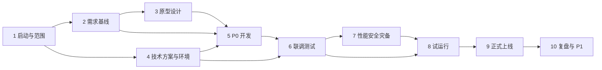

# 校园统一 AI 网关项目时间节点计划

## 计划说明

本计划对应《校园统一 AI 网关产品需求文档》，覆盖需求确认、原型设计、技术方案、开发、联调测试、试运行和上线复盘。

由于任务信息未提供明确的开始日期、截止日期及人员资源，采用以下假设：

- 计划开始时间：`2026-09-16`。
- 目标上线时间：`2026-10-30`，为建议目标，不代表已确认的项目期限。
- 计划周期：7 周（含 5 个工作日的上线缓冲/观察期）。
- 人员假设：1 名产品经理、1 名项目负责人、2 名后端/网关开发、1 名控制台前端、1 名测试工程师、1 名运维/安全工程师；实际人员不足时应调整期限。
- 资源假设：可用测试环境、至少 1 个公有云模型渠道、1 个校内私有模型或模拟渠道、统一身份认证测试账号和监控日志环境。
- 未明确事项：正式截止日期、首批模型与客户端名单、容量指标、费用口径、数据留存和内容审计策略，均在计划中标记为“待确认”。

若必须在 `2026-10-30` 前上线，应在 `2026-09-18` 前确认范围和资源。若首批渠道、统一认证或测试环境在该日期后仍未就绪，建议将上线日期顺延至资源到位后至少 10 个工作日。

## 时间节点计划

| 阶段 | 开始时间 | 截止时间 | 具体工作 | 交付成果 | 验收标准 | 依赖与风险 |
| --- | --- | --- | --- | --- | --- | --- |
| 1. 项目启动与范围确认 | 2026-09-16 | 2026-09-18 | 召开启动会；确认 P0/P1 范围、角色、首批模型/渠道/客户端、统一身份方案、数据合规边界和项目截止日期 | 项目章程；需求范围清单；角色与通讯录；待确认事项清单 | 负责人、产品、技术、运维共同确认范围；Q01-Q12 中影响 P0 的事项有结论或责任人和完成日期 | 依赖业务负责人和技术负责人参会；若首批资源不确定，后续排期只能按模拟渠道推进 |
| 2. 需求基线与验收设计 | 2026-09-17 | 2026-09-23 | 将 PRD 拆为用户故事、接口需求、权限矩阵、计量口径、错误码和验收用例；冻结 P0 需求 | 评审版 PRD；需求追踪矩阵；P0 验收用例；术语表 | 每项 P0 需求均有唯一编号、负责人、输入输出和验收标准；评审意见关闭率达到 100% | 依赖阶段 1 的范围确认；费用、日志正文和内容审计规则未确认会影响 F04/F07 |
| 3. 原型与交互设计 | 2026-09-21 | 2026-09-30 | 设计工作台、模型渠道、用户令牌、配额计量、路由、看板、日志审计、模型广场和帮助中心；补齐加载/空/失败/无权限状态 | 高保真原型；页面状态说明；交互标注；字段和权限说明 | 关键流程可走通：登录→选模型→创建 Key→调用→查用量/日志；产品和前端评审通过 | 依赖阶段 2；若权限矩阵变化，将产生返工；预留 2 个工作日评审缓冲 |
| 4. 技术方案与环境准备 | 2026-09-21 | 2026-10-02 | 确定 Higress/APISIX 与 LiteLLM 集成方案；设计数据模型、配置发布、路由、配额账本、日志审计和监控；准备开发/测试环境、密钥存储和 CI | 技术设计说明；接口契约；数据库/配置模型；环境清单；部署脚本 | 架构评审通过；测试环境可部署；统一身份、模型模拟渠道、日志和监控链路可连通 | 依赖阶段 1；环境、网络、证书或上游凭证延迟是关键风险；至少预留 3 个工作日环境缓冲 |
| 5. P0 核心开发 | 2026-09-28 | 2026-10-16 | 并行开发统一 API、协议适配、模型/渠道管理、用户与 Key、配额限流、基础路由/Fallback、调用日志和基础看板 | 可部署 P0 服务；管理控制台首版；接口文档首版；迁移/初始化脚本 | P0 主流程在开发环境跑通；无效 Key、权限、IP、额度、限流和渠道故障场景有自动化或可重复验证记录 | 依赖阶段 4；模块接口需在 2026-10-02 前冻结；并行开发需统一 request_id、错误码和数据口径 |
| 6. 联调与功能测试 | 2026-10-12 | 2026-10-21 | 接入真实或准生产公有渠道、私有模型和首批客户端；执行接口兼容、权限、配额、路由、流式、审计和看板测试；修复缺陷 | 联调报告；缺陷清单；兼容性矩阵；测试数据和测试记录 | P0 阻塞级/严重级缺陷为 0；核心验收用例通过率 100%；至少 1 个公有渠道和 1 个私有/模拟渠道通过端到端调用 | 依赖阶段 5 可部署版本和阶段 4 环境；上游额度不足或客户端版本变动会阻塞验证 |
| 7. 性能、安全与灾备验证 | 2026-10-19 | 2026-10-23 | 执行容量压测、并发与流式测试；验证 Key 脱敏、越权、IP、密钥轮换、日志留存；演练渠道故障、节点故障、重复结算和配置回滚 | 性能报告；安全测试报告；故障演练报告；容量与上线参数建议 | 达到已确认的 RPM/TPM/并发和延迟指标；无高风险安全问题；故障切换、回滚和账本幂等验证通过 | 容量指标当前为待确认；若 2026-10-09 前仍未确认，性能验收只能输出基线，不应承诺正式 SLA |
| 8. 试运行与上线评审 | 2026-10-24 | 2026-10-28 | 选定试点组织和应用；导入正式模型配置；培训管理员和开发者；观察错误率、延迟、余额、费用、告警和日志；完成上线检查 | 试运行报告；培训材料；上线检查表；回滚方案；最终发布包 | 试点用户完成首次调用；连续 3 个工作日无 P0/P1 事故；监控、告警、备份、值班和回滚责任人明确 | 依赖阶段 6、7 通过；若试点出现严重兼容或计量问题，启动回滚并顺延上线 |
| 9. 正式上线与观察缓冲 | 2026-10-29 | 2026-10-30 | 分批开放组织和应用；执行上线后冒烟测试；每日检查调用成功率、Fallback、Token/费用和告警；处理上线问题 | 正式上线记录；上线后监控日报；问题与改进清单 | 上线冒烟通过；关键指标在基线范围内；无未处理严重告警；用户可通过统一地址和 Key 调用获准模型 | 依赖阶段 8；保留 2 个工作日缓冲。若发生回滚，使用 2026-10-30 作为恢复窗口，正式目标应顺延 |
| 10. 复盘与 P1 排期 | 2026-11-02 | 2026-11-04 | 汇总试运行和上线数据；评估 OAuth/订阅适配、更多客户端、内容审计、高级路由等 P1 需求；确认下一版本资源和时间 | 项目复盘报告；运营指标基线；P1 版本路线图；遗留问题清单 | 关键问题有责任人、优先级和截止日期；P1 需求完成排序并获得评审确认 | 依赖阶段 9 的真实运行数据；缺少真实数据时只能输出初步结论 |

## 依赖关系

关键依赖如下：

1. 首批模型、渠道和客户端名单确认后，才能冻结兼容性测试范围。
2. 统一身份认证、测试凭证和测试环境就绪后，才能进行真实联调。
3. 计量、价格和失败成本口径确认后，才能完成费用验收；否则只能验收 Token 和事件记录。
4. 容量指标确认后，性能测试结果才具有正式验收效力。
5. Fallback、流式中断和重复结算规则必须在开发前冻结，否则会造成核心链路返工。

## 关键节点快速查看

| 日期 | 关键节点 | 判断标准 |
| --- | --- | --- |
| 2026-09-18 | 范围与资源确认 | P0 范围、首批模型/客户端、负责人和环境资源明确 |
| 2026-09-23 | 需求基线冻结 | PRD、权限矩阵、计量口径和验收用例评审通过 |
| 2026-10-02 | 技术与环境就绪 | 架构通过，测试环境、模拟渠道和监控链路可用 |
| 2026-10-16 | P0 开发完成 | 统一调用、Key、配额、路由、日志和看板首版可部署 |
| 2026-10-23 | 测试与上线门禁完成 | 严重缺陷清零，性能、安全、故障演练达到已确认标准 |
| 2026-10-30 | 正式上线目标 | 试运行通过，完成分批发布并保留上线观察缓冲 |

## 调整建议

当前没有用户确认的正式截止日期，因此 `2026-10-30` 只能作为建议目标。若实际截止日期早于 `2026-10-23`，不建议压缩测试、安全和故障演练；可将首期范围收敛为统一 API、一个公有渠道、一个私有/模拟渠道、Key、基础额度、基础日志和基础看板，并将 OAuth/订阅、多客户端扩展、内容审计和高级路由移至 P1。

若可投入人员少于上述假设，建议每减少 1 个核心开发角色增加 5 个工作日；若同时缺少测试或运维角色，至少增加 5—10 个工作日。若 `2026-09-18` 前无法获得真实上游凭证，则先用模拟渠道完成主流程开发，并把真实渠道联调和费用验收作为上线前置条件。

Create By nimbus(WXID:168007300)
