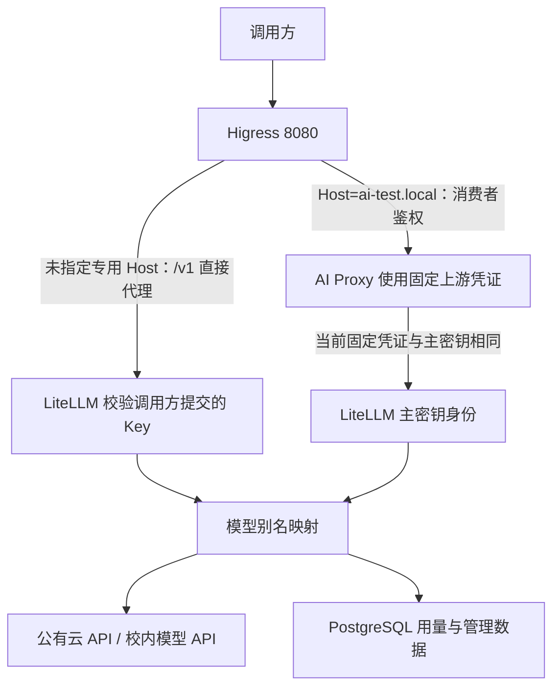

# 项目现状、未完成事项及后续实施计划

核查日期：2026-09-16  
范围：当前工作区的实际代码、配置、文档、测试、Git、本机现有容器、数据库只读统计与本地只读接口。  
配套证据：[doc/项目现状核查-验证记录-2026-09-16.md:1](/D:/zhilin/API网关/doc/项目现状核查-验证记录-2026-09-16.md:1)。

**当前定位：已有运行实例和专项验证工具的本地集成验证工程，尚未形成可交接复建、按校园用户治理并完成上线验收的平台。** 本次确认目录访问、基础鉴权、兼容补丁离线行为和监控采集可用；未重新调用真实模型。需求覆盖情况不能用容器数量、源码体量、模型目录数量或测试通过数代替。

本次只新增分析报告及验证记录，没有修改业务代码、配置或测试，没有部署、重建容器、直接写入业务数据、执行压力测试或调用外部模型。核查前后 33 个配置/测试等文件的内容摘要一致。

## 一、项目整体情况

### 1. 项目要做什么

目标是面向校园业务系统、AI 智能体、编程客户端及科研办公工具，提供统一地址和平台 API Key，集中调用公有云、校内私有模型以及具备接入条件的订阅/OAuth 资源，并管理模型渠道、身份权限、配额、计量、路由、监控、审计和接入文档。

需求依据为图片及其整理稿：[doc/校园统一AI网关产品需求文档.md:20](/D:/zhilin/API网关/doc/校园统一AI网关产品需求文档.md:20)、[doc/校园统一AI网关产品需求文档.md:169](/D:/zhilin/API网关/doc/校园统一AI网关产品需求文档.md:169)。该 PRD 明确区分图示需求、建议和待确认事项，尚不能把建议排期、价格口径、额度周期、性能数值或组件选型当作已批准约束，见 [doc/校园统一AI网关产品需求文档.md:42](/D:/zhilin/API网关/doc/校园统一AI网关产品需求文档.md:42)。

目标业务流程：

1. 用户通过校园身份登录，获得组织、应用和模型权限。
2. 创建个人/应用 Key，设置有效期、来源范围及限额。
3. 客户端向统一入口请求逻辑模型。
4. 网关认证并执行权限、预算、限流及路由；满足条件时切换兼容渠道。
5. 返回完整结果，记录原始用量、费用、调用归属和异常。
6. 用户查看消耗，管理员调整资源，运维/审计人员追踪问题。

**当前实际流程存在两条入口路径，身份模型不同：**

默认转发路由见 [runtime/higress/ingresses/litellm-proxy.yaml:32](/D:/zhilin/API网关/runtime/higress/ingresses/litellm-proxy.yaml:32)；专用路由见 [runtime/higress/ingresses/ai-route-litellm-ai-test.internal.yaml:46](/D:/zhilin/API网关/runtime/higress/ingresses/ai-route-litellm-ai-test.internal.yaml:46)；固定上游凭证见 [runtime/higress/wasmplugins/ai-proxy.internal.yaml:55](/D:/zhilin/API网关/runtime/higress/wasmplugins/ai-proxy.internal.yaml:55)。凭证相等关系已在内存中比对，未展示值，见 [doc/项目现状核查-验证记录-2026-09-16.md:92](/D:/zhilin/API网关/doc/项目现状核查-验证记录-2026-09-16.md:92)。

这两条链路不能作为同一种“用户独立 Key + 独立额度”实现来验收。专用路由目前不能直接依靠 LiteLLM 收到的 Key 区分各消费者。

### 2. 技术栈、目录与模块

| 目录/组件 | 当前内容与职责 | 边界 |
| --- | --- | --- |
| 根目录 Compose | 主服务、监控、独立压测环境编排 | 本地单机方案；主服务未使用项目内源码构建 Higress |
| config/litellm.yaml | 8 个逻辑模型别名、上游端点与凭证环境变量、Responses callback | 当前配置中没有同别名多部署、明确业务 Fallback、价格及业务限额 |
| config/litellm-patch/ | Python 请求兼容 hook、对特定 LiteLLM 模块的补丁、固定基础镜像、回滚覆盖配置及 13 项离线测试 | 只解决特定 Responses 流和目标 Qwen 模板问题 |
| config/monitoring/ | Prometheus 抓取、Grafana 数据源及 12 面板 Dashboard | 以 Envoy 入口/上游指标为主，不是完整用户费用看板 |
| test/ | Python CLI、测试器的单元测试、历史终端记录 | 部分 CLI 默认会发起真实调用，不能把整个目录直接当作安全离线测试集 |
| test/benchmark/ | Node HTTP Mock、k6、独立路由模板及初始化脚本 | 仅模拟上游；和当前业务部署的插件、数据库、镜像配置不同 |
| runtime/ | Higress 实际运行配置、历史 JSON 报告、请求/响应抓包等 | 被 Git 忽略；当前运行必需的部分配置只在此目录，不能直接复制全部内容入库 |
| sources/higress-src/ | 上游 Go 控制面、Envoy/WASM 插件源码 | 独立 Git 仓库；当前镜像与该源码提交的精确对应关系待验证 |
| sources/litellm-src/ | 上游 Python/FastAPI/Prisma 网关、管理接口、Next.js/React 管理界面等 | 是上游代码，不等于校园门户已经集成；源码版本与运行包版本不同 |
| doc/、jpg/ | 需求图、评估、验证说明、PRD、历史计划 | 存在文档落后于运行状态的情况 |
| 校园管理服务/门户 | 未发现独立项目级实现、校园身份适配和组织同步链路 | 可复用上游能力，但仍需适配、授权确认和验收 |

入口配置依据：[docker-compose.yml:1](/D:/zhilin/API网关/docker-compose.yml:1)；补丁构建依据：[config/litellm-patch/Dockerfile:1](/D:/zhilin/API网关/config/litellm-patch/Dockerfile:1)；监控依据：[config/monitoring/prometheus.yml:1](/D:/zhilin/API网关/config/monitoring/prometheus.yml:1)；上游栈依据：[sources/litellm-src/pyproject.toml:1](/D:/zhilin/API网关/sources/litellm-src/pyproject.toml:1)、[sources/litellm-src/ui/litellm-dashboard/package.json:6](/D:/zhilin/API网关/sources/litellm-src/ui/litellm-dashboard/package.json:6)、[sources/higress-src/go.mod:1](/D:/zhilin/API网关/sources/higress-src/go.mod:1)。

实际运行版本：LiteLLM **1.100.0**、PostgreSQL 16 镜像、Grafana 12.1.1；Higress 和 Prometheus 使用浮动标签，实际镜像 ID 已记录。LiteLLM 源码的 pyproject.toml 是 **1.102.0**，因此上游源码中存在的函数不能直接作为 1.100.0 运行环境已启用功能的证明。

### 3. 启动方式、依赖与必要配置

以下为根据现有编排核查出的操作入口，**本次均未执行启动或部署**：

| 场景 | 操作入口 | 必须先满足 |
| --- | --- | --- |
| 主服务 | 项目根目录执行 docker compose build litellm；随后 docker compose up -d | Docker Linux 引擎、镜像仓库可访问、外部 PostgreSQL 卷存在、Higress 路由/插件可恢复、端口/子网不冲突 |
| 监控 | docker compose -f docker-compose.monitoring.yml up -d，使用确认后的固定项目名 | api-gateway-higress 容器和 api-gateway-network 已存在；保持与原监控数据卷一致的项目名 |
| 压测环境 | docker compose -f docker-compose.benchmark.yml up -d --wait --wait-timeout 180 | 仅未来隔离验证时执行；会创建服务，不属于本次检查 |
| 补丁回滚 | 主 Compose 叠加 config/litellm-patch/compose.rollback.yml | 先在隔离环境验证；当前只确认配置可解析，未验证真实恢复 |

主网络为 172.30.50.0/24，压测网络为 172.30.51.0/24，使用固定 IP。PostgreSQL 依赖名为 litellm_postgres_data 的外部卷，当前机器存在，但全新机器不能仅凭 Compose 文件自动完成同样初始化，见 [docker-compose.yml:66](/D:/zhilin/API网关/docker-compose.yml:66)。

主配置需要 DASHSCOPE_API_KEY、ZHILIN_aigc_API_KEY、DEEPSEEK_API_KEY、AGNES_API_KEY；本机 .env 中对应变量有值，仅验证存在性，没有验证有效期、余额或供应商权限。示例文件却只列 MODEL_API_KEY，存在明确的配置交接不匹配，见 [.env.example:1](/D:/zhilin/API网关/.env.example:1)、[config/litellm.yaml:1](/D:/zhilin/API网关/config/litellm.yaml:1)。

LITELLM_MASTER_KEY、数据库密码和连接信息当前在 Compose 中定义，应在后续实施中迁出并轮换；本报告不复制这些值。现有配置仅对 PostgreSQL 设置 healthcheck，Higress 只通过启动顺序依赖 LiteLLM，不能保证 LiteLLM 已就绪，见 [docker-compose.yml:12](/D:/zhilin/API网关/docker-compose.yml:12)、[docker-compose.yml:50](/D:/zhilin/API网关/docker-compose.yml:50)。

外部依赖包括模型供应商 API、校内模型端点、镜像与插件资源、未来的学校身份系统、DNS/证书及部署环境。当前工程没有部署 Redis；是否引入 Redis 或其他共享状态实现，应由多副本限流/配额方案确定，不能把特定中间件当作图片已经指定的要求。

### 4. Git 与交接风险

根分支为 test，**没有任何提交**。已暂存的主要是图片、评估文档和两个源码 gitlink；业务配置、补丁、测试、PRD 和多数文档未跟踪。两个源码目录在索引中均为 mode=160000，但根没有 .gitmodules。

因此，“当前机器存在这些文件”和“接手人 clone 后得到可运行工程”是不同状态；当前无法从根提交 SHA 追踪发布内容，也不能确认已有独立可还原的交付版本。Higress 源码仅观察到原已存在的未跟踪缓存，LiteLLM 源码工作区干净。本次未暂存、提交、拉取或改动分支。完整证据见 [doc/项目现状核查-验证记录-2026-09-16.md:5](/D:/zhilin/API网关/doc/项目现状核查-验证记录-2026-09-16.md:5)。

## 二、已完成的功能及实际状态

状态定义：**已实现且已验证**仅适用于本次实际验证的明确子功能；**已实现但未验证**表示存在实质逻辑/配置，但未完成本次相应执行验证；**部分实现**表示只形成部分流程；**尚未实现**指项目集成范围没有对应闭环；**因依赖或环境受阻**仅用于明确的资源或环境前置条件。历史成功另列，不自动升级当前状态。

| 模块 | 功能 | 当前实现情况 | 关键代码位置 | 验证情况 |
| --- | --- | --- | --- | --- |
| F01 统一入口 | 目录转发与基础 Key 校验 | **已实现且已验证**：4000、默认 8080、专用 Host 路由可读取目录；匿名/无效 Key 被拒绝 | [runtime/higress/ingresses/litellm-proxy.yaml:32](/D:/zhilin/API网关/runtime/higress/ingresses/litellm-proxy.yaml:32)；[runtime/higress/wasmplugins/key-auth.internal.yaml:63](/D:/zhilin/API网关/runtime/higress/wasmplugins/key-auth.internal.yaml:63)；[sources/litellm-src/litellm/proxy/proxy_server.py:10307](/D:/zhilin/API网关/sources/litellm-src/litellm/proxy/proxy_server.py:10307) | 本次 GET 返回 8 个模型；合法 200、非法 401。仅证明目录与认证 |
| F01 模型调用 | Chat、SSE、向量、图片相关接口 | **已实现但未验证（本次真实调用）**：有配置和执行脚本，历史存在成功记录 | [config/litellm.yaml:1](/D:/zhilin/API网关/config/litellm.yaml:1)；[test/test_gateway_models.py:193](/D:/zhilin/API网关/test/test_gateway_models.py:193)；[test/test_gateway_models.py:340](/D:/zhilin/API网关/test/test_gateway_models.py:340) | 历史 Qwen/Kimi 调用有 JSON；向量/OCR 有终端记录。当前上游可用性及质量待复验 |
| F01 Responses | 空 choices 流兼容、目标模型前置指令合并 | **已实现且已验证（离线行为）** | [config/litellm-patch/patch_streaming.py:12](/D:/zhilin/API网关/config/litellm-patch/patch_streaming.py:12)；[config/litellm-patch/gateway_responses_compat.py:8](/D:/zhilin/API网关/config/litellm-patch/gateway_responses_compat.py:8)；[config/litellm-patch/gateway_responses_compat.py:38](/D:/zhilin/API网关/config/litellm-patch/gateway_responses_compat.py:38) | 容器内 6+7 项通过，部署文件摘要与本地一致；真实 Responses 和工具往返本次未执行 |
| F02 资源管理 | 模型别名、供应商/私有端点接入 | **部分实现**：8 个 YAML 别名、静态端点和凭证引用已加载 | [config/litellm.yaml:1](/D:/zhilin/API网关/config/litellm.yaml:1)；[runtime/higress/mcpbridges/default.yaml:17](/D:/zhilin/API网关/runtime/higress/mcpbridges/default.yaml:17) | 目录与配置一致；DB ProxyModelTable 为 0，不代表模型不存在；未见完整发布/价格/健康闭环 |
| F02 订阅/OAuth | 模型资源授权、刷新、撤销 | **尚未实现（当前接入配置）** | [config/litellm.yaml:3](/D:/zhilin/API网关/config/litellm.yaml:3)；[doc/model-capability-validation.md:13](/D:/zhilin/API网关/doc/model-capability-validation.md:13) | 当前均为 API Key 接入；具体订阅资源及可用授权方式待确认 |
| F03 用户/Key | 上游用户、团队和虚拟 Key 基础数据 | **部分实现**：有上游管理逻辑与数据库记录；独立校园身份链未连通 | [sources/litellm-src/litellm/proxy/management_endpoints/key_management_endpoints.py:1735](/D:/zhilin/API网关/sources/litellm-src/litellm/proxy/management_endpoints/key_management_endpoints.py:1735)；[sources/litellm-src/litellm/proxy/schema.prisma:419](/D:/zhilin/API网关/sources/litellm-src/litellm/proxy/schema.prisma:419)；[runtime/higress/wasmplugins/ai-proxy.internal.yaml:55](/D:/zhilin/API网关/runtime/higress/wasmplugins/ai-proxy.internal.yaml:55) | DB 为 1 用户、1 团队、6 Key；不据此声称创建/禁用/轮换全流程已验收；主密钥转发问题已确认 |
| F03 校园身份/IP | SSO、组织隔离与 IP 策略 | **尚未实现（校园集成层）** | [doc/校园统一AI网关产品需求文档.md:238](/D:/zhilin/API网关/doc/校园统一AI网关产品需求文档.md:238)；[docker-compose.yml:1](/D:/zhilin/API网关/docker-compose.yml:1)；[runtime/higress/wasmplugins/key-auth.internal.yaml:63](/D:/zhilin/API网关/runtime/higress/wasmplugins/key-auth.internal.yaml:63) | 无校园身份配置、SSO 绑定和组织数据；未见启用 IP 限制的运行插件，跨组织/API 越权测试未完成 |
| F04 计量 | 原始 Token 与调用记录持久化 | **部分实现**：历史调用已写入 PostgreSQL | [sources/litellm-src/litellm/proxy/schema.prisma:628](/D:/zhilin/API网关/sources/litellm-src/litellm/proxy/schema.prisma:628)；[docker-compose.yml:30](/D:/zhilin/API网关/docker-compose.yml:30) | 初次精确 count 为 232 条记录，218 条 Token>0；末次记录数 236；本次未发模型生成请求验证写入 |
| F04 费用/配额 | 价格、预算、周期额度、RPM/TPM/并发 | **部分实现**：5 Key 存有正预算，但未形成可验收治理闭环 | [config/litellm.yaml:56](/D:/zhilin/API网关/config/litellm.yaml:56)；[sources/litellm-src/litellm/proxy/schema.prisma:435](/D:/zhilin/API网关/sources/litellm-src/litellm/proxy/schema.prisma:435) | 初次与末次快照的消费记录费用均为 0；Key/团队 RPM、TPM、并发均未设；周期字段未设；严格预算和结算待验证 |
| F05 路由 | 多部署负载均衡、Fallback、会话粘性 | **尚未实现（当前业务配置）**；仅有映射与某路由网络重试 | [config/litellm.yaml:1](/D:/zhilin/API网关/config/litellm.yaml:1)；[runtime/higress/wasmplugins/ai-proxy.internal.yaml:58](/D:/zhilin/API网关/runtime/higress/wasmplugins/ai-proxy.internal.yaml:58)；[runtime/higress/ingresses/ai-route-litellm-ai-test.internal.yaml:7](/D:/zhilin/API网关/runtime/higress/ingresses/ai-route-litellm-ai-test.internal.yaml:7) | 单 provider，业务 failover=false；无同别名多部署、无已配置 Key/团队路由覆盖；网络重试不是模型 Fallback |
| F06 监控 | Envoy 抓取与 Grafana 基础看板 | **已实现且已验证（基础监控）** | [config/monitoring/prometheus.yml:5](/D:/zhilin/API网关/config/monitoring/prometheus.yml:5)；[config/monitoring/dashboards/higress.json:1](/D:/zhilin/API网关/config/monitoring/dashboards/higress.json:1) | 双 target up，12 面板存在，12 个展开宏后的 PromQL 执行成功；无生成流量窗口的 NaN 单独说明 |
| F06 业务看板 | 用户/模型/渠道费用、Token 排行、首段延迟 | **部分实现**：上游数据底座与网络指标存在，统一业务看板未交付 | [config/monitoring/dashboards/higress.json:103](/D:/zhilin/API网关/config/monitoring/dashboards/higress.json:103)；[doc/higress-monitoring-local.md:35](/D:/zhilin/API网关/doc/higress-monitoring-local.md:35) | 当前 12 面板无费用/逐 Key/模型首字指标；上游自带 UI 的相关流程未做本次页面验收 |
| F07 审计安全 | 调用追踪、管理审计、内容审计、留存与告警 | **部分实现**：有调用记录、测试 request_id 和路由级统计；其余闭环缺失 | [test/test_gateway_resilience.py:110](/D:/zhilin/API网关/test/test_gateway_resilience.py:110)；[runtime/higress/wasmplugins/ai-statistics-2.0.1.yaml:46](/D:/zhilin/API网关/runtime/higress/wasmplugins/ai-statistics-2.0.1.yaml:46)；[config/monitoring/prometheus.yml:1](/D:/zhilin/API网关/config/monitoring/prometheus.yml:1) | AuditLog、GuardrailsTable 为 0；Prometheus rule_groups=0；未验证日志跨层关联、留存、告警和恢复 |
| F08 模型广场/支持 | 目录、教程、统一自助门户、公告/FAQ | **部分实现**：文档和模型列表已有，校园自助闭环未形成 | [doc/model-capability-validation.md:1](/D:/zhilin/API网关/doc/model-capability-validation.md:1)；[doc/校园统一AI网关产品需求文档.md:398](/D:/zhilin/API网关/doc/校园统一AI网关产品需求文档.md:398) | 无完整校园门户链路证据；上游 Next.js 界面存在不能替代本项目接入与权限验收 |
| 测试设施 | Python 检查器、Mock、k6 | **已实现且已验证（限定离线部分）**，存在两项已复现漏检 | [test/test_dual_gateway_unit.py:12](/D:/zhilin/API网关/test/test_dual_gateway_unit.py:12)；[test/test_gateway_resilience_unit.py:28](/D:/zhilin/API网关/test/test_gateway_resilience_unit.py:28)；[test/benchmark/mock.test.mjs:14](/D:/zhilin/API网关/test/benchmark/mock.test.mjs:14) | 宿主 13 项、Mock 4 项通过；压测容器已停止，本次没有运行完整 k6 链路 |
| 交付运行 | 新环境复建、正式 TLS、备份恢复、升级回滚 | **部分实现；新环境复建因前置资源受阻** | [docker-compose.yml:60](/D:/zhilin/API网关/docker-compose.yml:60)；[docker-compose.yml:73](/D:/zhilin/API网关/docker-compose.yml:73)；[config/litellm-patch/compose.rollback.yml:1](/D:/zhilin/API网关/config/litellm-patch/compose.rollback.yml:1) | 当前实例可运行；全新机器缺少可交付路由初始化与外部卷准备；仅回滚配置解析通过 |

数据库记录数是服务运行期间的分次快照，读取接口可能增加日志和统计，未将变化归因于未经验证的来源。数据库、镜像与本次测试的实际结果分别见 [doc/项目现状核查-验证记录-2026-09-16.md:44](/D:/zhilin/API网关/doc/项目现状核查-验证记录-2026-09-16.md:44)、[doc/项目现状核查-验证记录-2026-09-16.md:68](/D:/zhilin/API网关/doc/项目现状核查-验证记录-2026-09-16.md:68)、[doc/项目现状核查-验证记录-2026-09-16.md:117](/D:/zhilin/API网关/doc/项目现状核查-验证记录-2026-09-16.md:117)。

## 三、未完成事项与现有问题

### 1. 优先级依据

- **P0**：影响身份/权限边界、凭证安全、核心调用可信性或工程可恢复性，应先解除，再扩大试点和实施范围。
- **P1**：图示要求尚未闭环，或影响正式功能/容量/运维验收的缺陷；在相应范围交付前完成。
- **P2**：不阻断核心试点的文档整理或可选效率优化。不能用 P2 名义把原定功能取消。

“已确认需求缺口”是指能对照图示功能确认未形成闭环，不表示 PRD 中所有建议细节都已经业务批准。技术工具、实现方案和暂定 SLA 另行决策。

### 2. 已确认的问题与需求缺口

| 事项 | 当前状态与证据 | 影响范围 | 优先级 | 前置依赖 | 建议处理方式 |
| --- | --- | --- | --- | --- | --- |
| 专用路由固定使用主密钥 | 运行配置凭证与 LITELLM_MASTER_KEY 相等；[runtime/higress/wasmplugins/ai-proxy.internal.yaml:55](/D:/zhilin/API网关/runtime/higress/wasmplugins/ai-proxy.internal.yaml:55)；[doc/项目现状核查-验证记录-2026-09-16.md:92](/D:/zhilin/API网关/doc/项目现状核查-验证记录-2026-09-16.md:92) | 不能直接按消费者独立 Key 授权、限额和归因；下游看到的身份权限过大 | P0 | 确认唯一平台凭证和调用身份传递方式 | 改为透传受限虚拟 Key，或建立可信的逐消费者映射；移除业务转发使用主密钥的路径；验证两个用户的隔离 |
| 硬编码凭证与宽端口绑定 | Compose 有固定主密钥/数据库密码；测试脚本中有当前有效消费者 Key；4000/8001/8080/8443 绑定全部接口；[docker-compose.yml:9](/D:/zhilin/API网关/docker-compose.yml:9)、[docker-compose.yml:35](/D:/zhilin/API网关/docker-compose.yml:35)、[test/test_higress_route.py:38](/D:/zhilin/API网关/test/test_higress_route.py:38) | 凭证流转、内核入口绕过治理、管理入口暴露风险；外部网络实际可达性仍待验证 | P0 | 凭证管理与目标网络范围 | 迁移敏感值、轮换已分发测试凭证、限制管理/内核端口，仅保留必要入口；不要把真实 runtime/secret 直接入库 |
| 鉴权插件失败策略需收紧 | key-auth 为 FAIL_OPEN；[runtime/higress/wasmplugins/key-auth.internal.yaml:77](/D:/zhilin/API网关/runtime/higress/wasmplugins/key-auth.internal.yaml:77)；插件版本标签与实际 URL 版本不同 | 插件失败时行为没有验收证据；存在旧版本加载失败历史 | P0 | 确认运行镜像、插件版本、鉴权故障策略 | 在隔离环境验证 fail-open/closed 的实际语义，选定安全策略；统一版本元数据，演练加载失败 |
| 仓库不可按提交复建 | 无根提交，关键工程文件未跟踪，gitlink 无 .gitmodules，业务路由只在被忽略的 runtime；[.gitignore:1](/D:/zhilin/API网关/.gitignore:1)；[docker-compose.yml:60](/D:/zhilin/API网关/docker-compose.yml:60)；验证记录 V01 | 接手、回滚、审计和新环境启动 | P0 | 源码管理策略及脱敏配置清单 | 形成可审查基线；固定依赖来源/版本；提交无秘密的运行模板和初始化方式，单独管理实际秘密值 |
| 运行版本与源码不一致 | 运行 LiteLLM 1.100.0，源码 1.102.0；[sources/litellm-src/pyproject.toml:3](/D:/zhilin/API网关/sources/litellm-src/pyproject.toml:3)；验证记录 V02 | 源码排障、能力判断、补丁升级和回归失真 | P0 | 选择继续固定运行版或升级 | 先记录版本/摘要清单并对齐诊断源码；升级属于后续独立变更，不能直接套用现有字节补丁 |
| 配置示例与真实变量不匹配 | 示例只有 MODEL_API_KEY，模型配置引用 4 个不同变量；外部卷必须预先存在；[.env.example:2](/D:/zhilin/API网关/.env.example:2)；[config/litellm.yaml:6](/D:/zhilin/API网关/config/litellm.yaml:6)；[docker-compose.yml:73](/D:/zhilin/API网关/docker-compose.yml:73) | 新环境真实模型调用和数据库启动 | P0 | 模型资源清单、卷初始化方案 | 补完整无密钥示例、变量校验和冷启动步骤；在空白环境验证缺项提示 |
| 校园身份、组织、应用权限缺失 | 无校园接入实现；SSO/组织表为空；单用户/单团队不能证明隔离；[doc/校园统一AI网关产品需求文档.md:238](/D:/zhilin/API网关/doc/校园统一AI网关产品需求文档.md:238)；验证记录 V05 | 多部门、多用户接入与管理 | P1 | 学校身份协议、组织来源、角色边界；身份转发问题先解决 | 复用合适的上游接口，补同步与管理流程；验证离职、转组、禁用及越权 |
| 费用与额度无法完成对账验收 | 初次 232 条、末次 236 条记录费用均 0，未配置显式价格，5 Key 预算字段不代表扣费有效；[config/litellm.yaml:1](/D:/zhilin/API网关/config/litellm.yaml:1)；验证记录 V05 | 费用统计、预算阻断、资源分摊 | P1，若首期依赖费用控制则为上线阻断 | 定价、币种、免费/未知价格、失败和重试费用口径 | 确定价格来源/版本，未知值显式标记；用受控请求核对原始用量、账本与余额，验证幂等和取消 |
| RPM/TPM/并发与周期额度未配置 | Key/团队相关字段设置数为 0，周期字段为 0，无共享状态方案；[sources/litellm-src/litellm/proxy/schema.prisma:435](/D:/zhilin/API网关/sources/litellm-src/litellm/proxy/schema.prisma:435)；验证记录 V05 | 资源公平性、限流、额度周期、多副本扩展 | P1 | 权威执行层、配额规则和部署规模 | 配置并验证限额；达到阈值、窗口恢复、并发竞争、进程异常和跨周期均应有证据 |
| 缺少业务 Fallback、粘性及兼容池 | 单 provider，模型别名单部署，failover 关闭；但专用路由启用含 non_idempotent 的网络重试；[runtime/higress/wasmplugins/ai-proxy.internal.yaml:58](/D:/zhilin/API网关/runtime/higress/wasmplugins/ai-proxy.internal.yaml:58)；[runtime/higress/ingresses/ai-route-litellm-ai-test.internal.yaml:7](/D:/zhilin/API网关/runtime/higress/ingresses/ai-route-litellm-ai-test.internal.yaml:7) | 可用性、重复执行、超时与成本 | P1 | 确认备用资源、跨模型降级及会话状态约束 | 明确重试唯一归属、总时限、次数、首段输出边界；建立兼容部署池并做故障注入 |
| 模型能力与别名说明未形成可信目录 | qwen3.7-flash 实际映射 openai/qwen3.5-ocr；drop_params=true；[config/litellm.yaml:16](/D:/zhilin/API网关/config/litellm.yaml:16)、[config/litellm.yaml:59](/D:/zhilin/API网关/config/litellm.yaml:59) | 用户按模型名选择、参数语义、工具兼容 | P1 | 资源负责人确认该映射是否有意、必要参数清单 | 核对模型名/能力/上下文/价格；逐项测试不可静默丢弃的参数，未验证能力不要宣传 |
| 客户端完整验收未齐 | Responses hook 仅命中目标别名；托管工具/状态复用未保证，显式函数 tool_choice 有已记录限制；[config/litellm-patch/gateway_responses_compat.py:40](/D:/zhilin/API网关/config/litellm-patch/gateway_responses_compat.py:40)；[config/litellm-patch/README.md:76](/D:/zhilin/API网关/config/litellm-patch/README.md:76) | Codex 及其他图示客户端 | P1 | 首批客户端与版本、模型组合 | 将已验证接口和限制写入矩阵；验收实际工具往返、上下文、流式结束和错误，不能只验 HTTP 200 |
| 业务监控、告警、审计与留存缺口 | 12 面板主要为网络指标；rule_groups=0，AuditLog=0；[config/monitoring/dashboards/higress.json:1](/D:/zhilin/API网关/config/monitoring/dashboards/higress.json:1)；[config/monitoring/prometheus.yml:1](/D:/zhilin/API网关/config/monitoring/prometheus.yml:1)；验证记录 V05/V06 | 用户消耗、成本、事故响应、责任追溯 | P1 | 统一请求标识、身份计量口径、日志策略 | 串联 request_id/attempt_id/Key 归属，补业务指标和告警规则，配置审计、脱敏、留存并验证失败恢复 |
| 模型广场、自助 Key 与帮助中心未闭环 | 只有目录 API 和文档，未见校园门户的完整前后端链路；[doc/校园统一AI网关产品需求文档.md:398](/D:/zhilin/API网关/doc/校园统一AI网关产品需求文档.md:398) | 用户自助接入、申请、状态说明 | P1 | 管理接口/权限确定；界面复用或新增方案 | 先交付登录、授权目录、Key 生命周期、用量查询和接入教程；公告/FAQ 按发布范围验收 |
| 订阅/OAuth 与内容审计未接入 | 当前使用 API Key；无对应资源授权刷新/撤销配置和治理记录；[doc/model-capability-validation.md:13](/D:/zhilin/API网关/doc/model-capability-validation.md:13)；[doc/校园统一AI网关产品需求文档.md:370](/D:/zhilin/API网关/doc/校园统一AI网关产品需求文档.md:370) | 图示扩展资源和内容治理 | P1，具体版本归属待确认 | 供应商接入能力、测试账号；学校审计规则 | 明确适用范围后适配，完成刷新/撤销、输入/输出审核和失败策略；不把未确认能力承诺在首期 |
| 两个测试有已复现漏检 | 普通双入口测试接受 HTTP 200 空对象；Mock 逗号表达式逐字符迭代；[test/test_dual_gateway.py:232](/D:/zhilin/API网关/test/test_dual_gateway.py:232)；[test/benchmark/mock.test.mjs:38](/D:/zhilin/API网关/test/benchmark/mock.test.mjs:38) | 测试结论可信度 | P1 | 无外部依赖 | 收紧正常响应判定、修正测试数据集合；先用失败样本验证测试会失败，再验证正确输入通过 |
| 历史高并发异常未闭环 | Kimi 500 次有 100 个 429 和 1 个 200 内容失败；[runtime/gateway-checks/check-c454f490009f4c7194a24b19ae2c1736.json:5440](/D:/zhilin/API网关/runtime/gateway-checks/check-c454f490009f4c7194a24b19ae2c1736.json:5440) | 上游限额、输出完整性和容量 | P1 | 同版本报告、上游与网关关联日志 | 确定 429 来源、空输出原因；报告异常预算/模型/输入，不推定为某层故障 |
| 缺少正式配置容量及交付演练 | 压测用未打补丁的浮动 LiteLLM、无 DB/业务插件；仅 3 秒级 Mock 报告；回滚未部署验证；[docker-compose.benchmark.yml:33](/D:/zhilin/API网关/docker-compose.benchmark.yml:33)；[doc/gateway-capacity-benchmark.md:17](/D:/zhilin/API网关/doc/gateway-capacity-benchmark.md:17)；[config/litellm-patch/README.md:56](/D:/zhilin/API网关/config/litellm-patch/README.md:56) | 上线容量、安全、可恢复性 | P1 | 固定版本/资源、目标负载及独立环境 | 同配置长时压测和安全回归；演练迁移、备份恢复、回滚、证书及值班流程 |
| 文档存在过时状态与计划假设 | 监控文档仍写未就绪，当前 Envoy LIVE；能力文档说部分用例未执行，但 tets.md 有后续输出；旧计划日期/人力未经确认 | 交接判断和排期 | P2，启动说明更新随 P0 完成 | 本报告证据、负责人确认 | 标历史日期与适用版本，补统一启动/验证入口；旧日期计划保留为历史假设，不沿用为承诺 |

### 3. TODO、模拟和占位的边界

本次在项目自有 config/test 范围未发现字面 TODO/FIXME/NotImplementedError 标记；这不代表功能完整。主要未完成内容表现为缺少业务配置、管理集成和验收闭环，而非代码中的 TODO。

test/benchmark/mock.mjs 使用固定文本和示例 usage，属于隔离测试数据，不是生产模型结果，见 [test/benchmark/mock.mjs:20](/D:/zhilin/API网关/test/benchmark/mock.mjs:20)、[test/benchmark/mock.mjs:74](/D:/zhilin/API网关/test/benchmark/mock.mjs:74)。向量和图像生成模型若未通过 CLI 参数明确分类，默认模型遍历可能按聊天接口调用，见 [test/test_gateway_models.py:328](/D:/zhilin/API网关/test/test_gateway_models.py:328)；因此不能把默认全模型运行的结果直接当作能力矩阵。

上游仓库中的通用 TODO 不直接列成本项目待办；只将当前集成实际使用到、经检查确认的缺陷纳入。

### 4. 可选优化与待决实现方案

以下不是新增的原定需求，不计为已经确认的缺失功能：

| 建议 | 优先级 | 采用条件 |
| --- | --- | --- |
| 用 Redis 实现共享限流/预算状态 | P2/架构决策 | 若需要多副本并且选定组件要求；验收目标是全局一致性，不是“必须有 Redis” |
| 迁移 Kubernetes、实现多节点 HA | P2/架构决策 | 正式可用性、运维条件和部署规模确认后；图片未规定必须使用 Kubernetes |
| 引入 Loki、OTel 或其他集中观测产品 | P2/工具选择 | 能满足日志关联、权限和留存即可，不指定单一产品 |
| 另建完全自研门户 | P2/实现选择 | 先评估复用现有管理接口与界面的能力和授权；统一用户体验是需求，自研方式不是唯一答案 |
| 高级成本/延迟路由、复杂内容分段审查 | P2/后续增强 | 先完成明确的基础路由与审计场景，再决定复杂策略 |
| 重新建立 CodeGraph 索引 | 不在本次建议执行范围 | 用户自行决定；本次未创建 |

## 四、验证结果

### 1. 实际执行与结果

| 类别 | 实际命令/方式 | 结果与解释 |
| --- | --- | --- |
| Git 与源码版本 | git status、git ls-files --stage、git log；子仓库 status/log；读取 pyproject.toml；容器 importlib.metadata | 确认无根提交、未跟踪工程文件、gitlink 问题和 1.102.0/1.100.0 版本差异 |
| Compose 检查 | docker compose -f 各配置文件 config --quiet；主配置叠加 rollback 覆盖 | 4 组均通过；不代表初始卷、路由、凭证和镜像均齐全 |
| Python 单元测试 | python -B -m pytest -p no:cacheprovider test/test_dual_gateway_unit.py test/test_gateway_resilience_unit.py -q | 13 passed、20 subtests passed，网络 Mock |
| Mock 行为测试 | node --test test/benchmark/mock.test.mjs | 4 passed；其中错误模型测试集合存在已复现漏检 |
| 运行镜像补丁测试 | docker exec 在现有容器执行 test_empty_choices.py 和 test_gateway_responses_compat.py | 6+7 项通过；禁用 pyc，使用本地价格映射，无上游生成调用 |
| 语法检查 | Python AST 解析；node --check mock.mjs、gateway.k6.js、init.mjs | 11 个 Python 文件与 3 个 JS 文件通过 |
| 网关读取 | 本地 /health/liveliness、/v1/models；Envoy /ready | 当前服务 LIVE；8 模型目录一致；缺失/无效认证被拒绝 |
| 数据库 | psql 只读模式执行信息结构及精确 count(*) | 确认基础数据与用量持久化，以及费用、限额、SSO、审计的实际缺口 |
| 监控 | Grafana health/dashboard；Prometheus targets/rules/query | 2 target up，12 表达式成功，告警规则 0；页面视觉与业务生成指标未验收 |
| 两项漏检复现 | Mock HTTP 200 {}；Node 独立求值逗号表达式 | 确认测试器会产生假阳性/漏测，未修改代码 |
| 不改动检查 | 核查前后 SHA-256 比较 + Git 再检查 | 33 个配置/测试等文件完全一致；上游受跟踪源码未改 |

精确命令、执行环境与可重复 SQL 见 [doc/项目现状核查-验证记录-2026-09-16.md:68](/D:/zhilin/API网关/doc/项目现状核查-验证记录-2026-09-16.md:68)、[doc/项目现状核查-验证记录-2026-09-16.md:117](/D:/zhilin/API网关/doc/项目现状核查-验证记录-2026-09-16.md:117)。

### 2. 失败、环境和配置问题的区分

- **已确认代码问题**：两个测试漏检，均通过离线方法复现，不是网络或供应商导致。
- **已确认配置/集成问题**：主密钥转发、硬编码凭证、变量示例不一致、缺少限额/路由/价格等当前业务配置、源码与运行版错位。
- **环境依赖边界**：宿主无 Go、无 LiteLLM 包；已有容器足以执行补丁离线测试，因此没有为检查安装依赖或启动新服务。压测容器退出 137 的原因待验证。
- **检查工具输入问题，已纠正**：消费者认证头重复 Bearer 导致一次 401；Windows 文本默认编码导致一次解码失败；Grafana 宏未经展开导致一次 Prometheus 400。修正检查方法后通过，不列为产品缺陷。
- **Git 状态事实**：git log 因不存在首次提交而失败，不是项目代码运行失败。

### 3. 历史证据与本次结果不能混用

已读取历史 JSON：Qwen 并发 10 的 50 次请求有效返回；Kimi 并发 60 的 500 次请求中只有 399 次有效返回。读取这些记录不是本次重跑。原始位置：[runtime/gateway-checks/check-955b5a77b44c40e5aeab14c00ed5dfda.json:571](/D:/zhilin/API网关/runtime/gateway-checks/check-955b5a77b44c40e5aeab14c00ed5dfda.json:571)、[runtime/gateway-checks/check-c454f490009f4c7194a24b19ae2c1736.json:5440](/D:/zhilin/API网关/runtime/gateway-checks/check-c454f490009f4c7194a24b19ae2c1736.json:5440)。

旧异常报告中无效 Key 返回 400，本次目录 GET 已返回 401；**不能由目录 GET 的修正推定聊天 POST 的所有错误语义已经修复**。旧监控文档中的 INITIALIZING 当前不再成立。两种差异都应在交接材料中标日期和接口范围。

模型能力文档曾标部分用例未执行，但 test/tets.md 已保留后续推理、编码、向量、OCR 和图片理解输出，见 [test/tets.md:1](/D:/zhilin/API网关/test/tets.md:1)、[test/tets.md:45](/D:/zhilin/API网关/test/tets.md:45)、[test/tets.md:77](/D:/zhilin/API网关/test/tets.md:77)、[test/tets.md:96](/D:/zhilin/API网关/test/tets.md:96)。输出存在不等于已运行生成代码断言、已完成领域质量评估，亦不能替代当前版本复验。

### 4. 尚未执行与验证方法

本次未执行真实模型和客户端工具链、镜像构建、冷启动、迁移、回滚、压力或故障注入，因为它们会调用外部资源或改变运行状态。resilience 的 errors 模式也先执行真实基线调用，见 [test/test_gateway_resilience.py:206](/D:/zhilin/API网关/test/test_gateway_resilience.py:206)，所以未直接运行。

后续应在独立环境、受限 Key、费用范围和模型名单确定后，依次执行：

1. 不依赖真实资源的鉴权、限额、异常和断流 Mock 回归。
2. 首批真实 Chat/Responses、工具调用、向量和已授权视觉能力验证。
3. 正式配置的并发、长流、超时、取消、Fallback 与计量一致性验证。
4. 独立环境的恢复、回滚、权限和交付验收。

未执行项目的详细边界见 [doc/项目现状核查-验证记录-2026-09-16.md:205](/D:/zhilin/API网关/doc/项目现状核查-验证记录-2026-09-16.md:205)。

## 五、后续实施计划与时间节点

### 1. 估算前提

未获得明确开工日、截止日和实际人员投入，本报告使用相对工作日，**不继续承诺旧计划中的 2026-10-30 上线日期**。旧文件明确是建议日期，见 [doc/校园统一AI网关时间节点计划.md:7](/D:/zhilin/API网关/doc/校园统一AI网关时间节点计划.md:7)；原先“少一名开发固定增加 5 天”的简化估算法不适用于当前依赖和并行关系。

以下是一版可用于任务拆分的初步估算：

- 2 名后端/网关开发、1 名前端、1 名测试，产品与运维各至少 0.5 人持续投入。
- 首期以复用网关内核和已有管理接口为基础，交付必要校园管理流程、2—3 个确定客户端和少量已确认渠道。
- 账号、身份测试环境、网络、证书及价格规则能在对应阶段开始前到位。
- 不包含采购等待、全量订阅/OAuth 适配、全部客户端、高级策略和 GPU 训练/部署平台建设。
- 1 人日表示 1 人 1 个工作日的投入；并行任务的人日相加，不等于日历工期。
- 下表预计总投入约 **88—133 人日**；在上述协作资源和范围下，排程参考为 **约 50 个工作日**，其中第 41—45 个工作日专门预留缓冲。该数字为本次基于缺口的工程估算，需在第 3 个工作日完成任务拆分后重估。
- 50 个工作日约对应 10 个工作周，实际日历时间需另计法定节假日、调休和等待。前期所有权、授权或外部资源未就绪时顺延，不通过压缩测试填补。

### 2. 分阶段实施

| 阶段 | 具体任务 | 涉及模块或文件 | 前置依赖 | 预估工作量 | 时间节点 | 交付成果 | 验收标准 |
| --- | --- | --- | --- | --- | --- | --- | --- |
| A 解除交接与范围阻塞 | 确认版本、身份/额度权威、首批模型/客户端；整理敏感项；决定源码依赖登记方式、运行模板和 SLO | Compose、.env.example、.gitignore、sources 登记、PRD 待确认清单 | 指定负责人及投入资源 | 4—6 人日 | 第 1—3 个工作日 | 决策记录、工作项和验收映射、脱敏版本清单 | 接手人知道使用哪个版本、哪条身份链、需要哪些资源；不存在未指派的 P0 |
| B 打通可信、可复建核心入口 | 固化无秘密的 Higress 模板；修复主密钥转发和两条路径的一致性；调整秘密值与端口边界；补变量/就绪检查；修复测试漏检 | docker-compose.yml、config/litellm.yaml、Higress 初始化模板、test_dual_gateway.py、mock.test.mjs | A 的身份和版本决定；独立测试环境 | 8—12 人日 | 第 4—8 个工作日 | 可复建的最小网关、两用户隔离测试、修复后的验证器 | 从空环境按说明启动；无 Key/无权模型被拒绝；请求携带正确受限身份；空 JSON/错误模型用例不会假通过 |
| C 完成治理核心 | 校园用户/组映射与 Key 生命周期；价格/用量口径；预算、RPM/TPM/并发和周期额度；明确失败结算与共享状态 | 上游管理 API 适配、计划新增的管理服务、litellm 配置、配额和权限测试 | B；学校身份样本；价格/额度规则 | 18—26 人日 | 第 9—20 个工作日 | 用户与应用授权链、限额策略、可核对账本、异常用例 | 两组织隔离；受限 Key 不越权；阈值阻断/恢复、并发竞争、跨周期和重复结算符合确定规则 |
| D 交付用户管理界面与业务查询 | 登录、授权模型目录、Key 创建/撤销、剩余额度、用量查询、接入教程；复用或扩展已选界面 | 计划新增/适配的门户与管理接口；doc；业务查询接口 | A 即可做原型；真实联调依赖 B/C 相应接口 | 24—36 人日 | 第 9—30 个工作日，与 C 部分并行 | 可供试点使用的页面及前后端闭环、客户端配置文档 | 普通用户完成登录→选模型→建 Key→调用→查消耗；无权限/失败/空状态明确，查询与导出不越权 |
| E 完成路由韧性和监控审计 | 兼容多部署、Fallback、流式边界、重试归属；请求关联、业务看板、告警和留存；接入选定审计场景 | 路由/插件配置、config/monitoring、日志/审计适配、故障 Mock | B；C 的身份与计量契约；备用渠道及审计规则 | 14—21 人日 | 第 21—30 个工作日，与 D 界面工作并行 | 故障策略、运维看板、告警、审计和恢复记录 | 切换不越权、不拼接断流结果；失败成本可解释；告警能触发/恢复；日志可按调用身份与请求关联 |
| F 联调、性能与交付验收 | 首批真实模型/客户端回归；跨角色安全；正式配置负载、长流、错误注入；迁移/备份/回滚演练 | test、benchmark 配置、上线候选镜像、运行手册 | C/D/E 对应功能完成；容量标准、受限真实资源 | 14—22 人日 | 第 31—40 个工作日 | 版本绑定的测试报告、缺陷清单、容量结论和演练记录 | 所有 P0 关闭；范围内 P1 验收通过；阻塞/严重缺陷清零；数据一致、恢复和安全目标达标 |
| G 风险缓冲与上线评审 | 修复 F 暴露的问题并针对性回归；完成材料和责任人检查 | 仅相关模块与验收记录 | F | 3—4 人日预留投入；另保留等待窗口 | 第 41—45 个工作日 | 最终发布候选、风险接受/延期决定 | 不引入新功能；未达门禁则延期，不能以消耗完缓冲替代验收 |
| H 试点部署、观察与交接 | 在未来获得部署授权后灰度试点、核对指标与费用、培训和移交；发生异常按已演练方案处理 | 发布包、部署/回滚说明、值班和交接清单 | G 评审通过；目标环境及执行窗口确认 | 3—6 人日 | 第 46—50 个工作日 | 试点运行记录、交接包、已知限制和后续版本任务 | 预先约定的观察窗口达标；管理员和接手人能独立操作/排障/恢复；未解决问题有明确负责人 |

投入合计最低 88 人日、最高 133 人日。并行安排要求前端能够依据已冻结契约先行开发，后端先保证 C 的身份/计量，D 后端适配和 E 按可用人力错峰；不假设同一人员同一天全额投入多项任务。若详细拆分显示关键角色冲突，必须顺延相应里程碑。

### 3. 依赖、并行和里程碑

关键顺序为 **A → B → C/E 与 D 的完整联调 → F → G → H**。D 的原型和静态交互可与 C 并行；E 的故障模型设计可提前，但涉及权限和计费的真实切换验收必须等待 C。F 可按已完成模块滚动准备，最终上线验收必须针对同一发布候选。

五个检查点：

| 节点 | 预期结论 |
| --- | --- |
| 第 3 个工作日 | 范围、版本、身份与费用关键决定明确，并重新校准人日和角色负载 |
| 第 8 个工作日 | 最小网关可从干净环境恢复，受限身份贯通，验证器可信 |
| 第 20 个工作日 | 用户/组/Key、费用及限额核心可验收 |
| 第 40 个工作日 | 发布候选完成业务、安全、容量与恢复验证，输出是否能进入上线评审的结论 |
| 第 50 个工作日 | 在前置条件全部满足且获得部署授权时完成试点交接；否则记录真实阻塞并调整日期 |

如果只需要“受控模型 API 试点”，可在 B 后针对少量已确认模型做有限开放，但这不等于六大管理模块交付；仍需明确身份隔离、费用风险、错误边界和试点资源上限。若要求订阅/OAuth、全部客户端、完整内容审计或正式 HA 同期上线，须另行拆分估算，不套用本表期限。

## 六、下一步立即做什么

### 1. 先统一身份链，停止把消费者请求当作主密钥请求设计

**为什么先做：** 用户权限、额度、费用归因和审计全部依赖真实调用身份，当前固定主密钥转发会使后续治理验收失去基础。

**具体工作：** 核查专用路由 apiTokens、默认路由透传方式、LiteLLM Key 归属；确定透传虚拟 Key 或可信映射方案，列出主密钥仅能用于哪些管理操作。改动位置为 Higress 路由/AI Proxy 配置及管理服务接口约定。

**如何验证：** 在隔离环境建立两个权限和预算不同的测试身份，分别请求模型目录及模型调用；核对下游接收身份与日志归属，测试跨模型/跨用户访问被拒绝。

**完成条件：** 业务请求不再使用共同主密钥代表所有消费者；默认入口和专用入口遵循同一权限模型；认证故障不会绕过治理。

### 2. 建立可恢复且不含秘密值的工程基线

**为什么先做：** 根仓库尚无提交，当前机器特有的 runtime 和外部卷是交接阻塞，版本差异又会误导修复。

**具体工作：** 盘点应纳入版本控制的 Compose、补丁、测试、模板；确定源码 gitlink 的登记/替代方式；记录镜像摘要；补 .env.example 的实际变量名、卷准备和初始化步骤。配置秘密值单独托管并制定轮换方案。

**如何验证：** 在未来独立干净目录和隔离卷中，仅凭基线与安全注入的凭证完成配置检查及启动；再核对镜像、模型目录和补丁摘要。

**完成条件：** 可以定位唯一交付版本；不依赖复制整份现有 runtime；没有秘密值进入提交；接手人能按说明重建最小链路。

### 3. 确认费用/额度规则，核对“有 Token、费用为 0”

**为什么先做：** 当前预算字段有值但费用记录全为 0，尚不具备费用约束和对账证据，直接增加用户可能扩大不可解释消耗。

**具体工作：** 核查每个模型的价格来源、免费/未知状态、输入输出及缓存计费；确认失败/重试/订阅/私有资源的计费规则，明确业务额度单位与周期，检查主密钥对预算的影响。

**如何验证：** 在受控测试配置中先跑可确定成本的模拟请求，核对预占、结算、释放与重复事件；取得许可后用少量真实样本比对供应商 usage 和费用。

**完成条件：** 每笔用量可解释；未知价格不冒充免费；相同事件不重复扣费；额度耗尽、并发竞争和周期边界符合确认后的规则。

### 4. 修复验证器漏检，形成不会误判成功的最小回归集

**为什么先做：** 后续实施将依赖现有测试，已复现的假通过会掩盖核心缺陷。

**具体工作：** 收紧 test_dual_gateway.py 普通模式对响应结构的判断；将 mock.test.mjs 的逗号表达式改为明确的测试输入集合；把离线检查与真实调用入口清晰区分。补充选定模型的流式结束、缺失正文、工具调用和错误语义场景。

**如何验证：** 空对象、缺失 choices、非法模型、断流必须使相应用例失败；正常正文或有效工具调用按接口约定通过。执行现有 Python、Node 和容器补丁回归。

**完成条件：** “测试通过”对应明确的行为断言；不会因 HTTP 200 或仅返回 JSON 就判定调用完整；离线运行不触发供应商调用。

### 5. 确认首期边界与资源后再承诺日期

**为什么先做：** 统一身份、管理面、精细计量和正式验证仍有实质工作；原 7 周计划没有资源和验收前提，不能直接执行。

**具体工作：** 确定 API 试点还是完整校园平台；列出首批模型/客户端版本、身份系统、角色、价格和日志政策；确认人力、独立测试环境、正式部署位置与性能目标。

**如何验证：** 将每项首期功能映射到负责人、前置资源、可执行验收和预估人日；检查同一角色的并行负载。

**完成条件：** P0 有责任人和解决节点；首期 P1 有明确验收；扩展能力不混入未估算范围；日历计划在资源确认后生成。

## 结论

项目当前处于**本地网关集成与专项验证阶段**。目录、基础鉴权、目标兼容补丁和网络监控已有本次实测证据；历史也记录了部分真实模型调用，但没有完整校园治理与正式交付验收。

距离“可由接手人复建的核心 API 流程”还需：工程版本基线、完整启动模板、真实受限身份传递、模型/参数契约以及当前环境的受控端到端复验。

距离“可上线交付的校园平台”还需：校园身份与权限、可靠配额和费用、路由韧性、用户管理界面、业务监控审计、正式配置测试以及部署恢复/交接门禁。

需要项目负责人补充的关键决定是：**首期范围与客户端名单、学校身份和角色规则、价格/额度/失败费用口径、订阅及审计适用范围、实际人员和目标部署环境/SLO**。这些未确认前，本文给出的是相对工作日实施估算，不是交付承诺。

